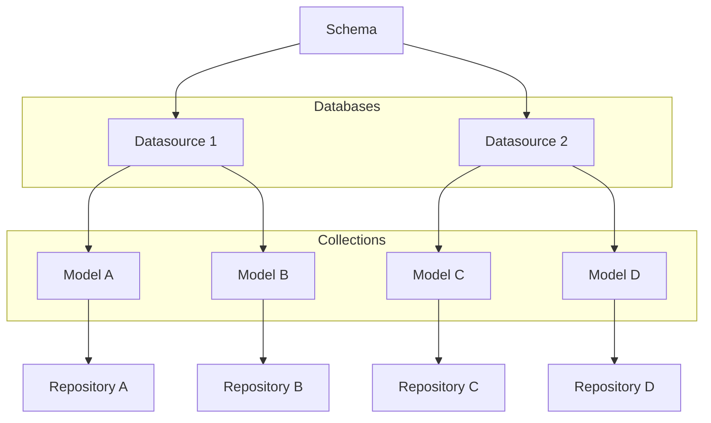

## @e22m4u/js-repository


[Русский](./README.md) | English

<br/>
<div align="center">
  
</div>
<br/>
<br/>

An implementation of the Repository pattern for working with databases in
Node.js.

- [Installation](#installation)
- [Importing](#importing)
- [Description](#description)
- [Example](#example)
- [Schema](#schema)
- [Datasource](#datasource)
- [Model](#model)
- [Properties](#properties)
- [Validators](#validators)
  - [Global Validators](#global-validators)
  - [Registering Global Validators](#registering-global-validators)
  - [Local Validators](#local-validators)
- [Transformers](#transformers)
  - [Global Transformers](#global-transformers)
  - [Registering Global Transformers](#registering-global-transformers)
  - [Local Transformers](#local-transformers)
- [Empty Values](#empty-values)
  - [Overriding Empty Values](#overriding-empty-values)
- [Repository](#repository)
  - [create](#repositorycreate)
  - [replaceById](#repositoryreplacebyid)
  - [replaceOrCreate](#repositoryreplaceorcreate)
  - [patchById](#repositorypatchbyid)
  - [patch](#repositorypatch)
  - [find](#repositoryfind)
  - [findOne](#repositoryfindone)
  - [findById](#repositoryfindbyid)
  - [delete](#repositorydelete)
  - [deleteById](#repositorydeletebyid)
  - [exists](#repositoryexists)
  - [count](#repositorycount)
- [Filtering](#filtering)
- [Relations](#relations)
  - [Belongs To](#belongs-to)
  - [Has One](#has-one)
  - [Has Many](#has-many)
  - [References Many](#references-many)
  - [Belongs To (polymorphic)](#belongs-to-polymorphic-version)
  - [Has One (polymorphic)](#has-one-polymorphic-version)
  - [Has Many (polymorphic)](#has-many-polymorphic-version)
- [Extending](#extending)
- [TypeScript](#typescript)
- [Tests](#tests)
- [License](#license)

## Installation

```bash
npm install @e22m4u/js-repository
```

Optionally, install the required adapter.

| adapter   | description                                                                                                                     |
|-----------|---------------------------------------------------------------------------------------------------------------------------------|
| `memory`  | An in-process memory database (no installation required)                                                                        |
| `mongodb` | MongoDB - a NoSQL database management system (*[install](https://www.npmjs.com/package/@e22m4u/js-repository-mongodb-adapter)*) |

## Importing

The module supports both ESM and CommonJS standards.

*ESM*

```js
import {DatabaseSchema} from '@e22m4u/js-repository';
```

*CommonJS*

```js
const {DatabaseSchema} = require('@e22m4u/js-repository');
```

## Description

The module allows you to abstract away from various database interfaces
by presenting them as named *datasources* connected to *models*.
A *Model* describes a database table (or collection), whose columns are the
model's properties. Model properties can have a specific *type* of allowed
value, a set of *validators*, and *transformers* that data passes through
before being written to the database. Additionally, a *model* can define
classic "one-to-one," "one-to-many," and other types of relationships
between models.

Data is read and written directly through a *repository*, which is available
for every model with a declared *datasource*. The repository can filter
queried documents, validate properties according to the model definition,
and embed related data into the query results.

- *Datasource* - defines how to connect to the database.
- *Model* - describes the document structure and relations to other models.
- *Repository* - performs read and write operations for model documents.



## Example

This example demonstrates creating a schema instance, declaring a datasource,
and a `country` model. Then, using the model's repository, a new document
(a country) is added to the collection and logged to the console.

```
   Country (country)
┌─────────────────────────┐
│  id: 1                  │
│  name: "Russia"         │
│  population: 143400000  │
└─────────────────────────┘
```

```js
import {DataType} from '@e22m4u/js-repository';
import {DatabaseSchema} from '@e22m4u/js-repository';

// create a DatabaseSchema instance
const dbs = new DatabaseSchema();

// declare the "myDb" datasource
dbs.defineDatasource({
  name: 'myDb',      // name of the new datasource
  adapter: 'memory', // chosen adapter
});

// declare the "country" model
dbs.defineModel({
  name: 'country',    // name of the new model
  datasource: 'myDb', // chosen datasource
  properties: {       // model properties
    name: DataType.STRING,       // type "string"
    population: DataType.NUMBER, // type "number"
  },
})

// get the model's repository
const countryRep = dbs.getRepository('country');

// add a new document to the collection
const country = await countryRep.create({
  name: 'Russia',
  population: 143400000,
});

// log the new document
console.log(country);
// {
//   id: 1,
//   name: 'Russia',
//   population: 143400000,
// }
```

The next block defines a `city` model with a `belongsTo` relation to the
`country` model from the example above. Then, a new city document is created,
linked to the previously created country. After creating the new document, a
query is executed to retrieve this city with its related country included.

```
   Country (country)                  City (city)
┌─────────────────────────┐       ┌─────────────────────────┐
│  id: 1  <───────────────│───┐   │  id: 1                  │
│  name: "Russia"         │   │   │  name: "Moscow"         │
│  population: 143400000  │   └───│─ countryId: 1           │
└─────────────────────────┘       └─────────────────────────┘
```

```js
// declare the "city" model with a relation to "country"
dbs.defineModel({
  name: 'city',
  datasource: 'myDb',
  properties: {
    name: DataType.STRING,
    countryId: DataType.NUMBER,
    // defining the "countryId" foreign key is not strictly necessary,
    // but it is recommended for type validation before writing to the
    // database, as the "memory" adapter creates numeric IDs by default
  },
  relations: {
    // defining the "country" relation allows for automatic inclusion
    // of related documents using the "include" option in repository methods
    country: {
      type: RelationType.BELONGS_TO, // relation type: belongs to...
      model: 'country',              // target model name
      foreignKey: 'countryId',       // foreign key field (optional)
      // if the foreign key follows the `relationName` + `Id` convention,
      // the `foreignKey` option is not required.
    },
  },
});

// get the repository for the "city" model
const cityRep = dbs.getRepository('city');

// create a new city and link it to the country via country.id
const city = await cityRep.create({
  name: 'Moscow',
  countryId: country.id, // use the id from the previously created country
});

console.log(city);
// {
//   id: 1,
//   name: 'Moscow',
//   countryId: 1,
// }

// retrieve the city by its id, including the related country
const cityWithCountry = await cityRep.findById(city.id, {
  include: 'country',
});

console.log(cityWithCountry);
// {
//   id: 1,
//   name: 'Moscow',
//   countryId: 1,
//   country: {
//     id: 1,
//     name: 'Russia',
//     population: 143400000
//   }
// }
```

## Schema

An instance of the `DatabaseSchema` class stores datasource and model
definitions.

**Methods**

- `defineDatasource(datasourceDef: object): this` - add a datasource
- `defineModel(modelDef: object): this` - add a model
- `getRepository(modelName: string): Repository` - get a repository

**Examples**

Import the class and create a schema instance.

```js
import {DatabaseSchema} from '@e22m4u/js-repository';

const dbs = new DatabaseSchema();
```

Define a new datasource.

```js
dbs.defineDatasource({
  name: 'myDb',      // name of the new datasource
  adapter: 'memory', // chosen adapter
});
```

Define a new model.

```js
dbs.defineModel({
  name: 'product',   // name of the new model
  datasource: 'myDb',// chosen datasource
  properties: {      // model properties
    name: DataType.STRING,
    weight: DataType.NUMBER,
  },
});
```

Get a repository by the model name.

```js
const productRep = dbs.getRepository('product');
```

## Datasource

A datasource stores the name of the selected adapter and its settings.
A new datasource is defined using the `defineDatasource` method of a
`DatabaseSchema` instance.

**Parameters**

- `name: string` a unique name
- `adapter: string` the chosen adapter
- adapter-specific parameters (if any)

**Examples**

Define a new datasource.

```js
dbs.defineDatasource({
  name: 'myDb',      // name of the new datasource
  adapter: 'memory', // chosen adapter
});
```

Passing additional parameters, using the MongoDB adapter as an example
(*[install](https://www.npmjs.com/package/@e22m4u/js-repository-mongodb-adapter)*).

```js
dbs.defineDatasource({
  name: 'myDb',
  adapter: 'mongodb',
  // parameters for the "mongodb" adapter
  host: '127.0.0.1',
  port: 27017,
  database: 'myDatabase',
});
```

## Model

Describes the structure of a collection's documents and its relations to
other models. A new model is defined using the `defineModel` method of a
`DatabaseSchema` instance.

**Parameters**

- `name: string` model name (required)
- `base: string` name of the base model to inherit from
- `tableName: string` name of the collection in the database
- `datasource: string` the chosen datasource
- `properties: object` property definitions (see [Properties](#properties))
- `relations: object` relation definitions (see [Relations](#relations))

**Examples**

Define a model with properties of specified types.

```js
dbs.defineModel({
  name: 'user', // name of the new model
  properties: { // model properties
    name: DataType.STRING,
    age: DataType.NUMBER,
  },
});
```

## Properties

The `properties` parameter in a model definition accepts an object where keys
are property names and values are either the property type or an object with
additional parameters.

**Data Types**

- `DataType.ANY` any value is allowed
- `DataType.STRING` only `string` values
- `DataType.NUMBER` only `number` values
- `DataType.BOOLEAN` only `boolean` values
- `DataType.ARRAY` only `array` values
- `DataType.OBJECT` only `object` values

**Parameters**

- `type: string` the allowed value type (required)
- `itemType: string` array item type (for `type: 'array'`)
- `model: string` object model (for `type: 'object'`)
- `primaryKey: boolean` declares the property as a primary key
- `columnName: string` overrides the column name
- `columnType: string` column type (defined by the adapter)
- `required: boolean` declares the property as required
- `default: any` default value
- `validate: string | Function | array | object` see [Validators](#validators)
- `unique: boolean | string` check value for uniqueness

**The `unique` Parameter**

If the `unique` parameter is `true` or `'strict'`, a strict uniqueness
check is performed. In this mode, [empty values](#empty-values) are also
checked, where `null` and `undefined` are considered values that must be
unique.

The `'sparse'` mode only checks values with a payload, excluding
[empty values](#empty-values), the list of which varies depending on the
property type. For example, for a `string` type, empty values are
`undefined`, `null`, and `''` (an empty string).

- `unique: true | 'strict'` strict uniqueness check
- `unique: 'sparse'` exclude [empty values](#empty-values) from the check
- `unique: false | 'nonUnique'` do not check for uniqueness (default)

You can use predefined constants as equivalents for the string values
`strict`, `sparse`, and `nonUnique`.

- `PropertyUniqueness.STRICT`
- `PropertyUniqueness.SPARSE`
- `PropertyUniqueness.NON_UNIQUE`

**Examples**

Short-form property definition.

```js
dbs.defineModel({
  name: 'city',
  properties: { // model properties
    name: DataType.STRING,       // property type "string"
    population: DataType.NUMBER, // property type "number"
  },
});
```

Full-form property definition.

```js
dbs.defineModel({
  name: 'city',
  properties: { // model properties
    name: {
      type: DataType.STRING, // property type "string" (required)
      required: true,        // disallows undefined and null values
    },
    population: {
      type: DataType.NUMBER, // property type "number" (required)
      default: 0,            // default value
    },
    code: {
      type: DataType.NUMBER,             // property type "number" (required)
      unique: PropertyUniqueness.STRICT, // check for uniqueness
    },
  },
});
```

Factory default value. The function's return value will be determined at the
time the document is written.

```js
dbs.defineModel({
  name: 'article',
  properties: { // model properties
    tags: {
      type: DataType.ARRAY,     // property type "array" (required)
      itemType: DataType.STRING,// item type "string"
      default: () => [],        // factory value
    },
    createdAt: {
      type: DataType.STRING, // property type "string" (required)
      default: () => new Date().toISOString(), // factory value
    },
  },
});
```

## Validators

Validators are used to check a property's value before writing it to the
database. Validation occurs immediately after the type check specified in the
model's property definition. [Empty values](#empty-values) bypass validators
as they have no payload.

### Global Validators

The module comes with a set of global validators:

- `regexp` validates against a regular expression,
  *parameter: `string | RegExp` - the regular expression;*

- `maxLength` maximum length for a string or array,
  *parameter: `number` - the maximum length;*

- `minLength` minimum length for a string or array,
  *parameter: `number` - the minimum length;*

The validators below are under development:

- `isLowerCase` checks for lowercase letters only;
- `isUpperCase` checks for uppercase letters only;
- `isEmail` checks for a valid email format;

**Examples**

Using a global validator.

```js
dbs.defineModel({
  name: 'user',
  properties: {
    email: {
      type: DataType.STRING,
      validate: 'isEmail',
    },
  },
});
```

Using global validators as an array.

```js
dbs.defineModel({
  name: 'user',
  properties: {
    email: {
      type: DataType.STRING,
      validate: [
        'isEmail',
        'isLowerCase',
      ],
    },
  },
});
```

Using global validators with arguments.

```js
dbs.defineModel({
  name: 'user',
  properties: {
    name: {
      type: DataType.STRING,
      validate: {
        minLength: 2,
        maxLength: 24,
        regexp: /^[a-zA-Z-']+$/,
      },
    },
  },
});
```

Global validators without parameters can accept any arguments.

```js
dbs.defineModel({
  name: 'user',
  properties: {
    email: {
      type: DataType.STRING,
      validate: {
        maxLength: 100,
        // since the "isEmail" validator has no parameters,
        // its definition allows any value to be passed
        // as an argument
        isEmail: true,
      },
    },
  },
});
```

### Registering Global Validators

A validator is a function that receives the value of the corresponding field
before it is written to the database. If the function returns `false` during
validation, a standard error is thrown. You can replace the standard error
by throwing a custom error directly inside the validation function.

A global validator is registered using the `addValidator` method of the
`PropertyValidatorRegistry` service, which takes the validator name and the
validation function.

**Examples**

Registering a global validator to check UUID format.

```js
import {createError} from 'http-errors';
import {format} from '@e22m4u/js-format';
import {Errorf} from '@e22m4u/js-format';
import {PropertyValidatorRegistry} from '@e22m4u/js-repository';

// get the service instance
const pvr = dbs.getService(PropertyValidatorRegistry);

// regular expressions for different UUID versions
const uuidRegex = {
  any: /^[0-9a-f]{8}-[0-9a-f]{4}-[0-9a-f]{4}-[0-9a-f]{4}-[0-9a-f]{12}$/i,
  v4: /^[0-9a-f]{8}-[0-9a-f]{4}-4[0-9a-f]{3}-[89ab][0-9a-f]{3}-[0-9a-f]{12}$/i,
};

// register the global validator "isUuid",
// which accepts a settings object with a "version" property.
pvr.addValidator('isUuid', (value, options, context) => {
  // value   - the value being validated;
  // options - validator parameters;
  // context - information about the property being validated;
  console.log(options);
  // {
  //   version: 'v4'
  // }
  console.log(context);
  // {
  //   validatorName: 'isUuid',
  //   modelName: 'device',
  //   propName: 'deviceId'
  // }

  // empty values are not passed to validators
  // (the condition below will never trigger)
  if (typeof value !== 'string') return false;
  // find the regex for the specified UUID version
  // (from the validator's options)
  const version = options?.version || 'any';
  const regex = uuidRegex[version];
  // if the regex is not found,
  // an internal error is thrown
  if (!regex)
    throw new Errorf(
      'Invalid UUID version %v specified for validator.',
      version,
    );
  // if validation fails, a 400 BadRequest
  // error is thrown
  if (!regex.test(value)) {
    const versionString = version !== 'any' ? ` (version ${version})` : '';
    throw createError(400, format(
      'The property %v of the model %v must be a valid UUID%s.',
      context.propName,
      context.modelName,
      versionString,
    ));
  }
  // on successful validation, return true;
  // otherwise, a standard validation error
  // will be thrown
  return true;
});
```

Using the global validator in a property definition.

```js
// define the "device" model
dbs.defineModel({
  name: 'device',
  properties: {
    deviceId: {
      type: DataType.STRING,
      required: true,
      validate: {
        // the value {version: 'v4'} will be passed as the second
        // argument to the validator function
        isUuid: {version: 'v4'},
      },
    },
  },
});
```

### Local Validators

A validator function can be passed directly in the property definition without
prior registration. To do this, simply pass the function to the `validate`
parameter as a value or as an array element alongside other validators.

**Examples**

Using a local validator to check password strength.

```js
// the `passwordStrength` validator checks password complexity
function passwordStrength(value, options, context) {
  // value   - the value being validated;
  // options - not used;
  // context - information about the property;
  console.log(context);
  // {
  //   validatorName: 'passwordStrength',
  //   modelName: 'user',
  //   propName: 'password'
  // }
  const errors = [];
  if (value.length < 8)
    errors.push('must be at least 8 characters long');
  if (!/\d/.test(value))
    errors.push('must contain at least one number');
  if (!/[a-zA-Z]/.test(value))
    errors.push('must contain at least one letter');
  // if any condition is met,
  // an error is thrown
  if (errors.length > 0)
    throw createError(400, format(
      'Value of the property %v of the model %v %s.',
      context.propName,
      context.modelName,
      errors.join(', '),
    ));
  // on successful validation, return true;
  // otherwise, a standard validation error
  // will be thrown
  return true;
}

// define the "user" model
dbs.defineModel({
  name: 'user',
  properties: {
    password: {
      type: DataType.STRING,
      required: true,
      validate: passwordStrength, // <=
      // or
      // validate: [passwordStrength, ...]
    },
  },
});
```

Using an anonymous validator function to check a slug.

```js
// define the "article" model
dbs.defineModel({
  name: 'article',
  properties: {
    slug: {
      type: DataType.STRING,
      validate: (value) => {
        const re = /^[a-z0-9]+(-[a-z0-9]+)*$/;
        return re.test(value);
      },
    },
  },
});
```

## Transformers

Transformers are used to modify a property's value before type checking and
sending the data to the database. Transformers allow for automatic cleaning
or formatting of data. [Empty values](#empty-values) are not passed to
transformers as they have no payload.

### Global Transformers

The module comes with a set of global transformers:

- `trim` removes whitespace from the beginning and end of a string;
- `toUpperCase` converts a string to uppercase;
- `toLowerCase` converts a string to lowercase;

The transformers below are under development:

- `cut` truncates a string or array to the specified length,
  *parameter: `number` - the maximum length;*

- `truncate` truncates a string and appends an ellipsis,
  *parameter: `number` - the maximum length;*

- `capitalize` converts the first letter of each word to uppercase,
  *parameter: `{firstWordOnly?: boolean}`;*

**Examples**

Using a global transformer.

```js
dbs.defineModel({
  name: 'user',
  properties: {
    username: {
      type: DataType.STRING,
      transform: 'toLowerCase',
    },
  },
});
```

Using global transformers as an array.

```js
dbs.defineModel({
  name: 'user',
  properties: {
    firstName: {
      type: DataType.STRING,
      transform: [
        'trim',
        'capitalize',
      ],
    },
  },
});
```

Using global transformers with arguments.

```js
dbs.defineModel({
  name: 'article',
  properties: {
    annotation: {
      type: DataType.STRING,
      transform: {
        truncate: 200,
        capitalize: {firstWordOnly: true},
      },
    },
  },
});
```

Global transformers without parameters can accept any arguments.

```js
dbs.defineModel({
  name: 'user',
  properties: {
    firstName: {
      type: DataType.STRING,
      transform: {
        cut: 60,
        // since the "trim" transformer has no parameters,
        // its definition allows any value to be passed
        // as an argument
        trim: true,
      },
    },
  },
});
```

### Registering Global Transformers

A transformer is a function that takes a property's value and returns a new
value. The function can be either synchronous or asynchronous (return a
`Promise`).

A global transformer is registered using the `addTransformer` method of the
`PropertyTransformerRegistry` service, which takes the transformer name and
the function itself.

**Examples**

Registering a global transformer to remove HTML tags.

```js
import {PropertyTransformerRegistry} from '@e22m4u/js-repository';

// get the service instance
const ptr = dbs.getService(PropertyTransformerRegistry);

// register the global transformer "stripTags"
ptr.addTransformer('stripTags', (value, options, context) => {
  // value   - the value being transformed;
  // options - transformer settings (if provided);
  // context - information about the property;
  console.log(context);
  // {
  //   transformerName: 'stripTags',
  //   modelName: 'comment',
  //   propName: 'text'
  // }
  
  if (typeof value !== 'string')
    return value; // return as is if not a string
  
  return value.replace(/<[^>]*>?/gm, '');
});
```

Using the global transformer in a model definition.

```js
dbs.defineModel({
  name: 'comment',
  properties: {
    text: {
      type: DataType.STRING,
      transform: 'stripTags',
    },
  },
});
```

### Local Transformers

A transformer function can be passed directly in the property definition
without prior registration. To do this, simply pass the function to the
`transform` parameter as a value or as an array element.

**Examples**

Using a local transformer to normalize names.

```js
// function to normalize a name
function normalizeName(value, options, context) {
  // value   - the value being transformed
  // options - not used
  // context - information about the property
  if (!value || typeof value !== 'string') return value;
  return value
    .trim()        // remove leading/trailing whitespace
    .toLowerCase() // convert to lowercase
    .split(' ')    // split into words
    // capitalize the first letter of each word
    .map(word => word.charAt(0).toUpperCase() + word.slice(1))
    .join(' ');    // join the array back into a string
}

// define the "user" model
dbs.defineModel({
  name: 'user',
  properties: {
    firstName: {
      type: DataType.STRING,
      transform: normalizeName, // <=
    },
    lastName: {
      type: DataType.STRING,
      transform: normalizeName, // <=
    },
  },
});
```

Using a local asynchronous transformer to hash a password.

```js
import * as bcrypt from 'bcrypt';

// asynchronous function to hash a value
async function hash(value, options, context) {
  // value   - the value being transformed
  // options - not used
  // context - information about the property
  console.log(context);
  // {
  //   transformerName: 'hash',
  //   modelName: 'user',
  //   propName: 'password'
  // }
  const saltRounds = 10;
  return bcrypt.hash(value, saltRounds);
}

// define the "user" model
dbs.defineModel({
  name: 'user',
  properties: {
    password: {
      type: DataType.STRING,
      transform: hash, // <=
      // or
      // transform: [hash, ...]
    },
  },
});
```

Using an anonymous transformer function to correct a slug.

```js
dbs.defineModel({
  name: 'article',
  properties: {
    slug: {
      type: DataType.STRING,
      transform: (value) => {
        if (typeof value !== 'string') return value;
        return value.toLowerCase().replace(/\s+/g, '-');
      },
    },
  },
});
```

## Empty Values

Different property types have their own sets of empty values. These sets are
used to determine if a property's value has a payload. For example, the
`default` parameter in a property definition sets a default value only if the
incoming value is empty. The `required` parameter disallows empty values by
throwing an error. And the `unique` parameter in `sparse` mode allows
duplicate empty values for a unique property, as they are not included in the
uniqueness check.

| type        | empty values              |
|-------------|---------------------------|
| `'any'`     | `undefined`, `null`       |
| `'string'`  | `undefined`, `null`, `''` |
| `'number'`  | `undefined`, `null`, `0`  |
| `'boolean'` | `undefined`, `null`       |
| `'array'`   | `undefined`, `null`, `[]` |
| `'object'`  | `undefined`, `null`, `{}` |

### Overriding Empty Values

The set of empty values for any data type can be overridden. These sets are
managed through a special service provided by the
[@e22m4u/js-empty-values](https://www.npmjs.com/package/@e22m4u/js-empty-values)
module (no installation required).

**EmptyValuesService**

To override empty values, you need to get an instance of the
`EmptyValuesService` class from the schema's container and call the method
that accepts the data type and an array of new values.

Interface:

```ts
class EmptyValuesService {
  /**
   * Set empty values
   * for a specific data type.
   * 
   * @param dataType    The data type.
   * @param emptyValues An array of new empty values.
   */
  setEmptyValuesOf(
    dataType: DataType,
    emptyValues: unknown[],
  ): this;
}
```

**Example**

By default, the value `0` is considered empty for numeric properties. The
following example shows how to change this behavior, leaving only `undefined`
and `null` as empty values.

```js
import {DataType} from '@e22m4u/js-repository';
import {DatabaseSchema} from '@e22m4u/js-repository';
import {EmptyValuesService} from '@e22m4u/js-empty-values';

const dbs = new DatabaseSchema();

// get the service for working with empty values
const emptyValuesService = dbs.getService(EmptyValuesService);

// override empty values for the DataType.NUMBER type
emptyValuesService.setEmptyValuesOf(DataType.NUMBER, [undefined, null]);
```

After this, the value `0` for properties of type `DataType.NUMBER` will no
longer be considered empty, will pass validator checks, and will not be
replaced by a default value.

## Repository

The repository performs read and write operations for a specific model's data.
It acts as an intermediary between the application's business logic and the
database.

**Methods**

- [`create(data, filter = undefined)`](#repositorycreate) creates a new document;
- [`replaceById(id, data, filter = undefined)`](#repositoryreplacebyid) completely replaces a document;
- [`replaceOrCreate(data, filter = undefined)`](#repositoryreplaceorcreate) replaces or creates a new document;
- [`patchById(id, data, filter = undefined)`](#repositorypatchbyid) partially updates a document;
- [`patch(data, where = undefined)`](#repositorypatch) updates all or matching documents;
- [`find(filter = undefined)`](#repositoryfind) finds all or matching documents;
- [`findOne(filter = undefined)`](#repositoryfindone) finds the first matching document;
- [`findById(id, filter = undefined)`](#repositoryfindbyid) finds a document by its id;
- [`delete(where = undefined)`](#repositorydelete) deletes all or matching documents;
- [`deleteById(id)`](#repositorydeletebyid) deletes a document by its id;
- [`exists(id)`](#repositoryexists) checks for existence by id;
- [`count(where = undefined)`](#repositorycount) counts all or matching documents;

**Arguments**

- `id: number|string` identifier (primary key)
- `data: object` document data (used for writing)
- `where: object` filter conditions (see [Filtering](#filtering))
- `filter: object` query parameters (see [Filtering](#filtering))

**Getting a Repository**

You can get a repository using the `getRepository()` method of a
`DatabaseSchema` instance. The method takes the model name as an argument.
The model must have a defined [datasource](#datasource), as the repository
interacts directly with the database through the adapter specified in the
datasource.

```js
// declare a datasource
dbs.defineDatasource({
  name: 'myDatasource',
  adapter: 'memory', // adapter
});

// declare a model
dbs.defineModel({
  name: 'myModel',
  datasource: 'myDatasource',
  // properties: { ... },
  // relations: { ... }
});

// get the model's repository
const modelRep = dbs.getRepository('myModel');
```

The first time `getRepository('myModel')` is called, a new repository instance
is created and cached. All subsequent calls with the same model name will
return the existing instance.

### repository.create

Creates a new document in the collection based on the provided data. Returns
the created document with an assigned identifier.

Signature:

```ts
create(
  data: WithOptionalId<FlatData, IdName>,
  filter?: ItemFilterClause<FlatData>,
): Promise<FlatData>;
```

**Examples**

Create a new document.

```js
const newProduct = await productRep.create({
  name: 'Laptop',
  price: 1200,
});
console.log(newProduct);
// {
//   id: 1,
//   name: 'Laptop',
//   price: 1200,
// }
```

Create a document, returning only specific fields.

```js
const product = await productRep.create(
  {name: 'Mouse', price: 25},
  {fields: ['id', 'name']},
);
console.log(product);
// {
//   id: 2,
//   name: 'Mouse',
// }
```

Create a document, including related data in the result.

```js
// assumes the Product model has a "category" relation
// (the "include" option only affects the returned result)
const product = await productRep.create(
  {name: 'Keyboard', price: 75, categoryId: 10},
  {include: 'category'},
);
console.log(product);
// {
//   id: 3,
//   name: 'Keyboard',
//   price: 75,
//   categoryId: 10,
//   category: {id: 10, name: 'Electronics'}
// }
```

### repository.replaceById

Completely replaces an existing document by its identifier. All previous data
in the document, except the identifier, is removed. Fields not provided in
`data` will be absent from the final document (unless they have a default
value).

Signature:

```ts
replaceById(
  id: IdType,
  data: WithoutId<FlatData, IdName>,
  filter?: ItemFilterClause<FlatData>,
): Promise<FlatData>;
```

**Examples**

Replace a document by its identifier.

```js
// original document
// {
//   id: 1,
//   name: 'Laptop',
//   price: 1200,
//   inStock: true
// }

const updatedProduct = await productRep.replaceById(1, {
  name: 'Laptop Pro',
  price: 1500,
});
console.log(updatedProduct);
// {
//   id: 1,
//   name: 'Laptop Pro',
//   price: 1500
// }
// the "inStock" property is removed
```

### repository.replaceOrCreate

Replaces an existing document if the provided data includes an identifier that
already exists in the collection. Otherwise, if the identifier is not
provided or not found, it creates a new document.

Signature:

```ts
replaceOrCreate(
  data: WithOptionalId<FlatData, IdName>,
  filter?: ItemFilterClause<FlatData>,
): Promise<FlatData>;
```

**Examples**

Create a new document if `id: 3` does not exist.

```js
const product = await productRep.replaceOrCreate({
  id: 3,
  name: 'Keyboard',
  price: 75,
});
console.log(product);
// {
//   id: 3,
//   name: 'Keyboard',
//   price: 75,
// }
```

Replace an existing document with `id: 1`.

```js
const updatedProduct = await productRep.replaceOrCreate({
  id: 1,
  name: 'Laptop Pro',
  price: 1500,
});
console.log(updatedProduct);
// {
//   id: 1,
//   name: 'Laptop Pro',
//   price: 1500,
// }
```

### repository.patchById

Partially updates an existing document by its identifier, modifying only the
provided fields. The other fields of the document remain unchanged.

Signature:

```ts
patchById(
  id: IdType,
  data: PartialWithoutId<FlatData, IdName>,
  filter?: ItemFilterClause<FlatData>,
): Promise<FlatData>;
```

**Examples**

Partially update a document by its identifier.

```js
// original document with id: 1
// {
//   id: 1,
//   name: 'Laptop Pro',
//   price: 1500
// }

const updatedProduct = await productRep.patchById(1, {
  price: 1450,
});
console.log(updatedProduct);
// {
//   id: 1,
//   name: 'Laptop Pro',
//   price: 1450
// }
```

### repository.patch

Partially updates one or more documents that match the `where` conditions.
Only the provided fields are changed; the rest remain unchanged. Returns the
number of updated documents. If `where` is not specified, it updates all
documents in the collection.

Signature:

```ts
patch(
  data: PartialWithoutId<FlatData, IdName>,
  where?: WhereClause<FlatData>,
): Promise<number>;
```

**Examples**

Update documents based on a condition.

```js
// updates all products with a price less than 30
const updatedCount = await productRep.patch(
  {inStock: false},
  {price: {lt: 30}},
);
```

Update all documents.

```js
// adds or updates the updatedAt field for all documents
const totalCount = await productRep.patch({
  updatedAt: new Date(),
});
```

### repository.find

Finds all documents that match the filter conditions and returns them as an
array. If no filter is specified, it returns all documents in the
collection.

Signature:

```ts
find(filter?: FilterClause<FlatData>): Promise<FlatData[]>;
```

**Examples**

Find all documents.

```js
const allProducts = await productRep.find();
```

Find documents by a `where` condition.

```js
const cheapProducts = await productRep.find({
  where: {price: {lt: 100}},
});
```

Find with sorting and limiting the result set.

```js
const latestProducts = await productRep.find({
  order: 'createdAt DESC',
  limit: 10,
});
```

### repository.findOne

Finds the first document that matches the filter conditions. Returns
`undefined` if no documents are found.

Signature:

```ts
findOne(
  filter?: FilterClause<FlatData>,
): Promise<FlatData | undefined>;
```

**Examples**

Find a single document by a condition.

```js
const expensiveProduct = await productRep.findOne({
  where: {price: {gt: 1000}},
  order: 'price DESC',
});
```

Handling the case where a document is not found.

```js
const product = await productRep.findOne({
  where: {name: 'Non-existent Product'},
});
if (!product) {
  console.log('Product not found.');
}
```

### repository.findById

Finds a single document by its unique identifier. Throws an error if the
document is not found.

Signature:

```ts
findById(
  id: IdType,
  filter?: ItemFilterClause<FlatData>,
): Promise<FlatData>;
```

**Examples**

Find a document by `id`.

```js
try {
  const product = await productRep.findById(1);
  console.log(product);
} catch (error) {
  console.error('Product with id 1 is not found.');
}
```

Find a document including related data.

```js
const product = await productRep.findById(1, {
  include: 'category',
});
```

### repository.delete

Deletes one or more documents that match the `where` conditions. Returns the
number of deleted documents. If `where` is not specified, it deletes all
documents in the collection.

Signature:

```ts
delete(where?: WhereClause<FlatData>): Promise<number>;
```

**Examples**

Delete documents based on a condition.

```js
const deletedCount = await productRep.delete({
  inStock: false,
});
```

Delete all documents.

```js
const totalCount = await productRep.delete();
```

### repository.deleteById

Deletes a single document by its unique identifier. Returns `true` if the
document was found and deleted, otherwise `false`.

Signature:

```ts
deleteById(id: IdType): Promise<boolean>;
```

**Examples**

Delete a document by `id`.

```js
const wasDeleted = await productRep.deleteById(1);
if (wasDeleted) {
  console.log('The document was deleted.');
} else {
  console.log('No document found to delete.');
}
```

### repository.exists

Checks for the existence of a document with the specified identifier.
Returns `true` if the document exists, otherwise `false`.

Signature:

```ts
exists(id: IdType): Promise<boolean>;
```

**Examples**

Check if a document exists by `id`.

```js
const productExists = await productRep.exists(1);
if (productExists) {
  console.log('A document with id 1 exists.');
}
```

### repository.count

Counts the number of documents that match the `where` conditions. If `where`
is not specified, it returns the total number of documents in the collection.

Signature:

```ts
count(where?: WhereClause<FlatData>): Promise<number>;
```

**Examples**

Count documents based on a condition.

```js
const cheapCount = await productRep.count({
  price: {lt: 100},
});
```

Count all documents.

```js
const totalCount = await productRep.count();
```

## Filtering

Some repository methods accept a settings object that affects the returned
result. The `find` method's first parameter has the widest set of these
settings, expecting an object with the options listed below.

- `where: object` conditions to filter documents by their properties;
- `order: string|string[]` sort by specified properties;
- `limit: number` limit the number of documents;
- `skip: number` skip documents (for pagination);
- `fields: string|string[]` select necessary model properties;
- `include: object` include related data in the result;

**Example**

```js
// the "find" repository method is used for the query,
// with a filter object passed as the first argument
const news = await newsRepository.find({
  where: {
    title: {like: '%Moscow%'},
    publishedAt: {gte: '2025-10-15T00:00:00.000Z'},
    tags: {inq: ['world', 'politic']},
    hidden: false,
  },
  order: 'publishedAt DESC',
  limit: 12,
  skip: 24,
  fields: ['title', 'annotation', 'body'],
  include: ['author', 'category'],
})
```

### where

This parameter accepts an object with query conditions and supports the
following set of comparison operators.

- [Search by value (shorthand)](#search-by-value-shorthand)
- [`eq`](#eq-strict-equality) (strict equality)
- [`neq`](#neq-inequality) (inequality)
- [`gt`](#gt-greater-than) (greater than)
- [`lt`](#lt-less-than) (less than)
- [`gte`](#gte-greater-than-or-equal-to) (greater than or equal to)
- [`lte`](#lte-less-than-or-equal-to) (less than or equal to)
- [`inq`](#inq-in-a-list) (in a list)
- [`nin`](#nin-not-in-a-list) (not in a list)
- [`between`](#between-range) (range)
- [`exists`](#exists-property-existence) (property existence)
- [`like`](#like-pattern-matching) (pattern matching)
- [`nlike`](#nlike-excluding-pattern) (excluding pattern)
- [`ilike`](#ilike-case-insensitive-pattern) (case-insensitive pattern)
- [`nilike`](#nilike-case-insensitive-excluding-pattern) (case-insensitive excluding pattern)
- [`regexp`](#regexp-regular-expression) (regular expression)

Conditions can be combined with logical operators:

- [`and`](#and-logical-and) (logical AND)
- [`or`](#or-logical-or) (logical OR)

#### Search by value (shorthand)

Finds documents where the value of the specified property is exactly equal
to the provided value. This is a shorthand for the `{eq: ...}` operator.

```js
// finds all documents where age is 21
const res = await rep.find({
  where: {
    age: 21,
  },
});
```

#### `eq` (strict equality)

Finds documents where the property value is equal to the specified value.

```js
// finds all documents where age is 21
const res = await rep.find({
  where: {
    age: {eq: 21},
  },
});
```

#### `neq` (inequality)

Finds documents where the property value is not equal to the specified value.

```js
// finds all documents where age is not 21
const res = await rep.find({
  where: {
    age: {neq: 21},
  },
});
```

#### `gt` (greater than)

Finds documents where the property value is strictly greater than the
specified value.

```js
// finds documents where age is greater than 30
const res = await rep.find({
  where: {
    age: {gt: 30},
  },
});
```

#### `lt` (less than)

Finds documents where the property value is strictly less than the
specified value.

```js
// finds documents where age is less than 30
const res = await rep.find({
  where: {
    age: {lt: 30},
  },
});
```

#### `gte` (greater than or equal to)

Finds documents where the property value is greater than or equal to the
specified value.

```js
// finds documents where age is greater than or equal to 30
const res = await rep.find({
  where: {
    age: {gte: 30},
  },
});
```

#### `lte` (less than or equal to)

Finds documents where the property value is less than or equal to the
specified value.

```js
// finds documents where age is less than or equal to 30
const res = await rep.find({
  where: {
    age: {lte: 30},
  },
});
```

#### `inq` (in a list)

Finds documents where the property value matches one of the values in the
provided array.

```js
// finds documents where name is 'John' or 'Mary'
const res = await rep.find({
  where: {
    name: {inq: ['John', 'Mary']},
  },
});
```

#### `nin` (not in a list)

Finds documents where the property value is not in the provided array.

```js
// finds all documents except those where name is 'John' or 'Mary'
const res = await rep.find({
  where: {
    name: {nin: ['John', 'Mary']},
  },
});
```

#### `between` (range)

Finds documents where the property value is within the specified range
(inclusive).

```js
// finds documents where age is between 20 and 30, inclusive
const res = await rep.find({
  where: {
    age: {between: [20, 30]},
  },
});
```

#### `exists` (property existence)

Checks for the presence or absence of a property in a document. Does not
check the property's value.

- `true` the property must exist (even if its value is `null`);
- `false` the property must be absent;

```js
// finds documents that have the 'nickname' property
const res1 = await rep.find({
  where: {
    nickname: {exists: true},
  },
});

// finds documents that do not have the 'nickname' property
const res2 = await rep.find({
  where: {
    nickname: {exists: false},
  },
});
```

#### `like` (pattern matching)

Performs a case-sensitive pattern match (see [more details](#pattern-matching-operators)).

```js
// finds {name: 'John Doe'}, but not {name: 'john doe'}
const res = await rep.find({
  where: {
    name: {like: 'John%'},
  },
});
```

#### `nlike` (excluding pattern)

Finds documents that do not match the case-sensitive pattern
(see [more details](#pattern-matching-operators)).

```js
// finds everything except names starting with 'John'
const res = await rep.find({
  where: {
    name: {nlike: 'John%'},
  },
});
```

#### `ilike` (case-insensitive pattern)

Performs a case-insensitive pattern match (see [more details](#pattern-matching-operators)).

```js
// finds both {name: 'John Doe'} and {name: 'john doe'}
const res = await rep.find({
  where: {
    name: {ilike: 'john%'},
  },
});
```

#### `nilike` (case-insensitive excluding pattern)

Finds strings that do not match the pattern, case-insensitively
(see [more details](#pattern-matching-operators)).

```js
// finds everything except names starting with 'John' or 'john'
const res = await rep.find({
  where: {
    name: {nilike: 'john%'},
  },
});
```

#### `regexp` (regular expression)

Finds documents where the string property's value matches the specified
regular expression. Can be passed as a string or a `RegExp` object.

```js
// finds documents where name starts with 'J'
const res1 = await rep.find({
  where: {
    name: {regexp: '^J'},
  },
});

// finds documents where name starts with 'J' or 'j' (case-insensitive)
const res2 = await rep.find({
  where: {
    name: {regexp: '^j', flags: 'i'},
  },
});
```

#### `and` (logical AND)

Combines multiple conditions into an array, requiring every condition to be
met.

```javascript
// finds documents where surname is 'Smith' AND age is 21
const res = await rep.find({
  where: {
    and: [
      {surname: 'Smith'},
      {age: 21}
    ],
  },
});
```

#### `or` (logical OR)

Combines multiple conditions into an array, requiring at least one of them
to be met.

```javascript
// finds documents where name is 'James' OR age is greater than 30
const res = await rep.find({
  where: {
    or: [
      {name: 'James'},
      {age: {gt: 30}}
    ],
  },
});
```

#### Pattern Matching Operators

The `like`, `nlike`, `ilike`, and `nilike` operators are designed for filtering
string properties based on pattern matching, similar to the `LIKE` operator
in SQL. They allow finding values that match a certain structure using
special characters.

**`%`** matches any sequence of zero or more characters:

- `'A%'` finds all strings starting with "A";
- `'%a'` finds all strings ending with "a";
- `'%word%'` finds all strings containing "word" anywhere;

**`_`** matches exactly one of any character:

- `'c_t'` finds "cat", "cot", but not "cart" or "ct";
- `'cat_'` finds "cats", "cat1", but not "cat" or "catch";

To find the literal characters `%` or `_`, they must be escaped with a
backslash `\`:

- `'100\%'` finds the string "100%";
- `'file\_name'` finds the string "file_name";
- `'path\\to'` finds the string "path\to";

### order

This parameter sorts the result set by the specified model properties. You can
specify descending order with the `DESC` postfix.

**Examples**

Sort by the `createdAt` field.

```js
const res = await rep.find({
  order: 'createdAt',
});
```

Sort by the `createdAt` field in descending order.

```js
const res = await rep.find({
  order: 'createdAt DESC',
});
```

Sort by multiple properties in different directions.

```js
const res = await rep.find({
  order: [
    'title',
    'price ASC',
    'featured DESC',
  ],
});
```

*i. The `ASC` sort direction is optional.*

### include

This parameter includes related documents in the method's result. The names
of the included relations must be defined in the current model
(see [Relations](#relations)).

**Examples**

Include a relation by its name.

```js
const res = await rep.find({
  include: 'city',
});
```

Include nested relations.

```js
const res = await rep.find({
  include: {
    city: 'country',
  },
});
```

Include multiple relations using an array.

```js
const res = await rep.find({
  include: [
    'city',
    'address',
    'employees'
  ],
});
```

Using filtering for included documents.

```js
const res = await rep.find({
  include: {
    relation: 'employees', // relation name
    scope: { // filter for "employees" documents
      where: {hidden: false}, // query conditions
      order: 'id', // document order
      limit: 10, // limit the number of documents
      skip: 5, // skip documents
      fields: ['name', 'surname'], // only these fields
      include: 'city', // include relations for "employees"
    },
  },
});
```

## Relations

Relations describe relationships between models, allowing for automatic
embedding of related data using the `include` option in repository methods.
The example below shows automatic relation resolution when using the
`findById` method.

```
         Role (role)
      ┌────────────────────┐
      │  id: 3  <──────────│────┐
      │  name: 'Manager'   │    │
      └────────────────────┘    │
                                │
     User (user)                │
  ┌────────────────────────┐    │
  │  id: 1                 │    │
  │  name: 'John Doe'      │    │
  │  roleId: 3   ──────────│────┘
  │  cityId: 24  ──────────│────┐
  └────────────────────────┘    │
                                │
         City (city)            │
      ┌────────────────────┐    │
      │  id: 24  <─────────│────┘
      │  name: 'Moscow'    │
      └────────────────────┘
```

```js
// query a document from the "users" collection,
// including related data (role and city)
const user = await userRep.findById(1, {
  include: ['role', 'city'],
});

console.log(user);
// {
//   id: 1,
//   name: 'John Doe',
//   roleId: 3,
//   role: {
//     id: 3,
//     name: 'Manager'
//   },
//   cityId: 24,
//   city: {
//     id: 24,
//     name: 'Moscow'
//   }
// }
```

### Defining a Relation

The `relations` property in a model definition accepts an object where keys
are relation names and values are their parameters. The relation name can
then be used in the `include` option of repository methods.

```js
import {
  DataType,
  RelationType,
  DatabaseSchema,
} from '@e22m4u/js-repository';

dbs.defineModel({
  name: 'user',
  datasource: 'memory',
  properties: {
    name: DataType.STRING,
  },
  relations: {
    // relation role -> parameters
    role: {
      type: RelationType.BELONGS_TO,
      model: 'role',
    },
    // relation city -> parameters
    city: {
      type: RelationType.BELONGS_TO,
      model: 'city',
    },
  },
});
```

**Core Parameters**

- `type: string` the relation type (required);
- `model: string` the target model name (required for some types);
- `foreignKey: string` the property in the current model for the target id;

*i. For Belongs To and References Many types, the `foreignKey` parameter
can be omitted as it's automatically generated based on the relation name.*

**Polymorphic Mode**

- `polymorphic: boolean|string` declares a polymorphic relation;
- `discriminator: string` the property in the current model for the target's name;

*i. Polymorphic mode allows dynamically determining the target model by its
name, which is stored in the document's discriminator property.*

### Relation Types

- [Belongs To](#belongs-to)
  The current model references the target model by its id.
  `type: "belongsTo"` or `type: RelationType.BELONGS_TO`

- [Has One](#has-one)
  The inverse of `belongsTo` for a "one-to-one" relationship.
  `type: "hasOne"` or `type: RelationType.HAS_ONE`

- [Has Many](#has-many)
  The inverse of `belongsTo` for a "one-to-many" relationship.
  `type: "hasMany"` or `type: RelationType.HAS_MANY`

- [References Many](#references-many)
  The current model references the target model via an array of IDs.
  `type: "referencesMany"` or `type: RelationType.REFERENCES_MANY`

Polymorphic versions:

- [Belongs To (polymorphic)](#belongs-to-polymorphic-version)
- [Has One (polymorphic)](#has-one-polymorphic-version)
- [Has Many (polymorphic)](#has-many-polymorphic-version)

The `type` parameter in a relation definition accepts a string with the type
name. To avoid typos, it's recommended to use the constants from the
`RelationType` object listed below.

- `RelationType.BELONGS_TO`
- `RelationType.HAS_ONE`
- `RelationType.HAS_MANY`
- `RelationType.REFERENCES_MANY`

#### Belongs To

The current model references the target model by its identifier.

```
    Current (user)                  Target (role)
┌─────────────────────────┐       ┌─────────────────────────┐
│   id: 1                 │   ┌───│─> id: 5                 │
│   roleId: 5  ───────────│───┤   │   ...                   │
│   ...                   │   │   └─────────────────────────┘
└─────────────────────────┘   │ 
┌─────────────────────────┐   │   
│   id: 2                 │   │
│   roleId: 5  ───────────│───┘   
│   ...                   │       
└─────────────────────────┘       
```

Relation definition:

```js
dbs.defineModel({
  name: 'user',
  relations: {
    role: { // relation name
      type: RelationType.BELONGS_TO, // current model references target
      model: 'role', // target model name
      foreignKey: 'roleId', // foreign key (optional)
      // if "foreignKey" is not specified, the foreign key property
      // is formed based on the relation name with an "Id" postfix
    },
  },
});
```

Example:

```js
import {
  DataType,
  RelationType,
  DatabaseSchema,
} from '@e22m4u/js-repository';

const dbs = new DatabaseSchema();

// datasource
dbs.defineDatasource({
  name: 'myDb',
  adapter: 'memory',
});

// role model
dbs.defineModel({
  name: 'role',
  datasource: 'myDb',
  properties: {
    name: DataType.STRING,
  },
});

// user model
dbs.defineModel({
  name: 'user',
  datasource: 'myDb',
  properties: {
    name: DataType.STRING,
    roleId: DataType.NUMBER, // optional
  },
  relations: {
    role: {
      type: RelationType.BELONGS_TO,
      model: 'role',
      foreignKey: 'roleId', // optional
    },
  },
});

// create a role
const roleRep = dbs.getRepository('role');
const role = await roleRep.create({
  id: 5,
  name: 'Manager',
});
console.log(role);
// {
//   id: 5,
//   name: 'Manager'
// }

// create a user
const userRep = dbs.getRepository('user');
const user = await userRep.create({
  id: 1,
  name: 'John Doe',
  roleId: role.id,
});
console.log(user);
// {
//   id: 1,
//   name: 'John Doe',
//   roleId: 5
// }

// fetch user with related role ("include" option)
const userWithRole = await userRep.findById(user.id, {include: 'role'});
console.log(userWithRole);
// {
//   id: 1,
//   name: 'John Doe',
//   roleId: 5,
//   role: {
//     id: 5,
//     name: 'Manager'
//   }
// }
```

#### Has One

The inverse of `belongsTo` for a "one-to-one" relationship.

```
    Current (profile)               Target (user)
┌─────────────────────────┐       ┌─────────────────────────┐
│   id: 5  <──────────────│───┐   │   id: 1                 │
│   ...                   │   └───│── profileId: 5          │
└─────────────────────────┘       │   ...                   │
                                  └─────────────────────────┘
```

Relation definition:

```js
// dbs.defineModel({
//   name: 'user',
//   relations: {
//     profile: {
//       type: RelationType.BELONGS_TO,
//       model: 'profile',
//     },
//   },
// });

dbs.defineModel({
  name: 'profile',
  relations: {
    user: { // relation name
      type: RelationType.HAS_ONE, // target model references current
      model: 'user', // target model name
      foreignKey: 'profileId', // foreign key from target to current
    },
  },
});
```

#### Has Many

The inverse of `belongsTo` for a "one-to-many" relationship.

```
    Current (role)                  Target (user)
┌─────────────────────────┐       ┌─────────────────────────┐
│   id: 5  <──────────────│───┐   │   id: 1                 │
│   ...                   │   ├───│── roleId: 5             │
└─────────────────────────┘   │   │   ...                   │
                              │   └─────────────────────────┘
                              │   ┌─────────────────────────┐
                              │   │   id: 2                 │
                              └───│── roleId: 5             │
                                  │   ...                   │
                                  └─────────────────────────┘
```

Relation definition:

```js
// dbs.defineModel({
//   name: 'user',
//   relations: {
//     role: {
//       type: RelationType.BELONGS_TO,
//       model: 'role',
//     },
//   },
// });

dbs.defineModel({
  name: 'role',
  relations: {
    users: { // relation name
      type: RelationType.HAS_MANY, // target model references current
      model: 'user', // target model name
      foreignKey: 'roleId', // foreign key in the target model
    },
  },
});
```

#### References Many

The current model references the target model via an array of identifiers.

```
    Current (article)                 Target (category)
┌─────────────────────────┐       ┌─────────────────────────┐
│   id: 1                 │   ┌───│─> id: 5                 │
│   categoryIds: [5, 6] ──│───┤   │   ...                   │
│   ...                   │   │   └─────────────────────────┘
└─────────────────────────┘   │   ┌─────────────────────────┐
                              └───│─> id: 6                 │
                                  │   ...                   │
                                  └─────────────────────────┘
```

Relation definition:

```js
// dbs.defineModel({name: 'category', ...

dbs.defineModel({
  name: 'article',
  relations: {
    categories: { // relation name
      type: RelationType.REFERENCES_MANY, // relation via array of IDs
      model: 'category', // target model name
      foreignKey: 'categoryIds', // foreign key (optional)
      // if "foreignKey" is not specified, the foreign key property
      // is formed based on the relation name with an "Ids" postfix
    },
  },
});
```

#### Belongs To (polymorphic version)

The current model references a target model by its identifier. The target
model's name is determined by a discriminator property.

```
    Current (file)               ┌──────> Target 1 (letter)
┌─────────────────────────────┐  │    ┌─────────────────────────┐
│   id: 1                     │  │ ┌──│─> id: 10                │
│   referenceType: 'letter'  ─│──┘ │  │   ...                   │
│   referenceId: 10  ─────────│────┘  └─────────────────────────┘
└─────────────────────────────┘
                                 ┌──────> Target 2 (user)
┌─────────────────────────────┐  │    ┌─────────────────────────┐
│   id: 2                     │  │ ┌──│─> id: 5                 │
│   referenceType: 'user'  ───│──┘ │  │   ...                   │
│   referenceId: 5  ──────────│────┘  └─────────────────────────┘
└─────────────────────────────┘
```

Relation definition:

```js
dbs.defineModel({
  name: 'file',
  relations: {
    reference: { // relation name
      type: RelationType.BELONGS_TO, // current model references target
      // polymorphic mode allows storing the target model's name
      // in a discriminator property, which is formed based on
      // the relation name with a "Type" postfix, in this case,
      // the target model's name is stored in "referenceType",
      // and the document's id is in "referenceId"
      polymorphic: true,
    },
  },
});
```

Relation definition with explicit properties:

```js
dbs.defineModel({
  name: 'file',
  relations: {
    reference: { // relation name
      type: RelationType.BELONGS_TO, // current model references target
      polymorphic: true, // target model name is in a discriminator
      foreignKey: 'referenceId', // property for the target's id
      discriminator: 'referenceType', // property for the target's name
    },
  },
});
```

#### Has One (polymorphic version)

The inverse of a polymorphic `belongsTo` for a "one-to-one" relationship.

```
    Current (company)  <───────┐      Target (license)
┌─────────────────────────┐    │  ┌─────────────────────────┐
│   id: 10  <─────────────│──┐ │  │   id: 1                 │
│   ...                   │  │ └──│── ownerType: 'company'  │
└─────────────────────────┘  └────│── ownerId: 10           │
                                  └─────────────────────────┘
```

Relation definition specifying the target's relation name:

```js
// dbs.defineModel({
//   name: 'license',
//   relations: {
//     owner: {
//       type: RelationType.BELONGS_TO,
//       polymorphic: true,
//     },
//   },
// });

dbs.defineModel({
  name: 'company',
  relations: {
    license: { // relation name
      type: RelationType.HAS_ONE, // target model references current
      model: 'license', // target model name
      polymorphic: 'owner', // polymorphic relation name in target model
    },
  },
});
```

Relation definition specifying the target model's properties:

```js
// dbs.defineModel({
//   name: 'license',
//   relations: {
//     owner: {
//       type: RelationType.BELONGS_TO,
//       polymorphic: true,
//       foreignKey: 'ownerId',
//       discriminator: 'ownerType',
//     },
//   },
// });

dbs.defineModel({
  name: 'company',
  relations: {
    license: { // relation name
      type: RelationType.HAS_ONE, // target model references current
      model: 'license', // target model name
      polymorphic: true, // current model name is in discriminator
      foreignKey: 'ownerId', // property in target for current's id
      discriminator: 'ownerType', // property in target for current's name
    },
  },
});
```

#### Has Many (polymorphic version)

The inverse of a polymorphic `belongsTo` for a "one-to-many" relationship.

```
    Current (letter)  <─────────┐      Target (file)
┌──────────────────────────┐    │  ┌────────────────────────────┐
│   id: 10  <──────────────│──┐ │  │   id: 1                    │
│   ...                    │  │ ├──│── referenceType: 'letter'  │
└──────────────────────────┘  ├─│──│── referenceId: 10          │
                              │ │  └────────────────────────────┘
                              │ │  ┌────────────────────────────┐
                              │ │  │   id: 2                    │
                              │ └──│── referenceType: 'letter'  │
                              └────│── referenceId: 10          │
                                   └────────────────────────────┘
```

Relation definition specifying the target's relation name:

```js
// dbs.defineModel({
//   name: 'file',
//   relations: {
//     reference: {
//       type: RelationType.BELONGS_TO,
//       polymorphic: true,
//     },
//   },
// });

dbs.defineModel({
  name: 'letter',
  relations: {
    attachments: { // relation name
      type: RelationType.HAS_MANY, // target model references current
      model: 'file', // target model name
      polymorphic: 'reference', // polymorphic relation name in target
    },
  },
});
```

Relation definition specifying the target model's properties:

```js
// dbs.defineModel({
//   name: 'file',
//   relations: {
//     reference: {
//       type: RelationType.BELONGS_TO,
//       polymorphic: true,
//       foreignKey: 'referenceId',
//       discriminator: 'referenceType',
//     },
//   },
// });

dbs.defineModel({
  name: 'letter',
  relations: {
    attachments: { // relation name
      type: RelationType.HAS_MANY, // target model references current
      model: 'file', // target model name
      polymorphic: true, // current model name is in discriminator
      foreignKey: 'referenceId', // property in target for current's id
      discriminator: 'referenceType', // property in target for current's name
    },
  },
});
```

## Extending

The `getRepository` method of a `DatabaseSchema` instance checks for an
existing repository for the specified model and returns it. Otherwise, a new
instance is created and cached for subsequent calls.

```js
import {Repository} from '@e22m4u/js-repository';
import {DatabaseSchema} from '@e22m4u/js-repository';

// const dbs = new DatabaseSchema();
// dbs.defineDatasource ...
// dbs.defineModel ...

const rep1 = dbs.getRepository('model');
const rep2 = dbs.getRepository('model');
console.log(rep1 === rep2); // true
```

You can replace the default repository constructor using the `setRepositoryCtor`
method of the `RepositoryRegistry` service, which is available in the
`DatabaseSchema` instance's service container. After that, all new
repositories will be created using the specified constructor instead of the
default one.

```js
import {Repository} from '@e22m4u/js-repository';
import {DatabaseSchema} from '@e22m4u/js-repository';
import {RepositoryRegistry} from '@e22m4u/js-repository';

class MyRepository extends Repository {
  /*...*/
}

// const dbs = new DatabaseSchema();
// dbs.defineDatasource ...
// dbs.defineModel ...

dbs.getService(RepositoryRegistry).setRepositoryCtor(MyRepository);
const rep = dbs.getRepository('model');
console.log(rep instanceof MyRepository); // true
```

*i. Since repository instances are cached, you should replace the
constructor before calling the `getRepository` method.*

## TypeScript

Getting a typed repository with a specified model interface.

```ts
import {DataType} from '@e22m4u/js-repository';
import {RelationType} from '@e22m4u/js-repository';
import {DatabaseSchema} from '@e22m4u/js-repository';

// const dbs = new DatabaseSchema();
// dbs.defineDatasource ...

// define the "city" model
dbs.defineModel({
  name: 'city',
  datasource: 'myDatasource',
  properties: {
    name: DataType.STRING,
    timeZone: DataType.STRING,
  },
});

// define the "city" interface
interface City {
  id: number;
  name?: string;
  timeZone?: string;
}

// when getting a repository for a model,
// you can specify the document type
const cityRep = dbs.getRepository<City>('city');

// now, repository methods return
// the City type instead of Record<string, unknown>
const city: City = await cityRep.create({
  name: 'Moscow',
  timeZone: 'Europe/Moscow',
});
```

For defining models using TypeScript classes, it is recommended to use the
specialized version of this module,
[@e22m4u/ts-repository](https://www.npmjs.com/package/@e22m4u/ts-repository),
which comes with a set of TypeScript decorators and additional tools for
working in a TypeScript environment.

## Tests

```bash
npm run test
```

## License

MIT