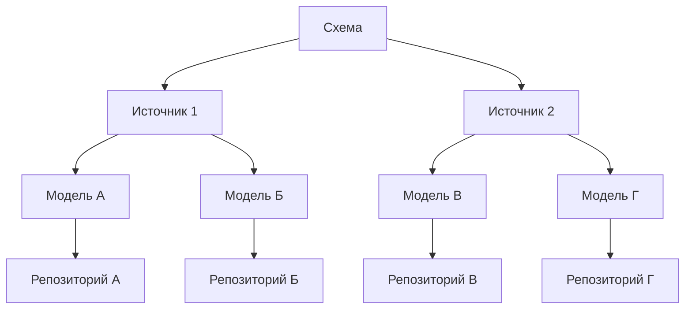

## @e22m4u/js-repository

Модуль для работы с базами данных для Node.js

## Установка

```bash
npm install @e22m4u/js-repository
```

Опционально устанавливаем адаптер. Например, если используется
*MongoDB*, то для подключения потребуется установить
[адаптер mongodb](https://www.npmjs.com/package/@e22m4u/js-repository-mongodb-adapter)
как отдельную зависимость.

```bash
npm install @e22m4u/js-repository-mongodb-adapter
```

Список адаптеров:

|           | описание                                                                                                                       |
|-----------|--------------------------------------------------------------------------------------------------------------------------------|
| `memory`  | виртуальная база в памяти процесса (не требует установки)                                                                      |
| `mongodb` | MongoDB - система управления NoSQL базами (*[установка](https://www.npmjs.com/package/@e22m4u/js-repository-mongodb-adapter))* |

## Введение

Модуль позволяет объединить несколько баз данных в единую систему с помощью
следующих абстракций:

- **Схема** - экземпляр класса `Schema` хранит определения источников и моделей.
- **Источник** - определяет адаптер для подключения к базе данных и его настройки.
- **Модель** - описывает структуру документа и связи к другим моделям.
- **Репозиторий** - интерфейс для чтения и записи документов определенной модели.



## Тесты

```bash
npm run test
```

## Лицензия

MIT
