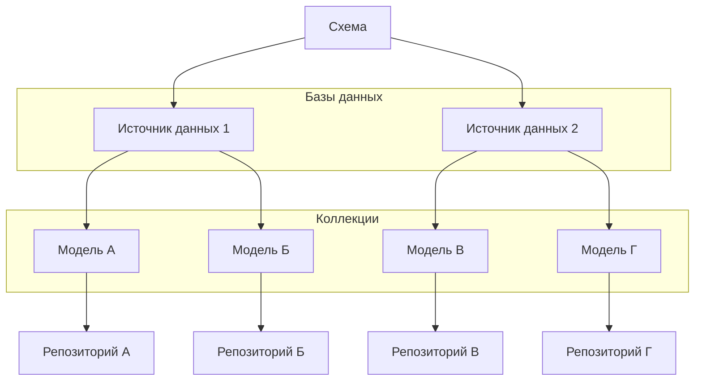

## @e22m4u/js-repository


Реализация паттерна «Репозиторий» для работы с базами данных в Node.js

- [Установка](#установка)
- [Импорт](#импорт)
- [Описание](#описание)
- [Пример](#пример)
- [Схема](#схема)
- [Источник данных](#источник-данных)
- [Модель](#модель)
- [Свойства](#свойства)
- [Валидаторы](#валидаторы)
  - [Глобальные валидаторы](#глобальные-валидаторы)
  - [Регистрация глобальных валидаторов](#регистрация-глобальных-валидаторов)
  - [Локальные валидаторы](#локальные-валидаторы)
- [Трансформеры](#трансформеры)
  - [Глобальные трансформеры](#глобальные-трансформеры)
  - [Регистрация глобальных трансформеров](#регистрация-глобальных-трансформеров)
  - [Локальные трансформеры](#локальные-трансформеры)
- [Пустые значения](#пустые-значения)
  - [Переопределение пустых значений](#переопределение-пустых-значений)
- [Репозиторий](#репозиторий)
  - [create](#repositorycreate)
  - [replaceById](#repositoryreplacebyid)
  - [replaceOrCreate](#repositoryreplaceorcreate)
  - [patchById](#repositorypatchbyid)
  - [patch](#repositorypatch)
  - [find](#repositoryfind)
  - [findOne](#repositoryfindone)
  - [findById](#repositoryfindbyid)
  - [delete](#repositorydelete)
  - [deleteById](#repositorydeletebyid)
  - [exists](#repositoryexists)
  - [count](#repositorycount)
- [Фильтрация](#фильтрация)
- [Связи](#связи)
  - [Belongs To](#belongs-to)
  - [Has One](#has-one)
  - [Has Many](#has-many)
  - [References Many](#references-many)
  - [Belongs To (полиморфная)](#belongs-to-полиморфная-версия)
  - [Has One (полиморфная)](#has-one-полиморфная-версия)
  - [Has Many (полиморфная)](#has-many-полиморфная-версия)
- [Расширение](#расширение)
- [TypeScript](#typescript)
- [Тесты](#тесты)
- [Лицензия](#лицензия)

## Установка

```bash
npm install @e22m4u/js-repository
```

Опционально устанавливается нужный адаптер.

| адаптер   | описание                                        | установка                                                                  |
|-----------|-------------------------------------------------|----------------------------------------------------------------------------|
| `memory`  | Виртуальная база в памяти процесса              | *встроенный*                                                               |
| `mongodb` | MongoDB - документо-ориентированная база данных | [npm](https://www.npmjs.com/package/@e22m4u/js-repository-mongodb-adapter) |

## Импорт

Модуль поддерживает ESM и CommonJS стандарты.

*ESM*

```js
import {DatabaseSchema} from '@e22m4u/js-repository';
```

*CommonJS*

```js
const {DatabaseSchema} = require('@e22m4u/js-repository');
```

## Описание

Модуль позволяет абстрагироваться от различных интерфейсов баз данных,
представляя их как именованные *источники данных*, подключаемые к *моделям*.
*Модель* же описывает таблицу базы, колонки которой являются свойствами
модели. Свойства модели могут иметь определенный *тип* допустимого значения,
набор *валидаторов* и *трансформеров*, через которые проходят данные перед
записью в базу. Кроме того, *модель* может определять классические связи
«один к одному», «один ко многим» и другие типы отношений между моделями.

Непосредственно чтение и запись данных производится с помощью *репозитория*,
который есть у каждой модели с объявленным *источником данных*. Репозиторий
может фильтровать запрашиваемые документы, выполнять валидацию свойств
согласно определению модели, и встраивать связанные данные в результат
выборки.

- *Источник данных* - определяет способ подключения к базе
- *Модель* - описывает структуру документа и связи к другим моделям
- *Репозиторий* - выполняет операции чтения и записи документов модели



## Пример

Пример демонстрирует создание экземпляра схемы, объявление источника данных
и модели `country`. После чего, с помощью репозитория данной модели, в коллекцию
добавляется новый документ (страна), который выводится в консоль.

```
   Страна (country)
┌─────────────────────────┐
│  id: 1                  │
│  name: "Russia"         │
│  population: 143400000  │
└─────────────────────────┘
```

```js
import {DataType} from '@e22m4u/js-repository';
import {DatabaseSchema} from '@e22m4u/js-repository';

// создание экземпляра DatabaseSchema
const dbs = new DatabaseSchema();

// объявление источника "myDb"
dbs.defineDatasource({
  name: 'myDb',      // название нового источника
  adapter: 'memory', // выбранный адаптер
});

// объявление модели "country"
dbs.defineModel({
  name: 'country',    // название новой модели
  datasource: 'myDb', // выбранный источник
  properties: {       // свойства модели
    name: DataType.STRING,       // тип "string"
    population: DataType.NUMBER, // тип "number"
  },
})

// получение репозитория модели
const countryRep = dbs.getRepository('country');

// добавление нового документа в коллекцию
const country = await countryRep.create({
  name: 'Russia',
  population: 143400000,
});

// вывод нового документа
console.log(country);
// {
//   id: 1,
//   name: 'Russia',
//   population: 143400000,
// }
```

В следующем блоке определяется модель `city` со связью `belongsTo` к модели
`country` из примера выше. Затем создается новый документ города, связанный
с ранее созданной страной. После создания нового документа, выполняется запрос
на извлечение данного города с включением связанной страны.

```
   Страна (country)                  Город (city)
┌─────────────────────────┐       ┌─────────────────────────┐
│  id: 1  <───────────────│───┐   │  id: 1                  │
│  name: "Russia"         │   │   │  name: "Moscow"         │
│  population: 143400000  │   └───│─ countryId: 1           │
└─────────────────────────┘       └─────────────────────────┘
```

```js
// объявление модели "city" со связью к "country"
dbs.defineModel({
  name: 'city',
  datasource: 'myDb',
  properties: {
    name: DataType.STRING,
    countryId: DataType.NUMBER,
    // внешний ключ "countryId" указывать не обязательно,
    // но для проверки типа значения перед записью в базу
    // рекомендуется, так как адаптер "memory" по умолчанию
    // создает числовые идентификаторы
  },
  relations: {
    // определение связи "country" позволит автоматически включать
    // связанные документы с помощью опции "include" при запросах
    // из данной коллекции через методы репозитория
    country: {
      type: RelationType.BELONGS_TO, // тип связи: принадлежит к...
      model: 'country',              // название целевой модели
      foreignKey: 'countryId',       // поле с внешним ключом (не обязательно)
      // если внешний ключ соответствует `relationName` + `Id`,
      // то указывать опцию `foreignKey` не обязательно
    },
  },
});

// получение репозитория для модели "city"
const cityRep = dbs.getRepository('city');

// создание нового города и его привязка к стране через country.id
const city = await cityRep.create({
  name: 'Moscow',
  countryId: country.id, // использование id созданной ранее страны
});

console.log(city);
// {
//   id: 1,
//   name: 'Moscow',
//   countryId: 1,
// }

// извлечение города по идентификатору с включением связанной страны
const cityWithCountry = await cityRep.findById(city.id, {
  include: 'country',
});

console.log(cityWithCountry);
// {
//   id: 1,
//   name: 'Moscow',
//   countryId: 1,
//   country: {
//     id: 1,
//     name: 'Russia',
//     population: 143400000
//   }
// }
```

## Схема

Экземпляр класса `DatabaseSchema` хранит определения источников данных и моделей.

**Методы**

- `defineDatasource(datasourceDef: object): this` - добавить источник
- `defineModel(modelDef: object): this` - добавить модель
- `getRepository(modelName: string): Repository` - получить репозиторий

**Примеры**

Импорт класса и создание экземпляра схемы.

```js
import {DatabaseSchema} from '@e22m4u/js-repository';

const dbs = new DatabaseSchema();
```

Определение нового источника.

```js
dbs.defineDatasource({
  name: 'myDb', // название нового источника
  adapter: 'memory', // выбранный адаптер
});
```

Определение новой модели.

```js
dbs.defineModel({
  name: 'product', // название новой модели
  datasource: 'myDb', // выбранный источник
  properties: { // свойства модели
    name: DataType.STRING,
    weight: DataType.NUMBER,
  },
});
```

Получение репозитория по названию модели.

```js
const productRep = dbs.getRepository('product');
```

## Источник данных

Источник хранит название выбранного адаптера и его настройки. Определение
нового источника выполняется методом `defineDatasource` экземпляра
`DatabaseSchema`.

**Параметры**

- `name: string` уникальное название
- `adapter: string` выбранный адаптер
- параметры адаптера (если имеются)

**Примеры**

Определение нового источника.

```js
dbs.defineDatasource({
  name: 'myDb', // название нового источника
  adapter: 'memory', // выбранный адаптер
});
```

Передача дополнительных параметров на примере MongoDB адаптера *([установка](https://www.npmjs.com/package/@e22m4u/js-repository-mongodb-adapter))*.

```js
dbs.defineDatasource({
  name: 'myDb',
  adapter: 'mongodb',
  // параметры адаптера "mongodb"
  host: '127.0.0.1',
  port: 27017,
  database: 'myDatabase',
});
```

## Модель

Описывает структуру документа коллекции и связи к другим моделям. Определение
новой модели выполняется методом `defineModel` экземпляра `DatabaseSchema`.

**Параметры**

- `name: string` название модели (обязательно)
- `base: string` название наследуемой модели
- `tableName: string` название коллекции в базе
- `datasource: string` выбранный источник данных
- `properties: object` определения свойств (см. [Свойства](#Свойства))
- `relations: object` определения связей (см. [Связи](#Связи))

**Примеры**

Определение модели со свойствами указанного типа.

```js
dbs.defineModel({
  name: 'user', // название новой модели
  properties: { // свойства модели
    name: DataType.STRING,
    age: DataType.NUMBER,
  },
});
```

## Свойства

Параметр `properties` находится в определении модели и принимает объект, ключи
которого являются свойствами этой модели, а значением тип свойства или объект
с дополнительными параметрами.

**Тип данных**

- `DataType.ANY` разрешено любое значение
- `DataType.STRING` только значение типа `string`
- `DataType.NUMBER` только значение типа `number`
- `DataType.BOOLEAN` только значение типа `boolean`
- `DataType.ARRAY` только значение типа `array`
- `DataType.OBJECT` только значение типа `object`

**Параметры**

- `type: string` тип допустимого значения (обязательно)
- `itemType: string` тип элемента массива (для `type: 'array'`)
- `model: string` модель объекта (для `type: 'object'`)
- `primaryKey: boolean` объявить свойство первичным ключом
- `columnName: string` переопределение названия колонки
- `columnType: string` тип колонки (определяется адаптером)
- `required: boolean` объявить свойство обязательным
- `default: any` значение по умолчанию
- `validate: string | Function | array | object` см. [Валидаторы](#Валидаторы)
- `unique: boolean | string` проверять значение на уникальность

**Параметр `unique`**

Если значением параметра `unique` является `true` или `'strict'`, то выполняется
строгая проверка на уникальность. В этом режиме [пустые значения](#Пустые-значения)
так же подлежат проверке, где `null` и `undefined` также считаются значениями,
которые должны быть уникальными.

Режим `'sparse'` проверяет только значения с полезной нагрузкой, исключая
[пустые значения](#Пустые-значения), список которых отличается в зависимости
от типа свойства. Например, для типа `string` пустым значением будет `undefined`,
`null` и `''` (пустая строка).

- `unique: true | 'strict'` строгая проверка на уникальность
- `unique: 'sparse'` исключить из проверки [пустые значения](#Пустые-значения)
- `unique: false | 'nonUnique'` не проверять на уникальность (по умолчанию)

В качестве значений параметра `unique` можно использовать предопределенные
константы как эквивалент строковых значений `strict`, `sparse` и `nonUnique`.

- `PropertyUniqueness.STRICT`
- `PropertyUniqueness.SPARSE`
- `PropertyUniqueness.NON_UNIQUE`

**Примеры**

Краткое определение свойств модели.

```js
dbs.defineModel({
  name: 'city',
  properties: { // свойства модели
    name: DataType.STRING, // тип свойства "string"
    population: DataType.NUMBER, // тип свойства "number"
  },
});
```

Расширенное определение свойств модели.

```js
dbs.defineModel({
  name: 'city',
  properties: { // свойства модели
    name: {
      type: DataType.STRING, // тип свойства "string" (обязательно)
      required: true, // исключение значений undefined и null
    },
    population: {
      type: DataType.NUMBER, // тип свойства "number" (обязательно)
      default: 0, // значение по умолчанию
    },
    code: {
      type: DataType.NUMBER, // тип свойства "number" (обязательно)
      unique: PropertyUniqueness.STRICT, // проверять уникальность
    },
  },
});
```

Фабричное значение по умолчанию. Возвращаемое значение функции будет
определено в момент записи документа.

```js
dbs.defineModel({
  name: 'article',
  properties: { // свойства модели
    tags: {
      type: DataType.ARRAY, // тип свойства "array" (обязательно)
      itemType: DataType.STRING, // тип элемента "string"
      default: () => [], // фабричное значение
    },
    createdAt: {
      type: DataType.STRING, // тип свойства "string" (обязательно)
      default: () => new Date().toISOString(), // фабричное значение
    },
  },
});
```

## Валидаторы

Валидаторы используются для проверки значения свойства перед записью в базу.
Проверка значения валидатором выполняется сразу после проверки типа, указанного
в определении свойства модели. [Пустые значения](#пустые-значения) пропускают
проверку валидаторами, так как не имеют полезной нагрузки.

### Глобальные валидаторы

Модуль поставляется с набором глобальных валидаторов:

- `regexp` проверка по регулярному выражению,  
  *параметр: `string | RegExp` - регулярное выражение;*

- `maxLength` максимальная длина строки или массива,  
  *параметр: `number` - максимальная длина;*

- `minLength` минимальная длина строки или массива,  
  *параметр: `number` - минимальная длина;*

Валидаторы указанные ниже находятся в разработке:

- `isLowerCase` проверка регистра (только строчные буквы);
- `isUpperCase` проверка регистра (только прописные буквы);
- `isEmail` проверка формата электронного адреса;

**Примеры**

Использование глобального валидатора.

```js
dbs.defineModel({
  name: 'user',
  properties: {
    email: {
      type: DataType.STRING,
      validate: 'isEmail',
    },
  },
});
```

Использование глобальных валидаторов в виде массива.

```js
dbs.defineModel({
  name: 'user',
  properties: {
    email: {
      type: DataType.STRING,
      validate: [
        'isEmail',
        'isLowerCase',
      ],
    },
  },
});
```

Использование глобальных валидаторов с передачей аргументов.

```js
dbs.defineModel({
  name: 'user',
  properties: {
    name: {
      type: DataType.STRING,
      validate: {
        minLength: 2,
        maxLength: 24,
        regexp: /^[a-zA-Z-']+$/,
      },
    },
  },
});
```

Глобальные валидаторы без параметров могут принимать любые аргументы.

```js
dbs.defineModel({
  name: 'user',
  properties: {
    email: {
      type: DataType.STRING,
      validate: {
        maxLength: 100,
        // так как валидатор "isEmail" не имеет параметров,
        // его определение допускает передачу любого значения
        // в качестве аргумента
        isEmail: true,
      },
    },
  },
});
```

### Регистрация глобальных валидаторов

Валидатором является функция, в которую передается значение соответствующего
поля перед записью в базу. Если во время проверки функция возвращает `false`,
то выбрасывается стандартная ошибка. Подмена стандартной ошибки возможна
с помощью выброса пользовательской ошибки непосредственно внутри проверяющей
функции.

Регистрация глобального валидатора выполняется методом `addValidator` сервиса
`PropertyValidatorRegistry`, который принимает название валидатора и функцию
для проверки значения.

**Примеры**

Регистрация глобального валидатора для проверки формата UUID.

```js
import {createError} from 'http-errors';
import {format} from '@e22m4u/js-format';
import {Errorf} from '@e22m4u/js-format';
import {PropertyValidatorRegistry} from '@e22m4u/js-repository';

// получение экземпляра сервиса
const pvr = dbs.getService(PropertyValidatorRegistry);

// регулярные выражения для разных версий UUID
const uuidRegex = {
  any: /^[0-9a-f]{8}-[0-9a-f]{4}-[0-9a-f]{4}-[0-9a-f]{4}-[0-9a-f]{12}$/i,
  v4: /^[0-9a-f]{8}-[0-9a-f]{4}-4[0-9a-f]{3}-[89ab][0-9a-f]{3}-[0-9a-f]{12}$/i,
};

// регистрация глобального валидатора "isUuid",
// принимающего объект настроек со свойством "version"
pvr.addValidator('isUuid', (value, options, context) => {
  // value   - проверяемое значение;
  // options - параметры валидатора;
  // context - информация о проверяемом свойстве;
  console.log(options);
  // {
  //   version: 'v4'
  // }
  console.log(context);
  // {
  //   validatorName: 'isUuid',
  //   modelName: 'device',
  //   propName: 'deviceId'
  // }

  // пустые значения не передаются в валидаторы
  // (условие ниже никогда не сработает)
  if (typeof value !== 'string') return false;
  // поиск регулярного выражения для указанной
  // версии UUID (из параметров валидатора)
  const version = options?.version || 'any';
  const regex = uuidRegex[version];
  // если регулярное выражение не найдено,
  // то выбрасывается внутренняя ошибка
  if (!regex)
    throw new Errorf(
      'Invalid UUID version %v specified for validator.',
      version,
    );
  // при неудачной проверке выбрасывается
  // ошибка 400 BadRequest
  if (!regex.test(value)) {
    const versionString = version !== 'any' ? ` (version ${version})` : '';
    throw createError(400, format(
      'The property %v of the model %v must be a valid UUID%s.',
      context.propName,
      context.modelName,
      versionString,
    ));
  }
  // при успешной проверке возвращается true,
  // в противном случае выбрасывается стандартная
  // ошибка проверки
  return true;
});
```

Использование глобального валидатора в определении свойства.

```js
// определение модели "device"
dbs.defineModel({
  name: 'device',
  properties: {
    deviceId: {
      type: DataType.STRING,
      required: true,
      validate: {
        // значение {version: 'v4'} будет передаваться
        // вторым аргументом в функцию-валидатор
        isUuid: {version: 'v4'},
      },
    },
  },
});
```

### Локальные валидаторы

Функция-валидатор может быть передана непосредственно в определении свойства
без предварительной регистрации. Для этого достаточно передать функцию
в параметр `validate` в качестве значения или элемента массива наряду
с другими валидаторами.

**Примеры**

Использование локального валидатора для проверки сложности пароля.

```js
// валидатор `passwordStrength` проверяет сложность пароля
function passwordStrength(value, options, context) {
  // value   - проверяемое значение;
  // options - не используется;
  // context - информация о свойстве;
  console.log(context);
  // {
  //   validatorName: 'passwordStrength',
  //   modelName: 'user',
  //   propName: 'password'
  // }
  const errors = [];
  if (value.length < 8)
    errors.push('must be at least 8 characters long');
  if (!/\d/.test(value))
    errors.push('must contain at least one number');
  if (!/[a-zA-Z]/.test(value))
    errors.push('must contain at least one letter');
  // если одно из условий сработало,
  // то выбрасывается ошибка
  if (errors.length > 0)
    throw createError(400, format(
      'Value of the property %v of the model %v %s.',
      context.propName,
      context.modelName,
      errors.join(', '),
    ));
  // при успешной проверке возвращается true,
  // в противном случае выбрасывается стандартная
  // ошибка проверки
  return true;
}

// определение модели "user"
dbs.defineModel({
  name: 'user',
  properties: {
    password: {
      type: DataType.STRING,
      required: true,
      validate: passwordStrength, // <=
      // или
      // validate: [passwordStrength, ...]
    },
  },
});
```

Использование анонимной функции-валидатора для проверки слага.

```js
// определение модели "article"
dbs.defineModel({
  name: 'article',
  properties: {
    slug: {
      type: DataType.STRING,
      validate: (value) => {
        const re = /^[a-z0-9]+(-[a-z0-9]+)*$/;
        return re.test(value);
      },
    },
  },
});
```

## Трансформеры

Трансформеры используются для модификации значения свойства перед проверкой
типа и передачей данных в базу. Трансформеры позволяют автоматически очищать
или приводить данные к нужному формату. [Пустые значения](#Пустые-значения)
не передаются в трансформеры, так как не имеют полезной нагрузки.

### Глобальные трансформеры

Модуль поставляется с набором глобальных трансформеров:

- `trim` удаление пробельных символов с начала и конца строки;
- `toUpperCase` перевод строки в верхний регистр;
- `toLowerCase` перевод строки в нижний регистр;

Трансформеры указанные ниже находятся в разработке:

- `cut` усечение строки или массива до указанной длины,  
  *параметр: `number` - максимальная длина;*

- `truncate` усечение строки с добавлением троеточия,  
  *параметр: `number` - максимальная длина;*

- `capitalize` перевод первой буквы каждого слова в верхний регистр,  
  *параметр: `{firstWordOnly?: boolean}`;*

**Примеры**

Использование глобального трансформера.

```js
dbs.defineModel({
  name: 'user',
  properties: {
    username: {
      type: DataType.STRING,
      transform: 'toLowerCase',
    },
  },
});
```

Использование глобальных трансформеров в виде массива.

```js
dbs.defineModel({
  name: 'user',
  properties: {
    firstName: {
      type: DataType.STRING,
      transform: [
        'trim',
        'capitalize',
      ],
    },
  },
});
```

Использование глобальных трансформеров с передачей аргументов.

```js
dbs.defineModel({
  name: 'article',
  properties: {
    annotation: {
      type: DataType.STRING,
      transform: {
        truncate: 200,
        capitalize: {firstWordOnly: true},
      },
    },
  },
});
```

Глобальные трансформеры без параметров могут принимать любые аргументы.

```js
dbs.defineModel({
  name: 'user',
  properties: {
    firstName: {
      type: DataType.STRING,
      transform: {
        cut: 60,
        // так как трансформер "trim" не имеет параметров,
        // его определение допускает передачу любого значения
        // в качестве аргумента
        trim: true,
      },
    },
  },
});
```

### Регистрация глобальных трансформеров

Трансформером является функция, которая принимает значение свойства и возвращает
новое значение. Функция может быть как синхронной, так и асинхронной (возвращать
`Promise`).

Регистрация глобального трансформера выполняется методом `addTransformer`
сервиса `PropertyTransformerRegistry`, который принимает название трансформера
и саму функцию.

**Примеры**

Регистрация глобального трансформера для удаления HTML-тегов.

```js
import {PropertyTransformerRegistry} from '@e22m4u/js-repository';

// получение экземпляра сервиса
const ptr = dbs.getService(PropertyTransformerRegistry);

// регистрация глобального трансформера "stripTags"
ptr.addTransformer('stripTags', (value, options, context) => {
  // value   - трансформируемое значение;
  // options - настройки трансформера (если переданы);
  // context - информация о свойстве;
  console.log(context);
  // {
  //   transformerName: 'stripTags',
  //   modelName: 'comment',
  //   propName: 'text'
  // }
  
  if (typeof value !== 'string')
    return value; // возвращаем как есть, если не строка
  
  return value.replace(/<[^>]*>?/gm, '');
});
```

Использование глобального трансформера в определении модели.

```js
dbs.defineModel({
  name: 'comment',
  properties: {
    text: {
      type: DataType.STRING,
      transform: 'stripTags',
    },
  },
});
```

### Локальные трансформеры

Функция-трансформер может быть передана непосредственно в определении свойства без предварительной регистрации. Для этого достаточно передать функцию в параметр `transform` в качестве значения или элемента массива.

**Примеры**

Использование локального трансформера для нормализации имен.

```js
// функция для нормализации имени
function normalizeName(value, options, context) {
  // value   - трансформируемое значение
  // options - не используется
  // context - информация о свойстве
  if (!value || typeof value !== 'string') return value;
  return value
    .trim()        // удаление пробелов в начале и конце
    .toLowerCase() // перевод к нижнему регистру
    .split(' ')    // разделение на слова
    // перевод к верхнему регистру первой буквы каждого слова
    .map(word => word.charAt(0).toUpperCase() + word.slice(1))
    .join(' ');    // сборка массива в строку
}

// определение модели "user"
dbs.defineModel({
  name: 'user',
  properties: {
    firstName: {
      type: DataType.STRING,
      transform: normalizeName, // <=
    },
    lastName: {
      type: DataType.STRING,
      transform: normalizeName, // <=
    },
  },
});
```

Использование локального асинхронного трансформера для хэширования пароля.

```js
import * as bcrypt from 'bcrypt';

// асинхронная функция для хеширования значения
async function hash(value, options, context) {
  // value   - трансформируемое значение
  // options - не используется
  // context - информация о свойстве
  console.log(context);
  // {
  //   transformerName: 'hash',
  //   modelName: 'user',
  //   propName: 'password'
  // }
  const saltRounds = 10;
  return bcrypt.hash(value, saltRounds);
}

// определение модели "user"
dbs.defineModel({
  name: 'user',
  properties: {
    password: {
      type: DataType.STRING,
      transform: hash, // <=
      // или
      // transform: [hash, ...]
    },
  },
});
```

Использование анонимной функции-трансформера для коррекции слага.

```js
dbs.defineModel({
  name: 'article',
  properties: {
    slug: {
      type: DataType.STRING,
      transform: (value) => {
        if (typeof value !== 'string') return value;
        return value.toLowerCase().replace(/\s+/g, '-');
      },
    },
  },
});
```


## Пустые значения

Разные типы свойств имеют свои наборы пустых значений. Эти наборы используются
для определения наличия полезной нагрузки в значении свойства. Например,
параметр `default` в определении свойства устанавливает значение по умолчанию,
только если входящее значение является пустым. Параметр `required` исключает
пустые значения выбрасывая ошибку. А параметр `unique` в режиме `sparse`
наоборот допускает дублирование пустых значений уникального свойства,
поскольку они не участвуют в проверке.

| тип         | пустые значения           |
|-------------|---------------------------|
| `'any'`     | `undefined`, `null`       |
| `'string'`  | `undefined`, `null`, `''` |
| `'number'`  | `undefined`, `null`, `0`  |
| `'boolean'` | `undefined`, `null`       |
| `'array'`   | `undefined`, `null`, `[]` |
| `'object'`  | `undefined`, `null`, `{}` |

### Переопределение пустых значений

Набор пустых значений для любого типа данных можно переопределить. Управление
этими наборами осуществляется через специальный сервис, который предоставляет
модуль
[@e22m4u/js-empty-values](https://www.npmjs.com/package/@e22m4u/js-empty-values)
(не требует установки).

**EmptyValuesService**

Для переопределения пустых значений необходимо получить экземпляр класса
`EmptyValuesService` из контейнера схемы и вызвать метод, который принимает
тип данных и массив новых значений.

Интерфейс:

```ts
class EmptyValuesService {
  /**
   * Установить пустые значения
   * для определенного типа данных.
   * 
   * @param dataType    Тип данных.
   * @param emptyValues Массив новых пустых значений.
   */
  setEmptyValuesOf(
    dataType: DataType,
    emptyValues: unknown[],
  ): this;
}
```

**Пример**

По умолчанию, для числовых свойств значение `0` считается пустым. Следующий
пример демонстрирует, как изменить это поведение, оставив в качестве пустых
значений только `undefined` и `null`.

```js
import {DataType} from '@e22m4u/js-repository';
import {DatabaseSchema} from '@e22m4u/js-repository';
import {EmptyValuesService} from '@e22m4u/js-empty-values';

const dbs = new DatabaseSchema();

// получение сервиса для работы с пустыми значениями
const emptyValuesService = dbs.getService(EmptyValuesService);

// переопределение пустых значений для типа DataType.NUMBER
emptyValuesService.setEmptyValuesOf(DataType.NUMBER, [undefined, null]);
```

После этого, значение `0` для свойств типа `DataType.NUMBER` больше не будет
считаться пустым и будет проходить проверки валидаторами, а также не будет
заменяться значением по умолчанию.

## Репозиторий

Репозиторий выполняет операции чтения и записи данных определенной модели.
Он выступает в роли посредника между бизнес-логикой приложения и базой данных.

**Методы**

- [`create(data, filter = undefined)`](#repositorycreate) создать новый документ;
- [`replaceById(id, data, filter = undefined)`](#repositoryreplacebyid) заменить документ полностью;
- [`replaceOrCreate(data, filter = undefined)`](#repositoryreplaceorcreate) заменить или создать новый;
- [`patchById(id, data, filter = undefined)`](#repositorypatchbyid) обновить документ частично;
- [`patch(data, where = undefined)`](#repositorypatch) обновить все документы или по условию;
- [`find(filter = undefined)`](#repositoryfind) найти все документы или по условию;
- [`findOne(filter = undefined)`](#repositoryfindone) найти первый документ или по условию;
- [`findById(id, filter = undefined)`](#repositoryfindbyid) найти документ по идентификатору;
- [`delete(where = undefined)`](#repositorydelete) удалить все документы или по условию;
- [`deleteById(id)`](#repositorydeletebyid) удалить документ по идентификатору;
- [`exists(id)`](#repositoryexists) проверить существование по идентификатору;
- [`count(where = undefined)`](#repositorycount) подсчет всех документов или по условию;

**Аргументы**

- `id: number|string` идентификатор (первичный ключ)
- `data: object` данные документа (используется при записи)
- `where: object` условия фильтрации (см. [Фильтрация](#Фильтрация))
- `filter: object` параметры выборки (см. [Фильтрация](#Фильтрация))

**Получение репозитория**

Получить репозиторий можно с помощью метода `getRepository()` экземпляра
`DatabaseSchema`. В качестве аргумента метод принимает название модели.
Обязательным условием является наличие у модели определенного [источника данных](#источник-данных) (`datasource`), так как репозиторий напрямую взаимодействует
с базой данных через указанный в источнике адаптер.

```js
// объявление источника
dbs.defineDatasource({
  name: 'myDatasource',
  adapter: 'memory', // адаптер
});

// объявление модели
dbs.defineModel({
  name: 'myModel',
  datasource: 'myDatasource',
  // properties: { ... },
  // relations: { ... }
});

// получение репозитория модели
const modelRep = dbs.getRepository('myModel');
```

При первом вызове `getRepository('myModel')` будет создан и сохранен новый
экземпляр репозитория. Все последующие вызовы с тем же названием модели будут
возвращать уже существующий экземпляр.

### repository.create

Создает новый документ в коллекции на основе переданных данных. Возвращает
созданный документ с присвоенным идентификатором.

Сигнатура:

```ts
create(
  data: WithOptionalId<FlatData, IdName>,
  filter?: ItemFilterClause<FlatData>,
): Promise<FlatData>;
```

**Примеры**

Создание нового документа.

```js
const newProduct = await productRep.create({
  name: 'Laptop',
  price: 1200,
});
console.log(newProduct);
// {
//   id: 1,
//   name: 'Laptop',
//   price: 1200,
// }
```

Создание документа с возвратом определенных полей.

```js
const product = await productRep.create(
  {name: 'Mouse', price: 25},
  {fields: ['id', 'name']},
);
console.log(product);
// {
//   id: 2,
//   name: 'Mouse',
// }
```

Создание документа с включением связанных данных в результат.

```js
// предполагается, что модель Product имеет связь "category"
// (опция "include" влияет только на возвращаемый результат)
const product = await productRep.create(
  {name: 'Keyboard', price: 75, categoryId: 10},
  {include: 'category'},
);
console.log(product);
// {
//   id: 3,
//   name: 'Keyboard',
//   price: 75,
//   categoryId: 10,
//   category: {id: 10, name: 'Electronics'}
// }
```

### repository.replaceById

Полностью заменяет существующий документ по его идентификатору. Все предыдущие
данные документа, кроме идентификатора, удаляются. Поля, которые не были
переданы в `data`, будут отсутствовать в итоговом документе (если для них
не задано значение по умолчанию).

Сигнатура:

```ts
replaceById(
  id: IdType,
  data: WithoutId<FlatData, IdName>,
  filter?: ItemFilterClause<FlatData>,
): Promise<FlatData>;
```

**Примеры**

Замена документа по идентификатору.

```js
// исходный документ
// {
//   id: 1,
//   name: 'Laptop',
//   price: 1200,
//   inStock: true
// }

const updatedProduct = await productRep.replaceById(1, {
  name: 'Laptop Pro',
  price: 1500,
});
console.log(updatedProduct);
// {
//   id: 1,
//   name: 'Laptop Pro',
//   price: 1500
// }
// свойство "inStock" удалено
```

### repository.replaceOrCreate

Заменяет существующий документ, если в переданных данных присутствует
идентификатор, который уже существует в коллекции. В противном случае,
если идентификатор не указан или не найден, создает новый документ.

Сигнатура:

```ts
replaceOrCreate(
  data: WithOptionalId<FlatData, IdName>,
  filter?: ItemFilterClause<FlatData>,
): Promise<FlatData>;
```

**Примеры**

Создание нового документа, если `id: 3` не существует.

```js
const product = await productRep.replaceOrCreate({
  id: 3,
  name: 'Keyboard',
  price: 75,
});
console.log(product);
// {
//   id: 3,
//   name: 'Keyboard',
//   price: 75,
// }
```

Замена существующего документа с `id: 1`.

```js
const updatedProduct = await productRep.replaceOrCreate({
  id: 1,
  name: 'Laptop Pro',
  price: 1500,
});
console.log(updatedProduct);
// {
//   id: 1,
//   name: 'Laptop Pro',
//   price: 1500,
// }
```

### repository.patchById

Частично обновляет существующий документ по его идентификатору, изменяя
только переданные поля. Остальные поля документа остаются без изменений.

Сигнатура:

```ts
patchById(
  id: IdType,
  data: PartialWithoutId<FlatData, IdName>,
  filter?: ItemFilterClause<FlatData>,
): Promise<FlatData>;
```

**Примеры**

Частичное обновление документа по идентификатору.

```js
// исходный документ с id: 1
// {
//   id: 1,
//   name: 'Laptop Pro',
//   price: 1500
// }

const updatedProduct = await productRep.patchById(1, {
  price: 1450,
});
console.log(updatedProduct);
// {
//   id: 1,
//   name: 'Laptop Pro',
//   price: 1450
// }
```

### repository.patch

Частично обновляет один или несколько документов, соответствующих условиям
`where`. Изменяются только переданные поля, остальные остаются без изменений.
Возвращает количество обновленных документов. Если `where` не указан,
обновляет все документы в коллекции.

Сигнатура:

```ts
patch(
  data: PartialWithoutId<FlatData, IdName>,
  where?: WhereClause<FlatData>,
): Promise<number>;
```

**Примеры**

Обновление документов по условию.

```js
// обновит все товары с ценой меньше 30
const updatedCount = await productRep.patch(
  {inStock: false},
  {price: {lt: 30}},
);
```

Обновление всех документов.

```js
// добавит или обновит поле updatedAt для всех документов
const totalCount = await productRep.patch({
  updatedAt: new Date(),
});
```

### repository.find

Находит все документы, соответствующие условиям фильтрации, и возвращает их
в виде массива. Если фильтр не указан, возвращает все документы коллекции.

Сигнатура:

```ts
find(filter?: FilterClause<FlatData>): Promise<FlatData[]>;
```

**Примеры**

Поиск всех документов.

```js
const allProducts = await productRep.find();
```

Поиск документов по условию `where`.

```js
const cheapProducts = await productRep.find({
  where: {price: {lt: 100}},
});
```

Поиск с сортировкой и ограничением выборки.

```js
const latestProducts = await productRep.find({
  order: 'createdAt DESC',
  limit: 10,
});
```

### repository.findOne

Находит первый документ, соответствующий условиям фильтрации. Возвращает
`undefined`, если документы не найдены.

Сигнатура:

```ts
findOne(
  filter?: FilterClause<FlatData>,
): Promise<FlatData | undefined>;
```

**Примеры**

Поиск одного документа по условию.

```js
const expensiveProduct = await productRep.findOne({
  where: {price: {gt: 1000}},
  order: 'price DESC',
});
```

Обработка случая, когда документ не найден.

```js
const product = await productRep.findOne({
  where: {name: 'Non-existent Product'},
});
if (!product) {
  console.log('Product not found.');
}
```

### repository.findById

Находит один документ по его уникальному идентификатору. Если документ не
найден, выбрасывается ошибка.

Сигнатура:

```ts
findById(
  id: IdType,
  filter?: ItemFilterClause<FlatData>,
): Promise<FlatData>;
```

**Примеры**

Поиск документа по `id`.

```js
try {
  const product = await productRep.findById(1);
  console.log(product);
} catch (error) {
  console.error('Product with id 1 is not found.');
}
```

Поиск документа с включением связанных данных.

```js
const product = await productRep.findById(1, {
  include: 'category',
});
```

### repository.delete

Удаляет один или несколько документов, соответствующих условиям `where`.
Возвращает количество удаленных документов. Если `where` не указан, удаляет
все документы в коллекции.

Сигнатура:

```ts
delete(where?: WhereClause<FlatData>): Promise<number>;
```

**Примеры**

Удаление документов по условию.

```js
const deletedCount = await productRep.delete({
  inStock: false,
});
```

Удаление всех документов.

```js
const totalCount = await productRep.delete();
```

### repository.deleteById

Удаляет один документ по его уникальному идентификатору. Возвращает `true`,
если документ был найден и удален, в противном случае `false`.

Сигнатура:

```ts
deleteById(id: IdType): Promise<boolean>;
```

**Примеры**

Удаление документа по `id`.

```js
const wasDeleted = await productRep.deleteById(1);
if (wasDeleted) {
  console.log('The document was deleted.');
} else {
  console.log('No document found to delete.');
}
```

### repository.exists

Проверяет существование документа с указанным идентификатором. Возвращает
`true`, если документ существует, иначе `false`.

Сигнатура:

```ts
exists(id: IdType): Promise<boolean>;
```

**Примеры**

Проверка существования документа по `id`.

```js
const productExists = await productRep.exists(1);
if (productExists) {
  console.log('A document with id 1 exists.');
}
```

### repository.count

Подсчитывает количество документов, соответствующих условиям `where`. Если
`where` не указан, возвращает общее количество документов в коллекции.

Сигнатура:

```ts
count(where?: WhereClause<FlatData>): Promise<number>;
```

**Примеры**

Подсчет документов по условию.

```js
const cheapCount = await productRep.count({
  price: {lt: 100},
});
```

Подсчет всех документов.

```js
const totalCount = await productRep.count();
```

## Фильтрация

Некоторые методы репозитория принимают объект настроек влияющий
на возвращаемый результат. Максимально широкий набор таких настроек
имеет первый параметр метода `find`, где ожидается объект содержащий
набор опций указанных ниже.

- `where: object` условия фильтрации по свойствам документа;
- `order: string|string[]` сортировка по указанным свойствам;
- `limit: number` ограничение количества документов;
- `skip: number` пропуск документов (пагинация);
- `fields: string|string[]` выбор необходимых свойств модели;
- `include: object` включение связанных данных в результат;

**Пример**

```js
// для запроса используется метод репозитория "find"
// с передачей объекта фильтрации первым аргументом
const news = await newsRepository.find({
  where: {
    title: {like: '%Moscow%'},
    publishedAt: {gte: '2025-10-15T00:00:00.000Z'},
    tags: {inq: ['world', 'politic']},
    hidden: false,
  },
  order: 'publishedAt DESC',
  limit: 12,
  skip: 24,
  fields: ['title', 'annotation', 'body'],
  include: ['author', 'category'],
})
```

### where

Параметр принимает объект с условиями выборки и поддерживает следующий набор
операторов сравнения.

- [Поиск по значению](#поиск-по-значению-сокращенная-форма)
- [`eq`](#eq-строгое-равенство) (строгое равенство)
- [`neq`](#neq-неравенство) (неравенство)
- [`gt`](#gt-больше-чем) (больше чем)
- [`lt`](#lt-меньше-чем) (меньше чем)
- [`gte`](#gte-больше-или-равно) (больше или равно)
- [`lte`](#lte-меньше-или-равно) (меньше или равно)
- [`inq`](#inq-в-списке) (в списке)
- [`nin`](#nin-не-в-списке) (не в списке)
- [`between`](#between-диапазон) (диапазон)
- [`exists`](#exists-наличие-свойства) (наличие свойства)
- [`like`](#like-шаблон) (шаблон)
- [`nlike`](#nlike-исключающий-шаблон) (исключающий шаблон)
- [`ilike`](#ilike-регистронезависимый-шаблон) (регистронезависимый шаблон)
- [`nilike`](#nilike-регистронезависимый-шаблон-исключения) (регистронезависимый шаблон исключения)
- [`regexp`](#regexp-регулярное-выражение) (регулярное выражение)

Условия можно объединять логическими операторами:

- [`and`](#and-логическое-и) (логическое И)
- [`or`](#or-логическое-или) (логическое ИЛИ)

#### Поиск по значению (сокращенная форма)

Находит документы, у которых значение указанного свойства в точности равно
переданному значению. Это сокращенная запись для оператора `{eq: ...}`.

```js
// найдет все документы, где age равен 21
const res = await rep.find({
  where: {
    age: 21,
  },
});
```

#### `eq` (строгое равенство)

Находит документы, у которых значение свойства равно указанному.

```js
// найдет все документы, где age равен 21
const res = await rep.find({
  where: {
    age: {eq: 21},
  },
});
```

#### `neq` (неравенство)

Находит документы, у которых значение свойства не равно указанному.

```js
// найдет все документы, где age не равен 21
const res = await rep.find({
  where: {
    age: {neq: 21},
  },
});
```

#### `gt` (больше чем)

Находит документы, у которых значение свойства строго больше указанного.

```js
// найдет документы, где age больше 30
const res = await rep.find({
  where: {
    age: {gt: 30},
  },
});
```

#### `lt` (меньше чем)

Находит документы, у которых значение свойства строго меньше указанного.

```js
// найдет документы, где age меньше 30
const res = await rep.find({
  where: {
    age: {lt: 30},
  },
});
```

#### `gte` (больше или равно)

Находит документы, у которых значение свойства больше или равно указанному.

```js
// найдет документы, где age больше или равен 30
const res = await rep.find({
  where: {
    age: {gte: 30},
  },
});
```

#### `lte` (меньше или равно)

Находит документы, у которых значение свойства меньше или равно указанному.

```js
// найдет документы, где age меньше или равен 30
const res = await rep.find({
  where: {
    age: {lte: 30},
  },
});
```

#### `inq` (в списке)

Находит документы, у которых значение свойства совпадает с одним из значений
в предоставленном массиве.

```js
// найдет документы, где name - 'John' или 'Mary'
const res = await rep.find({
  where: {
    name: {inq: ['John', 'Mary']},
  },
});
```

#### `nin` (не в списке)

Находит документы, у которых значение свойства отсутствует в предоставленном
массиве.

```js
// найдет все документы, кроме тех, где name - 'John' или 'Mary'
const res = await rep.find({
  where: {
    name: {nin: ['John', 'Mary']},
  },
});
```

#### `between` (диапазон)

Находит документы, у которых значение свойства находится в указанном диапазоне
(включая границы).

```js
// найдет документы, где age находится в диапазоне от 20 до 30 включительно
const res = await rep.find({
  where: {
    age: {between: [20, 30]},
  },
});
```

#### `exists` (наличие свойства)

Проверяет наличие или отсутствие свойства в документе. Не проверяет значение
свойства.

- `true` свойство должно существовать (даже если его значение `null`);
- `false` свойство должно отсутствовать;

```js
// найдет документы, у которых есть свойство 'nickname'
const res1 = await rep.find({
  where: {
    nickname: {exists: true},
  },
});

// найдет документы, у которых нет свойства 'nickname'
const res2 = await rep.find({
  where: {
    nickname: {exists: false},
  },
});
```

#### `like` (шаблон)

Выполняет сопоставление с шаблоном, с учетом регистра (см. [подробнее](#операторы-сопоставления-с-шаблоном)).

```js
// найдет {name: 'John Doe'}, но не {name: 'john doe'}
const res = await rep.find({
  where: {
    name: {like: 'John%'},
  },
});
```

#### `nlike` (исключающий шаблон)

Находит документы, которые не соответствуют шаблону, с учетом регистра (см. [подробнее](#операторы-сопоставления-с-шаблоном)).

```js
// найдет все, кроме тех, что начинаются на 'John'
const res = await rep.find({
  where: {
    name: {nlike: 'John%'},
  },
});
```

#### `ilike` (регистронезависимый шаблон)

Выполняет сопоставление с шаблоном без учета регистра (см. [подробнее](#операторы-сопоставления-с-шаблоном)).

```js
// найдет {name: 'John Doe'} и {name: 'john doe'}
const res = await rep.find({
  where: {
    name: {ilike: 'john%'},
  },
});
```

#### `nilike` (регистронезависимый шаблон исключения)

Находит строки, которые не соответствуют шаблону, без учета регистра (см. [подробнее](#операторы-сопоставления-с-шаблоном)).

```js
// найдет все, кроме тех, что начинаются на 'John' или 'john'
const res = await rep.find({
  where: {
    name: {nilike: 'john%'},
  },
});
```

#### `regexp` (регулярное выражение)

Находит документы, у которых значение строкового свойства соответствует
указанному регулярному выражению. Может быть передано в виде строки или
объекта `RegExp`.

```js
// найдет документы, где name начинается с 'J'
const res1 = await rep.find({
  where: {
    name: {regexp: '^J'},
  },
});

// найдет документы, где name начинается с 'J' или 'j' (регистронезависимо)
const res2 = await rep.find({
  where: {
    name: {regexp: '^j', flags: 'i'},
  },
});
```

#### `and` (логическое И)

Объединяет несколько условий в массив, требуя, чтобы каждое условие было
выполнено.

```javascript
// найдет документы, где surname равен 'Smith' И age равен 21
const res = await rep.find({
  where: {
    and: [
      {surname: 'Smith'},
      {age: 21}
    ],
  },
});
```

#### `or` (логическое ИЛИ)

Объединяет несколько условий в массив, требуя, чтобы хотя бы одно из них было
выполнено.

```javascript
// найдет документы, где name равен 'James' ИЛИ age больше 30
const res = await rep.find({
  where: {
    or: [
      {name: 'James'},
      {age: {gt: 30}}
    ],
  },
});
```

#### Операторы сопоставления с шаблоном

Операторы `like`, `nlike`, `ilike`, `nilike` предназначены для фильтрации
строковых свойств на основе сопоставления с шаблоном, подобно оператору
`LIKE` в SQL. Они позволяют находить значения, которые соответствуют
определённой структуре, используя специальные символы.

**`%`** соответствует любой последовательности из нуля или более символов:

- `'А%'` найдет все строки, начинающиеся на "А";  
- `'%а'` найдет все строки, заканчивающиеся на "а";  
- `'%слово%'` найдет все строки, содержащие "слово" в любом месте;

**`_`** соответствует ровно одному любому символу:

- `'к_т'` найдет "кот", "кит", но не "крот" или "кт";
- `'кот_'` найдет "коты", "коту" и "кота", но не "кот" или "котов";

Если нужно найти сами символы `%` или `_` как часть строки, их необходимо
экранировать с помощью обратного слэша `\`:

- `'100\%'` найдет строку "100%";
- `'file\_name'` найдет строку "file_name";
- `'path\\to'` найдет строку "path\to";

### order

Параметр упорядочивает выборку по указанным свойствам модели. Обратное
направление порядка можно задать постфиксом `DESC` в названии свойства.

**Примеры**

Упорядочить по полю `createdAt`

```js
const res = await rep.find({
  order: 'createdAt',
});
```

Упорядочить по полю `createdAt` в обратном порядке.

```js
const res = await rep.find({
  order: 'createdAt DESC',
});
```

Упорядочить по нескольким свойствам в разных направлениях.

```js
const res = await rep.find({
  order: [
    'title',
    'price ASC',
    'featured DESC',
  ],
});
```

*i. Направление порядка `ASC` указывать необязательно.*

### include

Параметр включает связанные документы в результат вызываемого метода.
Названия включаемых связей должны быть определены в текущей модели.
(см. [Связи](#Связи))

**Примеры**

Включение связи по названию.

```js
const res = await rep.find({
  include: 'city',
});
```

Включение вложенных связей.

```js
const res = await rep.find({
  include: {
    city: 'country',
  },
});
```

Включение нескольких связей массивом.

```js
const res = await rep.find({
  include: [
    'city',
    'address',
    'employees'
  ],
});
```

Использование фильтрации включаемых документов.

```js
const res = await rep.find({
  include: {
    relation: 'employees', // название связи
    scope: { // фильтрация документов "employees"
      where: {hidden: false}, // условия выборки
      order: 'id', // порядок документов
      limit: 10, // ограничение количества
      skip: 5, // пропуск документов
      fields: ['name', 'surname'], // только указанные поля
      include: 'city', // включение связей для "employees"
    },
  },
});
```

## Связи

Связи позволяют описывать отношения между моделями, что дает возможность
автоматически встраивать связанные данные с помощью опции `include`
в методах репозитория. Ниже приводится пример автоматического разрешения
связи при использовании метода `findById`.

```
         Роль (role)
      ┌────────────────────┐
      │  id: 3  <──────────│────┐
      │  name: 'Manager'   │    │
      └────────────────────┘    │
                                │
     Пользователь (user)        │
  ┌────────────────────────┐    │
  │  id: 1                 │    │
  │  name: 'John Doe'      │    │
  │  roleId: 3   ──────────│────┘
  │  cityId: 24  ──────────│────┐
  └────────────────────────┘    │
                                │
         Город (city)           │
      ┌────────────────────┐    │
      │  id: 24  <─────────│────┘
      │  name: 'Moscow'    │
      └────────────────────┘
```

```js
// запрос документа коллекции "users",
// включая связанные данные (role и city)
const user = await userRep.findById(1, {
  include: ['role', 'city'],
});

console.log(user);
// {
//   id: 1,
//   name: 'John Doe',
//   roleId: 3,
//   role: {
//     id: 3,
//     name: 'Manager'
//   },
//   cityId: 24,
//   city: {
//     id: 24,
//     name: 'Moscow'
//   }
// }
```

### Определение связи

Свойство `relations` в определении модели принимает объект, ключи которого
являются названиями связей, а значения их параметрами. В дальнейшем название
связи можно будет использовать в опции `include` методах репозитория.

```js
import {
  DataType,
  RelationType,
  DatabaseSchema,
} from '@e22m4u/js-repository';

dbs.defineModel({
  name: 'user',
  datasource: 'memory',
  properties: {
    name: DataType.STRING,
  },
  relations: {
    // связь role -> параметры
    role: {
      type: RelationType.BELONGS_TO,
      model: 'role',
    },
    // связь city -> параметры
    city: {
      type: RelationType.BELONGS_TO,
      model: 'city',
    },
  },
});
```

**Основные параметры**

- `type: string` тип связи (обязательно);
- `model: string` название целевой модели (обязательно для некоторых типов);
- `foreignKey: string` свойство текущей модели для идентификатора цели;

*i. Для типов Belongs To и References Many значение параметра `foreignKey`
можно опустить, так как генерируется автоматически по названию связи.*

**Полиморфный режим**

- `polymorphic: boolean|string` объявление полиморфной связи;
- `discriminator: string` свойство текущей модели для названия цели;

*i. Полиморфный режим позволяет динамически определять целевую модель
по ее названию, которое хранит документ в свойстве-дискриминаторе.*

### Типы связей

- [Belongs To](#belongs-to)  
  Текущая модель ссылается на целевую по идентификатору.  
  `type: "belongsTo"` или `type: RelationType.BELONGS_TO`  
  
- [Has One](#has-one)  
  Обратная сторона `belongsTo` по принципу *"один к одному"*.  
  `type: "hasOne"` или `type: RelationType.HAS_ONE`  

- [Has Many](#has-many)  
  Обратная сторона `belongsTo` по принципу *"один ко многим"*.  
  `type: "hasMany"` или `type: RelationType.HAS_MANY`  

- [References Many](#references-many)  
  Текущая модель ссылается на целевую через массив идентификаторов.  
  `type: "referencesMany"` или `type: RelationType.REFERENCES_MANY`  

Полиморфные версии:

- [Belongs To (полиморфная)](#belongs-to-полиморфная-версия)
- [Has One (полиморфная)](#has-one-полиморфная-версия)
- [Has Many (полиморфная)](#has-many-полиморфная-версия)

Параметр `type` в определении связи принимает строку с названием типа. Чтобы исключить опечатку, рекомендуется использовать константы объекта `RelationType`
указанные ниже.

- `RelationType.BELONGS_TO`
- `RelationType.HAS_ONE`
- `RelationType.HAS_MANY`
- `RelationType.REFERENCES_MANY`

#### Belongs To

Текущая модель ссылается на целевую по идентификатору.

```
    Текущая (user)                  Целевая (role)
┌─────────────────────────┐       ┌─────────────────────────┐
│   id: 1                 │   ┌───│─> id: 5                 │
│   roleId: 5  ───────────│───┤   │   ...                   │
│   ...                   │   │   └─────────────────────────┘
└─────────────────────────┘   │ 
┌─────────────────────────┐   │   
│   id: 2                 │   │
│   roleId: 5  ───────────│───┘   
│   ...                   │       
└─────────────────────────┘       
```

Определение связи:

```js
dbs.defineModel({
  name: 'user',
  relations: {
    role: { // название связи
      type: RelationType.BELONGS_TO, // текущая модель ссылается на целевую
      model: 'role', // название целевой модели
      foreignKey: 'roleId', // внешний ключ (необязательно)
      // если "foreignKey" не указан, то свойство внешнего
      // ключа формируется согласно названию связи
      // с добавлением постфикса "Id"
    },
  },
});
```

Пример:

```js
import {
  DataType,
  RelationType,
  DatabaseSchema,
} from '@e22m4u/js-repository';

const dbs = new DatabaseSchema();

// источник данных
dbs.defineDatasource({
  name: 'myDb',
  adapter: 'memory',
});

// модель роли
dbs.defineModel({
  name: 'role',
  datasource: 'myDb',
  properties: {
    name: DataType.STRING,
  },
});

// модель пользователя
dbs.defineModel({
  name: 'user',
  datasource: 'myDb',
  properties: {
    name: DataType.STRING,
    roleId: DataType.NUMBER, // не обязательно
  },
  relations: {
    role: {
      type: RelationType.BELONGS_TO,
      model: 'role',
      foreignKey: 'roleId', // не обязательно
    },
  },
});

// создание роли
const roleRep = dbs.getRepository('role');
const role = await roleRep.create({
  id: 5,
  name: 'Manager',
});
console.log(role);
// {
//   id: 5,
//   name: 'manager'
// }

// создание пользователя
const userRep = dbs.getRepository('user');
const user = await userRep.create({
  id: 1,
  name: 'John Doe',
  roleId: role.id,
});
console.log(user);
// {
//   id: 1,
//   name: 'John Doe',
//   roleId: 5
// }

// извлечение пользователя и связанной роли (опция "include")
const userWithRole = await userRep.findById(user.id, {include: 'role'});
console.log(userWithRole);
// {
//   id: 1,
//   name: 'John Doe',
//   roleId: 5,
//   role: {
//     id: 5,
//     name: 'Manager'
//   }
// }
```

#### Has One

Обратная сторона `belongsTo` по принципу *"один к одному"*.

```
    Текущая (profile)               Целевая (user)
┌─────────────────────────┐       ┌─────────────────────────┐
│   id: 5  <──────────────│───┐   │   id: 1                 │
│   ...                   │   └───│── profileId: 5          │
└─────────────────────────┘       │   ...                   │
                                  └─────────────────────────┘
```

Определение связи:

```js
// dbs.defineModel({
//   name: 'user',
//   relations: {
//     profile: {
//       type: RelationType.BELONGS_TO,
//       model: 'profile',
//     },
//   },
// });

dbs.defineModel({
  name: 'profile',
  relations: {
    user: { // название связи
      type: RelationType.HAS_ONE, // целевая модель ссылается на текущую
      model: 'user', // название целевой модели
      foreignKey: 'profileId', // внешний ключ из целевой модели на текущую
    },
  },
});
```

#### Has Many

Обратная сторона `belongsTo` по принципу *"один ко многим"*.

```
    Текущая (role)                  Целевая (user)
┌─────────────────────────┐       ┌─────────────────────────┐
│   id: 5  <──────────────│───┐   │   id: 1                 │
│   ...                   │   ├───│── roleId: 5             │
└─────────────────────────┘   │   │   ...                   │
                              │   └─────────────────────────┘
                              │   ┌─────────────────────────┐
                              │   │   id: 2                 │
                              └───│── roleId: 5             │
                                  │   ...                   │
                                  └─────────────────────────┘
```

Определение связи:

```js
// dbs.defineModel({
//   name: 'user',
//   relations: {
//     role: {
//       type: RelationType.BELONGS_TO,
//       model: 'role',
//     },
//   },
// });

dbs.defineModel({
  name: 'role',
  relations: {
    users: { // название связи
      type: RelationType.HAS_MANY, // целевая модель ссылается на текущую
      model: 'user', // название целевой модели
      foreignKey: 'roleId', // внешний ключ целевой модели
    },
  },
});
```

#### References Many

Текущая модель ссылается на целевую через массив идентификаторов.

```
    Текущая (article)                 Целевая (category)
┌─────────────────────────┐       ┌─────────────────────────┐
│   id: 1                 │   ┌───│─> id: 5                 │
│   categoryIds: [5, 6] ──│───┤   │   ...                   │
│   ...                   │   │   └─────────────────────────┘
└─────────────────────────┘   │   ┌─────────────────────────┐
                              └───│─> id: 6                 │
                                  │   ...                   │
                                  └─────────────────────────┘
```

Определение связи:

```js
// dbs.defineModel({name: 'category', ...

dbs.defineModel({
  name: 'article',
  relations: {
    categories: { // название связи
      type: RelationType.REFERENCES_MANY, // связь через массив идентификаторов
      model: 'category', // название целевой модели
      foreignKey: 'categoryIds', // внешний ключ (необязательно)
      // если "foreignKey" не указан, то свойство внешнего
      // ключа формируется согласно названию связи
      // с добавлением постфикса "Ids"
    },
  },
});
```

#### Belongs To (полиморфная версия)

Текущая модель ссылается на целевую по идентификатору. Название целевой модели
определяется свойством-дискриминатором.

```
    Текущая (file)               ┌──────> Целевая 1 (letter)
┌─────────────────────────────┐  │    ┌─────────────────────────┐
│   id: 1                     │  │ ┌──│─> id: 10                │
│   referenceType: 'letter'  ─│──┘ │  │   ...                   │
│   referenceId: 10  ─────────│────┘  └─────────────────────────┘
└─────────────────────────────┘
                                 ┌──────> Целевая 2 (user)
┌─────────────────────────────┐  │    ┌─────────────────────────┐
│   id: 2                     │  │ ┌──│─> id: 5                 │
│   referenceType: 'user'  ───│──┘ │  │   ...                   │
│   referenceId: 5  ──────────│────┘  └─────────────────────────┘
└─────────────────────────────┘
```

Определение связи:

```js
dbs.defineModel({
  name: 'file',
  relations: {
    reference: { // название связи
      type: RelationType.BELONGS_TO, // текущая модель ссылается на целевую
      // полиморфный режим позволяет хранить название целевой модели
      // в свойстве-дискриминаторе, которое формируется согласно
      // названию связи с постфиксом "Type", и в данном случае
      // название целевой модели хранит "referenceType",
      // а идентификатор документа "referenceId"
      polymorphic: true,
    },
  },
});
```

Определение связи с указанием свойств:

```js
dbs.defineModel({
  name: 'file',
  relations: {
    reference: { // название связи
      type: RelationType.BELONGS_TO, // текущая модель ссылается на целевую
      polymorphic: true, // название целевой модели хранит дискриминатор
      foreignKey: 'referenceId', // свойство для идентификатора цели
      discriminator: 'referenceType', // свойство для названия целевой модели
    },
  },
});
```

#### Has One (полиморфная версия)

Обратная сторона полиморфная связи `belongsTo` по принципу *"один к одному"*.

```
    Текущая (company)  <───────┐      Целевая (license)
┌─────────────────────────┐    │  ┌─────────────────────────┐
│   id: 10  <─────────────│──┐ │  │   id: 1                 │
│   ...                   │  │ └──│── ownerType: 'company'  │
└─────────────────────────┘  └────│── ownerId: 10           │
                                  └─────────────────────────┘
```

Определение связи с указанием названия связи целевой модели:

```js
// dbs.defineModel({
//   name: 'license',
//   relations: {
//     owner: {
//       type: RelationType.BELONGS_TO,
//       polymorphic: true,
//     },
//   },
// });

dbs.defineModel({
  name: 'company',
  relations: {
    license: { // название связи
      type: RelationType.HAS_ONE, // целевая модель ссылается на текущую
      model: 'license', // название целевой модели
      polymorphic: 'owner', // название полиморфной связи целевой модели
    },
  },
});
```

Определение связи с указанием свойств целевой модели:

```js
// dbs.defineModel({
//   name: 'license',
//   relations: {
//     owner: {
//       type: RelationType.BELONGS_TO,
//       polymorphic: true,
//       foreignKey: 'ownerId',
//       discriminator: 'ownerType',
//     },
//   },
// });

dbs.defineModel({
  name: 'company',
  relations: {
    license: { // название связи
      type: RelationType.HAS_ONE, // целевая модель ссылается на текущую
      model: 'license', // название целевой модели
      polymorphic: true, // название текущей модели находится в дискриминаторе
      foreignKey: 'ownerId', // свойство целевой модели для идентификатора
      discriminator: 'ownerType', // свойство целевой модели для названия текущей
    },
  },
});
```

#### Has Many (полиморфная версия)

Обратная сторона полиморфная связи `belongsTo` по принципу *"один ко многим"*.

```
    Текущая (letter)  <─────────┐      Целевая (file)
┌──────────────────────────┐    │  ┌────────────────────────────┐
│   id: 10  <──────────────│──┐ │  │   id: 1                    │
│   ...                    │  │ ├──│── referenceType: 'letter'  │
└──────────────────────────┘  ├─│──│── referenceId: 10          │
                              │ │  └────────────────────────────┘
                              │ │  ┌────────────────────────────┐
                              │ │  │   id: 2                    │
                              │ └──│── referenceType: 'letter'  │
                              └────│── referenceId: 10          │
                                   └────────────────────────────┘
```

Определение связи с указанием названия связи целевой модели:

```js
// dbs.defineModel({
//   name: 'file',
//   relations: {
//     reference: {
//       type: RelationType.BELONGS_TO,
//       polymorphic: true,
//     },
//   },
// });

dbs.defineModel({
  name: 'letter',
  relations: {
    attachments: { // название связи
      type: RelationType.HAS_MANY, // целевая модель ссылается на текущую
      model: 'file', // название целевой модели
      polymorphic: 'reference', // название полиморфной связи целевой модели
    },
  },
});
```

Определение связи с указанием свойств целевой модели:

```js
// dbs.defineModel({
//   name: 'file',
//   relations: {
//     reference: {
//       type: RelationType.BELONGS_TO,
//       polymorphic: true,
//       foreignKey: 'referenceId',
//       discriminator: 'referenceType',
//     },
//   },
// });

dbs.defineModel({
  name: 'letter',
  relations: {
    attachments: { // название связи
      type: RelationType.HAS_MANY, // целевая модель ссылается на текущую
      model: 'file', // название целевой модели
      polymorphic: true, // название текущей модели находится в дискриминаторе
      foreignKey: 'referenceId', // свойство целевой модели для идентификатора
      discriminator: 'referenceType', // свойство целевой модели для названия текущей
    },
  },
});
```

## Расширение

Метод `getRepository` экземпляра `DatabaseSchema` проверяет наличие
существующего  репозитория для указанной модели и возвращает его.
В противном случае создается новый экземпляр, который будет сохранен
для последующих обращений к методу.

```js
import {Repository} from '@e22m4u/js-repository';
import {DatabaseSchema} from '@e22m4u/js-repository';

// const dbs = new DatabaseSchema();
// dbs.defineDatasource ...
// dbs.defineModel ...

const rep1 = dbs.getRepository('model');
const rep2 = dbs.getRepository('model');
console.log(rep1 === rep2); // true
```

Подмена стандартного конструктора репозитория выполняется методом
`setRepositoryCtor` сервиса `RepositoryRegistry`, который находится
в сервис-контейнере экземпляра `DatabaseSchema`. После чего все новые
репозитории будут создаваться указанным конструктором вместо стандартного.

```js
import {Repository} from '@e22m4u/js-repository';
import {DatabaseSchema} from '@e22m4u/js-repository';
import {RepositoryRegistry} from '@e22m4u/js-repository';

class MyRepository extends Repository {
  /*...*/
}

// const dbs = new DatabaseSchema();
// dbs.defineDatasource ...
// dbs.defineModel ...

dbs.getService(RepositoryRegistry).setRepositoryCtor(MyRepository);
const rep = dbs.getRepository('model');
console.log(rep instanceof MyRepository); // true
```

*i. Так как экземпляры репозитория кэшируется, то замену конструктора
следует выполнять до обращения к методу `getRepository`.*

## TypeScript

Получение типизированного репозитория с указанием интерфейса модели.

```ts
import {DataType} from '@e22m4u/js-repository';
import {RelationType} from '@e22m4u/js-repository';
import {DatabaseSchema} from '@e22m4u/js-repository';

// const dbs = new DatabaseSchema();
// dbs.defineDatasource ...

// определение модели "city"
dbs.defineModel({
  name: 'city',
  datasource: 'myDatasource',
  properties: {
    name: DataType.STRING,
    timeZone: DataType.STRING,
  },
});

// определение интерфейса "city"
interface City {
  id: number;
  name?: string;
  timeZone?: string;
}

// при получении репозитория нужной модели
// можно указать тип документов
const cityRep = dbs.getRepository<City>('city');

// теперь, методы репозитория возвращают
// тип City вместо Record<string, unknown>
const city: City = await cityRep.create({
  name: 'Moscow',
  timeZone: 'Europe/Moscow',
});
```

Для определения моделей с помощью TypeScript классов,
рекомендуется использовать специальную версию данного модуля
[@e22m4u/ts-repository](https://www.npmjs.com/package/@e22m4u/ts-repository),
поставляемую с набором TypeScript декораторов и дополнительных
инструментов для работы в TypeScript окружении.

## Тесты

```bash
npm run test
```

## Лицензия

MIT
