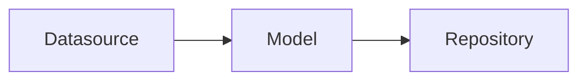

## @e22m4u/js-repository

Абстракция для работы с базами данных для Node.js

## Установка

```bash
npm install @e22m4u/js-repository
```

Опционально устанавливаем адаптер. Например, если используемой базой
является *MongoDB*, то для подключения к ней потребуется добавить
[пакет адаптера mongodb](https://www.npmjs.com/package/@e22m4u/js-repository-mongodb-adapter)
как отдельную зависимость.

```bash
npm install @e22m4u/js-repository-mongodb-adapter
```

Список доступных адаптеров:

| адаптер | описание                                                                                                                                        |
|---------|-------------------------------------------------------------------------------------------------------------------------------------------------|
| memory  | виртуальная база в памяти процесса (для разработки и тестирования)                                                                              |
| mongodb | MongoDB - система управления NoSQL базами данных (*[требует установки](https://www.npmjs.com/package/@e22m4u/js-repository-mongodb-adapter))* |

## Концепция

Модуль позволяет спроектировать систему связанных данных, доступ к которым
осуществляется посредством репозиториев. Каждый репозиторий имеет собственную
модель, которая описывает структуру определенной коллекции в базе,
а так же определяет связи к другим коллекциям.



## Использование

Определения источников и моделей хранятся в экземпляре класса `Schema`,
и первым шагом будет создание данного экземпляра.

```js
import {Schema} from '@e22m4u/js-repository';

const schema = new Schema();
```

Интерфейс экземпляра `Schema` содержит три основных метода:

- `defineDatasource(datasourceDef: object): this` - добавить источник
- `defineModel(modelDef: object): this` - добавить модель
- `getRepository(modelName: string): Repository` - получить репозиторий

#### Источник данных

Источник описывает способ подключения к базе, и используемый адаптер.
Если адаптер имеет настройки, то они передаются в объекте определения
источника методом `defineDatasource`, как это показано ниже.

```js
schema.defineDatasource({
  name: 'myMongo', // название нового источника данных
  adapter: 'mongodb', // название выбранного адаптера
  // настройки адаптера mongodb
  host: '127.0.0.1',
  port: 27017,
  database: 'data'
});
```

Параметры источника:

- `name: string` уникальное название
- `adapter: string` выбранный адаптер базы данных

При желании можно использовать встроенный адаптер `memory`, который хранит
данные в памяти процесса. У него нет специальных настроек, и он отлично
подходит для тестов и прототипирования.

```js
schema.defineDatasource({
  name: 'myMemory', // название источника
  adapter: 'memory', // выбранный адаптер
});
```

#### Модель данных

Когда источники определены, можно перейти на следующий уровень абстракции,
где описываются модели данных. Модель может определять как структуру
какого-либо объекта, так и являться отражением реальной коллекции базы.

Представьте себе коллекцию торговых точек, у каждой из которых имеются
координаты `lat` и `lng`. Мы можем заранее определить модель для
объекта координат методом `defineModel` и использовать ее в других
коллекциях.

```js
schema.defineModel({
  name: 'latLng', // название новой модели
  properties: { // поля модели
    lat: DataType.NUMBER, // поле широты
    lng: DataType.NUMBER, // поле долготы
  },
});
```

Параметры модели:

- `name: string` название новой модели (обязательно)
- `datasource: string` выбранный источник данных
- `properties: object` определения полей модели
- `relations: object` определения связей модели

Параметр `properties` принимает объект, ключи которого являются именами
полей, а значением тип поля или объект с дополнительными параметрами.

```js
schema.defineModel({
  name: 'latLng',
  properties: {
    lat: DataType.NUMBER, // краткое определение поля "lat"
    lng: { // определение поля "lng" с параметром "required"
      type: DataType.NUMBER,
      required: true, // исключает null и undefined
    },
  },
});
```

Типы данных:

- `DataType.ANY`
- `DataType.STRING`
- `DataType.NUMBER`
- `DataType.BOOLEAN`
- `DataType.ARRAY`
- `DataType.OBJECT`

Модель `latLng` всего лишь описывает структуру объекта координат, тогда
как торговая точка должна иметь реальную таблицу в базе. По аналогии с
предыдущим примером, добавим модель `place`, но дополнительно укажем
источник данных в параметре `datasource`

```js
schema.defineModel({
  name: 'place',
  datasource: 'myMemory', // выбранный источник данных
  properties: {
    name: DataType.STRING, // поле для названия торговой точки
    location: { // поле объекта координат
      type: DataType.OBJECT, // допускать только объекты
      model: 'latLng', // определение структуры объекта
    },
  },
});
```

В примере выше мы использовали модель `latLng` как структуру допустимого
значения поля `location`. Возможный документ данной коллекции может
выглядеть так:

```json
{
  "id": 1,
  "name": "Burger King at Avenue Mall",
  "location": {
    "lat": 32.412891,
    "lng": 34.7660061
  }
}
```

Стоит обратить внимание, что мы могли бы не объявлять параметр `properties`,
при этом теряя возможность проверки данных перед записью в базу.

```js
schema.defineModel({
  name: 'place',
  adapter: 'myMemory',
  // параметр "properties" не указан
});
```

Параметры поля:

- `type: string` тип допустимого значения (обязательно)
- `itemType: string` тип элемента массива (для `type: 'array'`)
- `model: string` модель объекта (для `type: 'object'`)
- `primaryKey: boolean` объявить поле первичным ключом
- `columnName: string` переопределение названия колонки
- `columnType: string` тип колонки (определяется адаптером)
- `required: boolean` объявить поле обязательным
- `default: any` значение по умолчанию

#### Репозиторий

В отличие от `latLng`, модель `place` имеет источник данных с названием
`myMemory`, который был объявлен ранее. Наличие источника позволяет получить
репозиторий по названию такой модели.

```js
const rep = schema.getRepository('place');
```

## Пример

Создаем модель `user`

```js
schema.defineModel({
  name: 'user', // название модели
  adapter: 'myMemory', // выбранный источник
  properties: { // поля модели
    name: 'string',
    age: 'number',
  },
});
```

Получаем репозиторий модели `user`

```js
const userRep = schema.getRepository('user');
```

Добавляем новую запись методом `create`

```js
const fedor = await userRep.create({
  name: 'Fedor',
  age: 24,
});

console.log(fedor);
// {
//   id: 1,
//   name: 'Fedor',
//   age: 24,
// }
```

Изменяем данные методом `patchById`

```js
const result = await userRep.patchById(
  fedor.id,
  {age: 30},
);

console.log(result);
// {
//   id: 1,
//   name: 'Fedor',
//   age: 30,
// }
```

Удаляем по идентификатору методом `deleteById`

```js
await userRep.deleteById(fedor.id); // true
```

## Репозиторий

Выполняет операции чтения и записи определенной коллекции.

Методы:

- `create(data, filter = undefined)`
- `replaceById(id, data, filter = undefined)`
- `replaceOrCreate(data, filter = undefined)`
- `patchById(id, data, filter = undefined)`
- `find(filter = undefined)`
- `findOne(filter = undefined)`
- `findById(id, filter = undefined)`
- `delete(where = undefined)`
- `deleteById(id)`
- `exists(id)`
- `count(where = undefined)`

Получение репозитория модели:

```js
import {Schema} from '@e22m4u/js-repository';

const schema = new Schema();
// создаем источник
schema.defineDatasource({name: 'myDatasource', adapter: 'memory'});
// создаем модель
schema.defineModel({name: 'myModel', datasource: 'myDatasource'});
// получаем репозиторий по названию модели
const repositorty = schema.getRepository('myModel');
```

Переопределение конструктора:

```js
import {Schema} from '@e22m4u/js-repository';
import {Repository} from '@e22m4u/js-repository';
import {RepositoryRegistry} from '@e22m4u/js-repository';

class MyRepository extends Repository {
  /*...*/
}

const schema = new Schema();
schema.get(RepositoryRegistry).setRepositoryCtor(MyRepository);
// теперь schema.getRepository(modelName) будет возвращать
// экземпляр класса MyRepository
```

### Filter

Большинство методов репозитория принимают объект `filter` для
фильтрации возвращаемого ответа. Описание параметров объекта:

- **where** *(условия выборки данных из базы)*  
  примеры:  
  `where: {foo: 'bar'}` поиск по значению поля `foo`  
  `where: {foo: {eq: 'bar'}}` оператор равенства `eq`  
  `where: {foo: {neq: 'bar'}}` оператор неравенства `neq`  
  `where: {foo: {gt: 5}}` оператор "больше" `gt`  
  `where: {foo: {lt: 10}}` оператор "меньше" `lt`  
  `where: {foo: {gte: 5}}` оператор "больше или равно" `gte`  
  `where: {foo: {lte: 10}}` оператор "меньше или равно" `lte`  
  `where: {foo: {inq: ['bar', 'baz']}}` равенство одного из значений `inq`  
  `where: {foo: {nin: ['bar', 'baz']}}` исключение значений массива `nin`  
  `where: {foo: {between: [5, 10]}}` оператор диапазона `between`  
  `where: {foo: {exists: true}}` оператор наличия значения `exists`  
  `where: {foo: {like: 'bar'}}` оператор поиска подстроки `like`  
  `where: {foo: {ilike: 'BaR'}}` регистронезависимая версия `ilike`  
  `where: {foo: {nlike: 'bar'}}` оператор исключения подстроки `nlike`  
  `where: {foo: {nilike: 'BaR'}}` регистронезависимая версия `nilike`  
  `where: {foo: {regexp: 'ba.+'}}` оператор регулярного выражения `regexp`  
  `where: {foo: {regexp: 'ba.+', flags: 'i'}}` флаги регулярного выражения


- **order** *(упорядочить записи по полю)*  
  примеры:  
  `order: 'foo'` порядок по полю `foo`  
  `order: 'foo ASC'` явное указание порядка  
  `order: 'foo DESC'` инвертировать порядок  
  `order: ['foo', 'bar ASC', 'baz DESC']` по нескольким полям


- **limit** *(не более N записей)*  
  примеры:  
  `limit: 0` не ограничивать  
  `limit: 14` не более 14-и


- **skip** *(пропуск первых N записей)*  
  примеры:  
  `skip: 0` выборка без пропуска  
  `skip: 10` пропустить 10 объектов выборки


- **include** *(включение связанных данных в результат)*  
  примеры:  
  `include: 'foo'` включение связи `foo`  
  `include: ['foo', 'bar']` включение `foo` и `bar`  
  `include: {foo: 'bar'}` включение вложенной связи `foo`

## Источник данных

Определяет настройки и способ подключения к базе.

Параметры:

- `name: string` название нового источника
- `adapter: string` выбранный адаптер базы данных

Пример:

```js
schema.defineDatasource({
  name: 'myDatasource',
  adapter: 'memory',
});
```

Адаптер может иметь параметры, которые передаются
при определении источника.

Пример:

```js
schema.defineDatasource({
  name: 'myDatasource',
  adapter: 'mongodb',
  // параметры адаптера:
  host: '127.0.0.1',
  port: 27017,
});
```

## Модель

Описывает набор полей и связей к другим моделям.

Параметры:

- `name: string` название новой модели
- `datasource: string` выбранный источник данных
- `properties: object` определения полей модели
- `relations: object` определения связей модели

Пример:

```js
schema.defineModel({
  name: 'myModel',
  datasource: 'myDatasource',
  properties: {...}, // см. ниже
  relations: {...}, // см. ниже
});
```

## Поля

Параметр `properties` описывает набор полей и их настройки.

Типы:

- `string`  
- `number`  
- `boolean`  
- `array`  
- `object`  
- `any`  

Пример:

```js
schema.defineModel({
  // ...
  properties: {
    prop1: 'string',
    prop2: 'number',
    prop3: 'boolean',
    prop4: 'array',
    prop5: 'object',
    prop6: 'any',
  },
});
```

Расширенные параметры:

- `type: string` тип хранимого значения
- `itemType: string` тип элемента массива (для `type: 'array'`)
- `model: string` модель объекта (для `type: 'object'`)
- `primaryKey: boolean` объявить поле первичным ключом 
- `columnName: string` переопределение названия колонки
- `columnType: string` тип колонки (определяется адаптером)
- `required: boolean` объявить поле обязательным
- `default: any` значение по умолчанию для `undefined`

Пример:

```js
schema.defineModel({
  // ...
  properties: {
    prop1: {
      type: 'string',
      primaryKey: true,
    },
    prop2: {
      type: 'boolean',
      required: true,
    },
    prop3: {
      type: 'number',
      default: 100,
    },
    prop3: {
      type: 'string',
      // фабричное значение
      default: () => new Date().toISOString(),
    },
    prop4: {
      type: 'array',
      itemType: 'string',
    },
    prop5: {
      type: 'object',
      model: 'objectModel',
    },
  },
});
```

## Связи

Параметр `relations` описывает набор связей к другим моделям.

Понятия:

- источник связи  
*- модель в которой определена данная связь*  
- целевая модель  
*- модель на которую ссылается источник связи*  

Типы:

- `belongsTo` - ссылка на целевую модель находится в источнике
- `hasOne` - ссылка на источник находится в целевой модели (one-to-one)
- `hasMany` - ссылка на источник находится в целевой модели (one-to-many)
- `referencesMany` - массив ссылок на целевую модель находится в источнике

Параметры:

- `type: string` тип связи
- `model: string` целевая модель
- `foreignKey: string` поле для идентификатора цели
- `polymorphic: boolean|string` объявить связь полиморфной*
- `discriminator: string` поле для названия целевой модели (для `polymorphic: true`)

*i. Полиморфный режим `belongsTo` позволяет динамически определять цель связи,
где имя целевой модели хранится в отдельном поле, рядом с `foreignKey`*

#### BelongsTo

Связь заказа к покупателю через поле `customerId`

```js
schema.defineModel({
  // ...
  relations: {
    // ...
    customer: {
      type: 'belongsTo',
      model: 'customer',
      foreignKey: 'customerId', // опционально
    },
  },
});
```

Полиморфная версия

```js
schema.defineModel({
  // ...
  relations: {
    // ...
    customer: {
      type: 'belongsTo',
      polymorphic: true,
      foreignKey: 'customerId', // опционально
      discriminator: 'customerType', // опционально
    },
  },
});
```

#### HasOne (one-to-one)

Связь покупателя к заказу, как обратная сторона `belongsTo`

```js
schema.defineModel({
  // ...
  relations: {
    // ...
    order: {
      type: 'hasOne',
      model: 'order',
      foreignKey: 'customerId', // опционально
    },
  },
});
```

Обратная сторона полиморфной версии `belongsTo`

```js
schema.defineModel({
  // ...
  relations: {
    // ...
    order: {
      type: 'hasOne',
      model: 'order',
      polymorphic: 'customer', // имя связи целевой модели
    },
  },
});
```

Явное указание `foreignKey` и `discriminator`

```js
schema.defineModel({
  // ...
  relations: {
    // ...
    order: {
      type: 'hasOne',
      model: 'order',
      polymorphic: true, // true вместо имени модели
      foreignKey: 'customerId', // поле целевой модели 
      discriminator: 'customerType', // поле целевой модели
    },
  },
});
```

#### HasMany (one-to-many)

Связь покупателя к заказам, как обратная сторона `belongsTo`

```js
schema.defineModel({
  // ...
  relations: {
    // ...
    orders: {
      type: 'hasMany',
      model: 'order',
      foreignKey: 'customerId', // опционально
    },
  },
});
```

Обратная сторона полиморфной версии `belongsTo`

```js
schema.defineModel({
  // ...
  relations: {
    // ...
    orders: {
      type: 'hasMany',
      model: 'order',
      polymorphic: 'customer', // имя связи целевой модели
    },
  },
});
```

Явное указание `foreignKey` и `discriminator`

```js
schema.defineModel({
  // ...
  relations: {
    // ...
    orders: {
      type: 'hasMany',
      model: 'order',
      polymorphic: true, // true вместо имени модели
      foreignKey: 'customerId', // поле целевой модели 
      discriminator: 'customerType', // поле целевой модели
    },
  },
});
```

#### ReferencesMany

Связь покупателя к заказам через поле `orderIds`

```js
schema.defineModel({
  // ...
  relations: {
    // ...
    orders: {
      type: 'referencesMany',
      model: 'order',
      foreignKey: 'orderIds', // опционально
    },
  },
});
```

## Тесты

```bash
npm run test
```

## Лицензия

MIT
