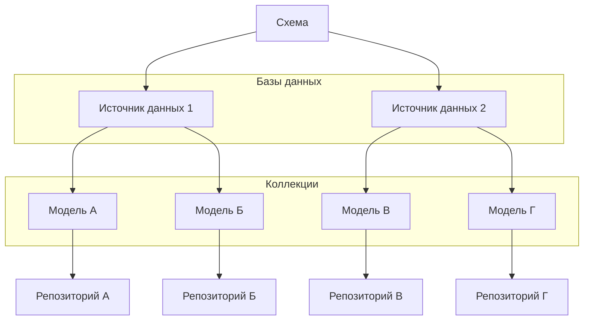

## @e22m4u/js-repository

Реализация паттерна «Репозиторий» для работы с базами данных в Node.js

- [Установка](#установка)
- [Импорт](#импорт)
- [Описание](#описание)
- [Пример](#пример)
- [Схема](#схема)
- [Источник данных](#источник-данных)
- [Модель](#модель)
- [Свойства](#свойства)
- [Валидаторы](#валидаторы)
  - [Глобальные валидаторы](#глобальные-валидаторы)
  - [Регистрация глобальных валидаторов](#регистрация-глобальных-валидаторов)
  - [Локальные валидаторы](#локальные-валидаторы)
- [Трансформеры](#трансформеры)
  - [Глобальные трансформеры](#глобальные-трансформеры)
  - [Регистрация глобальных трансформеров](#регистрация-глобальных-трансформеров)
  - [Локальные трансформеры](#локальные-трансформеры)
- [Пустые значения](#пустые-значения)
  - [Переопределение пустых значений](#переопределение-пустых-значений)
- [Репозиторий](#репозиторий)
- [Фильтрация](#фильтрация)
- [Связи](#связи)
- [Расширение](#расширение)
- [TypeScript](#typescript)
- [Тесты](#тесты)
- [Лицензия](#лицензия)

## Установка

```bash
npm install @e22m4u/js-repository
```

Опционально устанавливается нужный адаптер.

| адаптер   | описание                                                                                                                       |
|-----------|--------------------------------------------------------------------------------------------------------------------------------|
| `memory`  | Виртуальная база в памяти процесса (не требует установки)                                                                      |
| `mongodb` | MongoDB - система управления NoSQL базами (*[установка](https://www.npmjs.com/package/@e22m4u/js-repository-mongodb-adapter))* |

## Импорт

Модуль поддерживает ESM и CommonJS стандарты.

*ESM*

```js
import {DatabaseSchema} from '@e22m4u/js-repository';
```

*CommonJS*

```js
const {DatabaseSchema} = require('@e22m4u/js-repository');
```

## Описание

Модуль позволяет абстрагироваться от различных интерфейсов баз данных,
представляя их как именованные *источники данных*, подключаемые к *моделям*.
*Модель* же описывает таблицу базы, колонки которой являются свойствами
модели. Свойства модели могут иметь определенный *тип* допустимого значения,
набор *валидаторов* и *трансформеров*, через которые проходят данные перед
записью в базу. Кроме того, *модель* может определять классические связи
«один к одному», «один ко многим» и другие типы отношений между моделями.

Непосредственно чтение и запись данных производится с помощью *репозитория*,
который имеет каждая модель с объявленным *источником данных*. Репозиторий
может фильтровать запрашиваемые документы, выполнять валидацию свойств
согласно определению модели, и встраивать связанные данные в результат
выборки.

- *Источник данных* - определяет способ подключения к базе
- *Модель* - описывает структуру документа и связи к другим моделям
- *Репозиторий* - выполняет операции чтения и записи документов модели



## Пример

Объявление источника данных, модели и добавление нового документа в коллекцию.

```js
import {DataType} from '@e22m4u/js-repository';
import {DatabaseSchema} from '@e22m4u/js-repository';

// создание экземпляра DatabaseSchema
const dbs = new DatabaseSchema();

// объявление источника "myMemory"
dbs.defineDatasource({
  name: 'myMemory', // название нового источника
  adapter: 'memory', // выбранный адаптер
});

// объявление модели "country"
dbs.defineModel({
  name: 'country', // название новой модели
  datasource: 'myMemory', // выбранный источник
  properties: { // свойства модели
    name: DataType.STRING, // тип "string"
    population: DataType.NUMBER, // тип "number"
  },
})

// получение репозитория модели
const countryRep = dbs.getRepository('country');

// добавление нового документа в коллекцию
const country = await countryRep.create({
  name: 'Russia',
  population: 143400000,
});

// вывод нового документа
console.log(country);
// {
//   id: 1,
//   name: 'Russia',
//   population: 143400000,
// }
```

## Схема

Экземпляр класса `DatabaseSchema` хранит определения источников данных и моделей.

**Методы**

- `defineDatasource(datasourceDef: object): this` - добавить источник
- `defineModel(modelDef: object): this` - добавить модель
- `getRepository(modelName: string): Repository` - получить репозиторий

**Примеры**

Импорт класса и создание экземпляра схемы.

```js
import {DatabaseSchema} from '@e22m4u/js-repository';

const dbs = new DatabaseSchema();
```

Определение нового источника.

```js
dbs.defineDatasource({
  name: 'myMemory', // название нового источника
  adapter: 'memory', // выбранный адаптер
});
```

Определение новой модели.

```js
dbs.defineModel({
  name: 'product', // название новой модели
  datasource: 'myMemory', // выбранный источник
  properties: { // свойства модели
    name: DataType.STRING,
    weight: DataType.NUMBER,
  },
});
```

Получение репозитория по названию модели.

```js
const productRep = dbs.getRepository('product');
```

## Источник данных

Источник хранит название выбранного адаптера и его настройки. Определение
нового источника выполняется методом `defineDatasource` экземпляра
`DatabaseSchema`.

**Параметры**

- `name: string` уникальное название
- `adapter: string` выбранный адаптер
- параметры адаптера (если имеются)

**Примеры**

Определение нового источника.

```js
dbs.defineDatasource({
  name: 'myMemory', // название нового источника
  adapter: 'memory', // выбранный адаптер
});
```

Передача дополнительных параметров адаптера.

```js
dbs.defineDatasource({
  name: 'myMongodb',
  adapter: 'mongodb',
  // параметры адаптера "mongodb"
  host: '127.0.0.1',
  port: 27017,
  database: 'myDatabase',
});
```

## Модель

Описывает структуру документа коллекции и связи к другим моделям. Определение
новой модели выполняется методом `defineModel` экземпляра `DatabaseSchema`.

**Параметры**

- `name: string` название модели (обязательно)
- `base: string` название наследуемой модели
- `tableName: string` название коллекции в базе
- `datasource: string` выбранный источник данных
- `properties: object` определения свойств (см. [Свойства](#Свойства))
- `relations: object` определения связей (см. [Связи](#Связи))

**Примеры**

Определение модели со свойствами указанного типа.

```js
dbs.defineModel({
  name: 'user', // название новой модели
  properties: { // свойства модели
    name: DataType.STRING,
    age: DataType.NUMBER,
  },
});
```

## Свойства

Параметр `properties` находится в определении модели и принимает объект, ключи
которого являются свойствами этой модели, а значением тип свойства или объект
с дополнительными параметрами.

**Тип данных**

- `DataType.ANY` разрешено любое значение
- `DataType.STRING` только значение типа `string`
- `DataType.NUMBER` только значение типа `number`
- `DataType.BOOLEAN` только значение типа `boolean`
- `DataType.ARRAY` только значение типа `array`
- `DataType.OBJECT` только значение типа `object`

**Параметры**

- `type: string` тип допустимого значения (обязательно)
- `itemType: string` тип элемента массива (для `type: 'array'`)
- `model: string` модель объекта (для `type: 'object'`)
- `primaryKey: boolean` объявить свойство первичным ключом
- `columnName: string` переопределение названия колонки
- `columnType: string` тип колонки (определяется адаптером)
- `required: boolean` объявить свойство обязательным
- `default: any` значение по умолчанию
- `validate: string | Function | array | object` см. [Валидаторы](#Валидаторы)
- `unique: boolean | string` проверять значение на уникальность

**Параметр `unique`**

Если значением параметра `unique` является `true` или `'strict'`, то выполняется
строгая проверка на уникальность. В этом режиме [пустые значения](#Пустые-значения)
так же подлежат проверке, где `null` и `undefined` не могут повторяться более одного
раза.

Режим `'sparse'` проверяет только значения с полезной нагрузкой, исключая
[пустые значения](#Пустые-значения), список которых отличается в зависимости
от типа свойства. Например, для типа `string` пустым значением будет `undefined`,
`null` и `''` (пустая строка).

- `unique: true | 'strict'` строгая проверка на уникальность
- `unique: 'sparse'` исключить из проверки [пустые значения](#Пустые-значения)
- `unique: false | 'nonUnique'` не проверять на уникальность (по умолчанию)

В качестве значений параметра `unique` можно использовать предопределенные
константы как эквивалент строковых значений `strict`, `sparse` и `nonUnique`.

- `PropertyUniqueness.STRICT`
- `PropertyUniqueness.SPARSE`
- `PropertyUniqueness.NON_UNIQUE`

**Примеры**

Краткое определение свойств модели.

```js
dbs.defineModel({
  name: 'city',
  properties: { // свойства модели
    name: DataType.STRING, // тип свойства "string"
    population: DataType.NUMBER, // тип свойства "number"
  },
});
```

Расширенное определение свойств модели.

```js
dbs.defineModel({
  name: 'city',
  properties: { // свойства модели
    name: {
      type: DataType.STRING, // тип свойства "string" (обязательно)
      required: true, // исключение значений undefined и null
    },
    population: {
      type: DataType.NUMBER, // тип свойства "number" (обязательно)
      default: 0, // значение по умолчанию
    },
    code: {
      type: DataType.NUMBER, // тип свойства "number" (обязательно)
      unique: PropertyUniqueness.STRICT, // проверять уникальность
    },
  },
});
```

Фабричное значение по умолчанию. Возвращаемое значение функции будет
определено в момент записи документа.

```js
dbs.defineModel({
  name: 'article',
  properties: { // свойства модели
    tags: {
      type: DataType.ARRAY, // тип свойства "array" (обязательно)
      itemType: DataType.STRING, // тип элемента "string"
      default: () => [], // фабричное значение
    },
    createdAt: {
      type: DataType.STRING, // тип свойства "string" (обязательно)
      default: () => new Date().toISOString(), // фабричное значение
    },
  },
});
```

## Валидаторы

Валидаторы используются для проверки значения свойства перед записью в базу.
Проверка значения валидатором выполняется сразу после проверки типа, указанного
в определении свойства модели. [Пустые значения](#пустые-значения) пропускают
проверку валидаторами, так как не имеют полезной нагрузки.

### Глобальные валидаторы

Модуль поставляется с набором глобальных валидаторов:

- `regexp` проверка по регулярному выражению,  
  *параметр: `string | RegExp` - регулярное выражение;*

- `maxLength` максимальная длина строки или массива,  
  *параметр: `number` - максимальная длина;*

- `minLength` минимальная длина строки или массива,  
  *параметр: `number` - минимальная длина;*

Валидаторы указанные ниже находятся в разработке:

- `isLowerCase` проверка регистра (только прописные буквы);
- `isUpperCase` проверка регистра (только строчные буквы);
- `isEmail` проверка формата электронного адреса;

**Примеры**

Использование глобального валидатора.

```js
dbs.defineModel({
  name: 'user',
  properties: {
    email: {
      type: DataType.STRING,
      validate: 'isEmail',
    },
  },
});
```

Использование глобальных валидаторов в виде массива.

```js
dbs.defineModel({
  name: 'user',
  properties: {
    email: {
      type: DataType.STRING,
      validate: [
        'isEmail',
        'isLowerCase',
      ],
    },
  },
});
```

Использование глобальных валидаторов с передачей аргументов.

```js
dbs.defineModel({
  name: 'user',
  properties: {
    name: {
      type: DataType.STRING,
      validate: {
        minLength: 2,
        maxLength: 24,
        regexp: /^[a-zA-Z-']+$/,
      },
    },
  },
});
```

Глобальные валидаторы без параметров могут принимать любые аргументы.

```js
dbs.defineModel({
  name: 'user',
  properties: {
    email: {
      type: DataType.STRING,
      validate: {
        maxLength: 100,
        // так как валидатор "isEmail" не имеет параметров,
        // его определение допускает передачу любого значения
        // в качестве аргумента
        isEmail: true,
      },
    },
  },
});
```

### Регистрация глобальных валидаторов

Валидатором является функция, в которую передается значение соответствующего
поля перед записью в базу. Если во время проверки функция возвращает `false`,
то выбрасывается стандартная ошибка. Подмена стандартной ошибки возможна
с помощью выброса пользовательской ошибки непосредственно внутри проверяющей
функции.

Регистрация глобального валидатора выполняется методом `addValidator` сервиса
`PropertyValidatorRegistry`, который принимает название валидатора и функцию
для проверки значения.

**Примеры**

Регистрация глобального валидатора для проверки формата UUID.

```js
import {createError} from 'http-errors';
import {format} from '@e22m4u/js-format';
import {Errorf} from '@e22m4u/js-format';
import {PropertyValidatorRegistry} from '@e22m4u/js-repository';

// получение экземпляра сервиса
const pvr = dbs.get(PropertyValidatorRegistry);

// регулярные выражения для разных версий UUID
const uuidRegex = {
  any: /^[0-9a-f]{8}-[0-9a-f]{4}-[0-9a-f]{4}-[0-9a-f]{4}-[0-9a-f]{12}$/i,
  v4: /^[0-9a-f]{8}-[0-9a-f]{4}-4[0-9a-f]{3}-[89ab][0-9a-f]{3}-[0-9a-f]{12}$/i,
};

// регистрация глобального валидатора "isUuid",
// принимающего объект настроек со свойством "version"
pvr.addValidator('isUuid', (value, options, context) => {
  // value   - проверяемое значение;
  // options - параметры валидатора;
  // context - информация о проверяемом свойстве;
  console.log(options);
  // {
  //   version: 'v4'
  // }
  console.log(context);
  // {
  //   validatorName: 'isUuid',
  //   modelName: 'device',
  //   propName: 'deviceId'
  // }

  // пустые значения не передаются в валидаторы
  // (условие ниже никогда не сработает)
  if (typeof value !== 'string') return false;
  // поиск регулярного выражения для указанной
  // версии UUID (из параметров валидатора)
  const version = options?.version || 'any';
  const regex = uuidRegex[version];
  // если регулярное выражение не найдено,
  // то выбрасывается внутренняя ошибка
  if (!regex)
    throw new Errorf(
      'Invalid UUID version %v specified for validator.',
      version,
    );
  // при неудачной проверке выбрасывается
  // ошибка 400 BadRequest
  if (!regex.test(value)) {
    const versionString = version !== 'any' ? ` (version ${version})` : '';
    throw createError(400, format(
      'The property %v of the model %v must be a valid UUID%s.',
      context.propName,
      context.modelName,
      versionString,
    ));
  }
  // при успешной проверке возвращается true,
  // в противном случае выбрасывается стандартная
  // ошибка проверки
  return true;
});
```

Использование глобального валидатора в определении свойства.

```js
// определение модели "device"
dbs.defineModel({
  name: 'device',
  properties: {
    deviceId: {
      type: DataType.STRING,
      required: true,
      validate: {
        // значение {version: 'v4'} будет передаваться
        // вторым аргументом в функцию-валидатор
        isUuid: {version: 'v4'},
      },
    },
  },
});
```

### Локальные валидаторы

Функция-валидатор может быть передана непосредственно в определении свойства
без предварительной регистрации. Для этого достаточно передать функцию
в параметр `validate` в качестве значения или элемента массива наряду
с другими валидаторами.

**Примеры**

Использование локального валидатора для проверки сложности пароля.

```js
// валидатор `passwordStrength` проверяет сложность пароля
function passwordStrength(value, options, context) {
  // value   - проверяемое значение;
  // options - не используется;
  // context - информация о свойстве;
  console.log(context);
  // {
  //   validatorName: 'passwordStrength',
  //   modelName: 'user',
  //   propName: 'password'
  // }
  const errors = [];
  if (value.length < 8)
    errors.push('must be at least 8 characters long');
  if (!/\d/.test(value))
    errors.push('must contain at least one number');
  if (!/[a-zA-Z]/.test(value))
    errors.push('must contain at least one letter');
  // если одно из условий сработало,
  // то выбрасывается ошибка
  if (errors.length > 0)
    throw createError(400, format(
      'Value of the property %v of the model %v %s.',
      context.propName,
      context.modelName,
      errors.join(', '),
    ));
  // при успешной проверке возвращается true,
  // в противном случае выбрасывается стандартная
  // ошибка проверки
  return true;
}

// определение модели "user"
dbs.defineModel({
  name: 'user',
  properties: {
    password: {
      type: DataType.STRING,
      required: true,
      validate: passwordStrength, // <=
      // или
      // validate: [passwordStrength, ...]
    },
  },
});
```

Использование анонимной функции-валидатора для проверки слага.

```js
// определение модели "article"
dbs.defineModel({
  name: 'article',
  properties: {
    slug: {
      type: DataType.STRING,
      validate: (value) => {
        const re = /^[a-z0-9]+(-[a-z0-9]+)*$/;
        return re.test(value);
      },
    },
  },
});
```

## Трансформеры

Трансформеры используются для модификации значения свойства перед проверкой
типа и передачей данных в базу. Трансформеры позволяют автоматически очищать
или приводить данные к нужному формату. [Пустые значения](#Пустые-значения)
не передаются в трансформеры, так как не имеют полезной нагрузки.

### Глобальные трансформеры

Модуль поставляется с набором глобальных трансформеров:

- `trim` удаление пробельных символов с начала и конца строки;
- `toUpperCase` перевод строки в верхний регистр;
- `toLowerCase` перевод строки в нижний регистр;

Трансформеры указанные ниже находятся в разработке:

- `cut` усечение строки или массива до указанной длины,  
  *параметр: `number` - максимальная длина;*

- `truncate` усечение строки с добавлением троеточия,  
  *параметр: `number` - максимальная длина;*

- `capitalize` перевод первой буквы каждого слова в верхний регистр,  
  *параметр: `{firstWordOnly?: boolean}`;*

**Примеры**

Использование глобального трансформера.

```js
dbs.defineModel({
  name: 'user',
  properties: {
    username: {
      type: DataType.STRING,
      transform: 'toLowerCase',
    },
  },
});
```

Использование глобальных трансформеров в виде массива.

```js
dbs.defineModel({
  name: 'user',
  properties: {
    firstName: {
      type: DataType.STRING,
      transform: [
        'trim',
        'capitalize',
      ],
    },
  },
});
```

Использование глобальных трансформеров с передачей аргументов.

```js
dbs.defineModel({
  name: 'article',
  properties: {
    annotation: {
      type: DataType.STRING,
      transform: {
        truncate: 200,
        capitalize: {firstWordOnly: true},
      },
    },
  },
});
```

Глобальные трансформеры без параметров могут принимать любые аргументы.

```js
dbs.defineModel({
  name: 'user',
  properties: {
    firstName: {
      type: DataType.STRING,
      transform: {
        cut: 60,
        // так как трансформер "trim" не имеет параметров,
        // его определение допускает передачу любого значения
        // в качестве аргумента
        trim: true,
      },
    },
  },
});
```

### Регистрация глобальных трансформеров

Трансформером является функция, которая принимает значение свойства и возвращает
новое значение. Функция может быть как синхронной, так и асинхронной (возвращать
`Promise`).

Регистрация глобального трансформера выполняется методом `addTransformer`
сервиса `PropertyTransformerRegistry`, который принимает название трансформера
и саму функцию.

**Примеры**

Регистрация глобального трансформера для удаления HTML-тегов.

```js
import {PropertyTransformerRegistry} from '@e22m4u/js-repository';

// получение экземпляра сервиса
const ptr = dbs.get(PropertyTransformerRegistry);

// регистрация глобального трансформера "stripTags"
ptr.addTransformer('stripTags', (value, options, context) => {
  // value   - трансформируемое значение;
  // options - настройки трансформера (если переданы);
  // context - информация о свойстве;
  console.log(context);
  // {
  //   transformerName: 'stripTags',
  //   modelName: 'comment',
  //   propName: 'text'
  // }
  
  if (typeof value !== 'string')
    return value; // возвращаем как есть, если не строка
  
  return value.replace(/<[^>]*>?/gm, '');
});
```

Использование глобального трансформера в определении модели.

```js
dbs.defineModel({
  name: 'comment',
  properties: {
    text: {
      type: DataType.STRING,
      transform: 'stripTags',
    },
  },
});
```

### Локальные трансформеры

Функция-трансформер может быть передана непосредственно в определении свойства без предварительной регистрации. Для этого достаточно передать функцию в параметр `transform` в качестве значения или элемента массива.

**Примеры**

Использование локального трансформера для нормализации имен.

```js
// функция для нормализации имени
function normalizeName(value, options, context) {
  // value   - трансформируемое значение
  // options - не используется
  // context - информация о свойстве
  if (!value || typeof value !== 'string') return value;
  return value
    .trim()        // удаление пробелов в начале и конце
    .toLowerCase() // перевод к нижнему регистру
    .split(' ')    // разделение на слова
    // перевод к верхнему регистру первой буквы каждого слова
    .map(word => word.charAt(0).toUpperCase() + word.slice(1))
    .join(' ');    // сборка массива в строку
}

// определение модели "user"
dbs.defineModel({
  name: 'user',
  properties: {
    firstName: {
      type: DataType.STRING,
      transform: normalizeName, // <=
    },
    lastName: {
      type: DataType.STRING,
      transform: normalizeName, // <=
    },
  },
});
```

Использование локального асинхронного трансформера для хэширования пароля.

```js
import * as bcrypt from 'bcrypt';

// асинхронная функция для хеширования значения
async function hash(value, options, context) {
  // value   - трансформируемое значение
  // options - не используется
  // context - информация о свойстве
  console.log(context);
  // {
  //   transformerName: 'hash',
  //   modelName: 'user',
  //   propName: 'password'
  // }
  const saltRounds = 10;
  return bcrypt.hash(value, saltRounds);
}

// определение модели "user"
dbs.defineModel({
  name: 'user',
  properties: {
    password: {
      type: DataType.STRING,
      transform: hash, // <=
      // или
      // transform: [hash, ...]
    },
  },
});
```

Использование анонимной функции-трансформера для коррекции слага.

```js
dbs.defineModel({
  name: 'article',
  properties: {
    slug: {
      type: DataType.STRING,
      transform: (value) => {
        if (typeof value !== 'string') return value;
        return value.toLowerCase().replace(/\s+/g, '-');
      },
    },
  },
});
```


## Пустые значения

Разные типы свойств имеют свои наборы пустых значений. Эти наборы
используются для определения наличия полезной нагрузки в значении
свойства. Например, параметр `default` в определении свойства
устанавливает значение по умолчанию, только если входящее значение
является пустым. Параметр `required` исключает пустые значения
выбрасывая ошибку. А параметр `unique` в режиме `sparse` наоборот
допускает дублирование пустых значений уникального свойства.

| тип         | пустые значения           |
|-------------|---------------------------|
| `'any'`     | `undefined`, `null`       |
| `'string'`  | `undefined`, `null`, `''` |
| `'number'`  | `undefined`, `null`, `0`  |
| `'boolean'` | `undefined`, `null`       |
| `'array'`   | `undefined`, `null`, `[]` |
| `'object'`  | `undefined`, `null`, `{}` |

### Переопределение пустых значений

Набор пустых значений для любого типа данных можно переопределить. Управление
этими наборами осуществляется через специальный сервис, который предоставляет
модуль
[@e22m4u/js-empty-values](https://www.npmjs.com/package/@e22m4u/js-empty-values)
(не требует установки).

**EmptyValuesService**

Для переопределения пустых значений необходимо получить экземпляр данного
сервиса из контейнера схемы и вызвать метод, который принимает тип данных
и массив новых значений.

Интерфейс:

```ts
class EmptyValuesService {
  /**
   * Установить пустые значения
   * для определенного типа данных.
   * 
   * @param dataType    Тип данных.
   * @param emptyValues Массив новых пустых значений.
   */
  setEmptyValuesOf(
    dataType: DataType,
    emptyValues: unknown[],
  ): this;
}
```

**Пример**

По умолчанию, для числовых свойств значение `0` считается пустым. Следующий
пример демонстрирует, как изменить это поведение, оставив в качестве пустых
значений только `undefined` и `null`.

```js
import {DataType} from '@e22m4u/js-repository';
import {DatabaseSchema} from '@e22m4u/js-repository';
import {EmptyValuesService} from '@e22m4u/js-empty-values';

const dbs = new DatabaseSchema();

// получение сервиса для работы с пустыми значениями
const emptyValuesService = dbs.getService(EmptyValuesService);

// переопределение пустых значений для типа DataType.NUMBER
emptyValuesService.setEmptyValuesOf(DataType.NUMBER, [undefined, null]);
```

После этого, значение `0` для свойств типа `DataType.NUMBER` больше не будет
считаться пустым и будет проходить проверки валидаторами, а также не будет
заменяться значением по умолчанию.

## Репозиторий

Выполняет операции чтения и записи документов определенной модели.
Получить репозиторий можно методом `getRepository` экземпляра `DatabaseSchema`.

**Методы**

- `create(data, filter = undefined)` добавить новый документ
- `replaceById(id, data, filter = undefined)` заменить весь документ
- `replaceOrCreate(data, filter = undefined)` заменить или создать новый
- `patchById(id, data, filter = undefined)` частично обновить документ
- `patch(data, where = undefined)` обновить все документы или по условию
- `find(filter = undefined)` найти все документы или по условию
- `findOne(filter = undefined)` найти первый документ или по условию
- `findById(id, filter = undefined)` найти документ по идентификатору
- `delete(where = undefined)` удалить все документы или по условию
- `deleteById(id)` удалить документ по идентификатору
- `exists(id)` проверить существование по идентификатору
- `count(where = undefined)` подсчет всех документов или по условию

**Аргументы**

- `id: number|string` идентификатор (первичный ключ)
- `data: object` объект отражающий состав документа
- `where: object` параметры выборки (см. [Фильтрация](#Фильтрация))
- `filter: object` параметры возвращаемого результата (см. [Фильтрация](#Фильтрация))

**Примеры**

Получение репозитория по названию модели.

```js
const countryRep = dbs.getRepository('country');
```

Добавление нового документа в коллекцию.

```js
const res = await countryRep.create({
  name: 'Russia',
  population: 143400000,
});

console.log(res);
// {
//   "id": 1,
//   "name": "Russia",
//   "population": 143400000,
// }
```

Поиск документа по идентификатору.

```js
const res = await countryRep.findById(1);

console.log(res);
// {
//   "id": 1,
//   "name": "Russia",
//   "population": 143400000,
// }
```

Удаление документа по идентификатору.

```js
const res = await countryRep.deleteById(1);

console.log(res); // true
```

## Фильтрация

Некоторые методы репозитория принимают объект настроек влияющий
на возвращаемый результат. Максимально широкий набор таких настроек
имеет первый параметр метода `find`, где ожидается объект содержащий
набор опций указанных ниже.

- `where: object` объект выборки
- `order: string[]` указание порядка
- `limit: number` ограничение количества документов
- `skip: number` пропуск документов
- `fields: string[]` выбор необходимых свойств модели
- `include: object` включение связанных данных в результат

### where

Параметр принимает объект с условиями выборки и поддерживает широкий
набор операторов сравнения.

`{foo: 'bar'}` поиск по значению свойства `foo`  
`{foo: {eq: 'bar'}}` оператор равенства `eq`  
`{foo: {neq: 'bar'}}` оператор неравенства `neq`  
`{foo: {gt: 5}}` оператор "больше" `gt`  
`{foo: {lt: 10}}` оператор "меньше" `lt`  
`{foo: {gte: 5}}` оператор "больше или равно" `gte`  
`{foo: {lte: 10}}` оператор "меньше или равно" `lte`  
`{foo: {inq: ['bar', 'baz']}}` равенство одного из значений `inq`  
`{foo: {nin: ['bar', 'baz']}}` исключение значений массива `nin`  
`{foo: {between: [5, 10]}}` оператор диапазона `between`  
`{foo: {exists: true}}` оператор наличия значения `exists`  
`{foo: {like: 'bar'}}` оператор поиска подстроки `like`  
`{foo: {ilike: 'BaR'}}` регистронезависимая версия `ilike`  
`{foo: {nlike: 'bar'}}` оператор исключения подстроки `nlike`  
`{foo: {nilike: 'BaR'}}` регистронезависимая версия `nilike`  
`{foo: {regexp: 'ba.+'}}` оператор регулярного выражения `regexp`  
`{foo: {regexp: 'ba.+', flags: 'i'}}` флаги регулярного выражения

*i. Условия можно объединять операторами `and`, `or` и `nor`.*

**Примеры**

Применение условий выборки при подсчете документов.

```js
const res = await rep.count({
  authorId: 251,
  publishedAt: {
    lte: '2023-12-02T14:00:00.000Z',
  },
});
```

Применение оператора `or` при удалении документов.

```js
const res = await rep.delete({
  or: [
    {draft: true},
    {title: {like: 'draft'}},
  ],
});
```

### order

Параметр упорядочивает выборку по указанным свойствам модели. Обратное
направление порядка можно задать постфиксом `DESC` в названии свойства.

**Примеры**

Упорядочить по полю `createdAt`

```js
const res = await rep.find({
  order: 'createdAt',
});
```

Упорядочить по полю `createdAt` в обратном порядке.

```js
const res = await rep.find({
  order: 'createdAt DESC',
});
```

Упорядочить по нескольким свойствам в разных направлениях.

```js
const res = await rep.find({
  order: [
    'title',
    'price ASC',
    'featured DESC',
  ],
});
```

*i. Направление порядка `ASC` указывать необязательно.*

### include

Параметр включает связанные документы в результат вызываемого метода.
Названия включаемых связей должны быть определены в текущей модели.
(см. [Связи](#Связи))

**Примеры**

Включение связи по названию.

```js
const res = await rep.find({
  include: 'city',
});
```

Включение вложенных связей.

```js
const res = await rep.find({
  include: {
    city: 'country',
  },
});
```

Включение нескольких связей массивом.

```js
const res = await rep.find({
  include: [
    'city',
    'address',
    'employees'
  ],
});
```

Использование фильтрации включаемых документов.

```js
const res = await rep.find({
  include: {
    relation: 'employees', // название связи
    scope: { // фильтрация документов "employees"
      where: {hidden: false}, // условия выборки
      order: 'id', // порядок документов
      limit: 10, // ограничение количества
      skip: 5, // пропуск документов
      fields: ['name', 'surname'], // только указанные поля
      include: 'city', // включение связей для "employees"
    },
  },
});
```

## Связи

Связи позволяют описывать отношения между моделями, что дает возможность
автоматически встраивать связанные данные с помощью опции `include`
в методах репозитория. Ниже приводится пример автоматического разрешения
связи при использовании метода `findById`.

```js
// запрос документа коллекции "users",
// включая связанные данные (role и city)
const user = await userRep.findById(1, {
  include: ['role', 'city'],
});

console.log(user);
// {
//   id: 1,
//   name: 'John Doe',
//   roleId: 3,
//   role: {
//     id: 3,
//     name: 'Manager'
//   },
//   cityId: 24,
//   city: {
//     id: 24,
//     name: 'Moscow'
//   }
// }
```

### Определение связи

Свойство `relations` в определении модели принимает объект, ключи которого
являются названиями связей, а значения их параметрами. В дальнейшем название
связи можно будет использовать в опции `include` методах репозитория.

```js
import {DataType} from '@e22m4u/js-repository';
import {RelationType} from '@e22m4u/js-repository';

dbs.defineModel({
  name: 'user',
  datasource: 'memory',
  properties: {
    name: DataType.STRING,
  },
  relations: {
    // связь role -> параметры
    role: {
      type: RelationType.BELONGS_TO,
      model: 'role',
    },
    // связь city -> параметры
    city: {
      type: RelationType.BELONGS_TO,
      model: 'city',
    },
  },
});
```

**Основные параметры**

- `type: string` тип связи (обязательно);
- `model: string` название целевой модели (обязательно для некоторых типов);
- `foreignKey: string` свойство текущей модели для идентификатора цели;

*i. Для типов Belongs To и References Many значение параметра `foreignKey`
можно опустить, так как генерируется автоматически по названию связи.*

**Полиморфный режим**

- `polymorphic: boolean|string` объявление полиморфной связи;
- `discriminator: string` свойство текущей модели для названия цели;

*i. Полиморфный режим позволяет динамически определять целевую модель
по ее названию, которое хранит документ в свойстве-дискриминаторе.*

**Типы связи**

- `belongsTo` - текущая модель ссылается на целевую по идентификатору;
- `hasOne` - обратная сторона `belongsTo` по принципу "один к одному";
- `hasMany` - обратная сторона `belongsTo` по принципу "один ко многим";
- `referencesMany` - модель ссылается через массив идентификаторов;

Параметр `type` в определении связи принимает строку с названием типа. Чтобы исключить опечатку, рекомендуется использовать константы объекта `RelationType`
указанные ниже.

- `RelationType.BELONGS_TO`
- `RelationType.HAS_ONE`
- `RelationType.HAS_MANY`
- `RelationType.REFERENCES_MANY`

**Примеры**

Объявление связи `belongsTo`.

```js
dbs.defineModel({
  name: 'user',
  relations: {
    role: { // название связи
      type: RelationType.BELONGS_TO, // текущая модель ссылается на целевую
      model: 'role', // название целевой модели
      foreignKey: 'roleId', // внешний ключ (необязательно)
      // если "foreignKey" не указан, то свойство внешнего
      // ключа формируется согласно названию связи
      // с добавлением постфикса "Id"
    },
  },
});
```

Объявление связи `hasMany`.

```js
dbs.defineModel({
  name: 'role',
  relations: {
    users: { // название связи
      type: RelationType.HAS_MANY, // целевая модель ссылается на текущую
      model: 'user', // название целевой модели
      foreignKey: 'roleId', // внешний ключ из целевой модели на текущую
    },
  },
});
```

Объявление связи `referencesMany`.

```js
dbs.defineModel({
  name: 'article',
  relations: {
    categories: { // название связи
      type: RelationType.REFERENCES_MANY, // связь через массив идентификаторов
      model: 'category', // название целевой модели
      foreignKey: 'categoryIds', // внешний ключ (необязательно)
      // если "foreignKey" не указан, то свойство внешнего
      // ключа формируется согласно названию связи
      // с добавлением постфикса "Ids"
    },
  },
});
```

Полиморфная версия `belongsTo`.

```js
dbs.defineModel({
  name: 'file',
  relations: {
    reference: { // название связи
      type: RelationType.BELONGS_TO, // текущая модель ссылается на целевую
      // полиморфный режим позволяет хранить название целевой модели
      // в свойстве-дискриминаторе, которое формируется согласно
      // названию связи с постфиксом "Type", и в данном случае
      // название целевой модели хранит "referenceType",
      // а идентификатор документа "referenceId"
      polymorphic: true,
    },
  },
});
```

Полиморфная версия `belongsTo` с указанием свойств.

```js
dbs.defineModel({
  name: 'file',
  relations: {
    reference: { // название связи
      type: RelationType.BELONGS_TO, // текущая модель ссылается на целевую
      polymorphic: true, // название целевой модели хранит дискриминатор
      foreignKey: 'referenceId', // свойство для идентификатора цели
      discriminator: 'referenceType', // свойство для названия целевой модели
    },
  },
});
```

Полиморфная версия `hasMany` с указанием названия связи целевой модели.

```js
dbs.defineModel({
  name: 'letter',
  relations: {
    attachments: { // название связи
      type: RelationType.HAS_MANY, // целевая модель ссылается на текущую
      model: 'file', // название целевой модели
      polymorphic: 'reference', // название полиморфной связи целевой модели
    },
  },
});
```

Полиморфная версия `hasMany` с указанием свойств целевой модели.

```js
dbs.defineModel({
  name: 'letter',
  relations: {
    attachments: { // название связи
      type: RelationType.HAS_MANY, // целевая модель ссылается на текущую
      model: 'file', // название целевой модели
      polymorphic: true, // название текущей модели находится в дискриминаторе
      foreignKey: 'referenceId', // свойство целевой модели для идентификатора
      discriminator: 'referenceType', // свойство целевой модели для названия текущей
    },
  },
});
```

## Расширение

Метод `getRepository` экземпляра `DatabaseSchema` проверяет наличие
существующего  репозитория для указанной модели и возвращает его.
В противном случае создается новый экземпляр, который будет сохранен
для последующих обращений к методу.

```js
import {Repository} from '@e22m4u/js-repository';
import {DatabaseSchema} from '@e22m4u/js-repository';

// const dbs = new DatabaseSchema();
// dbs.defineDatasource ...
// dbs.defineModel ...

const rep1 = dbs.getRepository('model');
const rep2 = dbs.getRepository('model');
console.log(rep1 === rep2); // true
```

Подмена стандартного конструктора репозитория выполняется методом
`setRepositoryCtor` сервиса `RepositoryRegistry`, который находится
в сервис-контейнере экземпляра `DatabaseSchema`. После чего все новые
репозитории будут создаваться указанным конструктором вместо стандартного.

```js
import {Repository} from '@e22m4u/js-repository';
import {DatabaseSchema} from '@e22m4u/js-repository';
import {RepositoryRegistry} from '@e22m4u/js-repository';

class MyRepository extends Repository {
  /*...*/
}

// const dbs = new DatabaseSchema();
// dbs.defineDatasource ...
// dbs.defineModel ...

dbs.get(RepositoryRegistry).setRepositoryCtor(MyRepository);
const rep = dbs.getRepository('model');
console.log(rep instanceof MyRepository); // true
```

*i. Так как экземпляры репозитория кэшируется, то замену конструктора
следует выполнять до обращения к методу `getRepository`.*

## TypeScript

Получение типизированного репозитория с указанием интерфейса модели.

```ts
import {DataType} from '@e22m4u/js-repository';
import {RelationType} from '@e22m4u/js-repository';
import {DatabaseSchema} from '@e22m4u/js-repository';

// const dbs = new DatabaseSchema();
// dbs.defineDatasource ...
// dbs.defineModel ...

// определение модели "city"
dbs.defineModel({
  name: 'city',
  datasource: 'myDatasource',
  properties: {
    name: DataType.STRING,
    timeZone: DataType.STRING,
  },
  relations: {
    country: {
      type: RelationType.BELONGS_TO,
      model: 'country',
    },
  },
});

// определение интерфейса "city"
interface City {
  id: number;
  name?: string;
  timeZone?: string;
  countryId?: number;
  country?: Country;
}

// получаем репозиторий по названию модели
// указывая ее тип и тип идентификатора
const cityRep = dbs.getRepository<City, number>('city');
```

## Тесты

```bash
npm run test
```

## Лицензия

MIT
