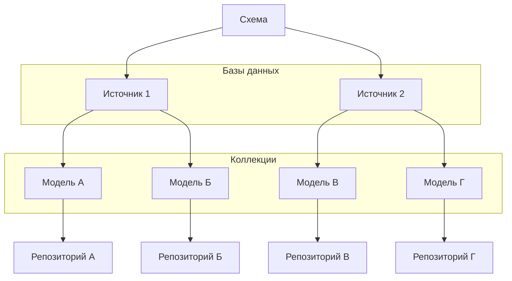

## @e22m4u/js-repository

Модуль для работы с базами данных для Node.js

## Установка

```bash
npm install @e22m4u/js-repository
```

Опционально устанавливаем адаптер:

|           | описание                                                                                                                       |
|-----------|--------------------------------------------------------------------------------------------------------------------------------|
| `memory`  | виртуальная база в памяти процесса (не требует установки)                                                                      |
| `mongodb` | MongoDB - система управления NoSQL базами (*[установка](https://www.npmjs.com/package/@e22m4u/js-repository-mongodb-adapter))* |

## Введение

Модуль позволяет объединить несколько баз данных в единую абстракцию «Схема».
Являясь экземпляром класса `Schema`, абстракция предоставляет методы для
определения «Источника данных» и «Модели». Источник заботится о подключении
к базе, а модель описывает структуру документа коллекции и связи к другим
моделям.

Непосредственно чтение и запись производится с помощью «Репозитория», который
можно получить для каждой модели, если она имеет источник данных.



## Тесты

```bash
npm run test
```

## Лицензия

MIT
