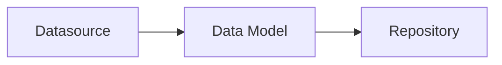

## @e22m4u/js-repository

Абстракция для работы с базами данных для Node.js

## Установка

```bash
npm install @e22m4u/js-repository
```

Опционально устанавливаем адаптер. Например, если используется
*MongoDB*, то для подключения потребуется установить
[адаптер mongodb](https://www.npmjs.com/package/@e22m4u/js-repository-mongodb-adapter)
как отдельную зависимость.

```bash
npm install @e22m4u/js-repository-mongodb-adapter
```

**Список доступных адаптеров:**

| адаптер   | описание                                                                                                                                        |
|-----------|-------------------------------------------------------------------------------------------------------------------------------------------------|
| `memory`  | виртуальная база в памяти процесса (для разработки и тестирования)                                                                              |
| `mongodb` | MongoDB - система управления NoSQL базами (*[требует установки](https://www.npmjs.com/package/@e22m4u/js-repository-mongodb-adapter))* |

## Концепция

Модуль позволяет спроектировать систему связанных данных, доступ к которым
осуществляется посредством репозиториев. Каждый репозиторий имеет собственную
модель данных, которая описывает структуру определенной коллекции в базе,
а так же определяет связи к другим коллекциям.



## Использование

Определения источников и моделей хранятся в экземпляре класса `Schema`,
и первым шагом будет создание данного экземпляра.

```js
import {Schema} from '@e22m4u/js-repository';

const schema = new Schema();
```

Интерфейс `Schema` содержит три основных метода:

- `defineDatasource(datasourceDef: object): this` - добавить источник
- `defineModel(modelDef: object): this` - добавить модель
- `getRepository(modelName: string): Repository` - получить репозиторий

### Источник данных

Источник описывает способ подключения к базе и используемый адаптер.
Если адаптер имеет настройки, то они передаются вместе с объектом
определения источника методом `defineDatasource`, как это показано
ниже.

```js
schema.defineDatasource({
  name: 'myMongo', // название нового источника
  adapter: 'mongodb', // название выбранного адаптера
  // настройки адаптера mongodb
  host: '127.0.0.1',
  port: 27017,
  database: 'data'
});
```

**Параметры источника:**

- `name: string` уникальное название
- `adapter: string` выбранный адаптер

При желании можно использовать встроенный адаптер `memory`, который хранит
данные в памяти процесса. У него нет специальных настроек, и он отлично
подходит для тестов и прототипирования.

```js
schema.defineDatasource({
  name: 'myMemory', // название источника
  adapter: 'memory', // выбранный адаптер
});
```

### Модель данных

Когда источники определены, можно перейти к описанию моделей данных.
Модель может определять как структуру какого-либо объекта,
так и являться отражением реальной коллекции базы.

Представьте себе коллекцию торговых точек, у каждой из которых имеются
координаты `lat` и `lng`. Мы можем заранее определить модель для
объекта координат методом `defineModel` и использовать ее в других
коллекциях.

```js
schema.defineModel({
  name: 'latLng', // название новой модели
  properties: { // поля модели
    lat: DataType.NUMBER, // поле широты
    lng: DataType.NUMBER, // поле долготы
  },
});
```

**Параметры модели:**

- `name: string` уникальное название (обязательно)
- `datasource: string` выбранный источник данных
- `properties: object` определения полей модели
- `relations: object` определения связей модели

Параметр `properties` принимает объект, ключи которого являются именами
полей, а значением тип поля или объект с дополнительными параметрами.

```js
schema.defineModel({
  name: 'latLng',
  properties: {
    lat: DataType.NUMBER, // краткое определение поля "lat"
    lng: { // расширенное определение поля "lng"
      type: DataType.NUMBER, // тип допустимого значения
      required: true, // исключает null и undefined
    },
  },
});
```

**Типы данных:**

- `DataType.ANY`
- `DataType.STRING`
- `DataType.NUMBER`
- `DataType.BOOLEAN`
- `DataType.ARRAY`
- `DataType.OBJECT`

Модель `latLng` всего лишь описывает структуру объекта координат, тогда
как торговая точка должна иметь реальную таблицу в базе. По аналогии с
предыдущим примером, добавим модель `place`, но дополнительно укажем
источник данных в параметре `datasource`

```js
schema.defineModel({
  name: 'place',
  datasource: 'myMemory', // выбранный источник данных
  properties: {
    name: DataType.STRING, // поле для названия торговой точки
    location: { // поле объекта координат
      type: DataType.OBJECT, // допускать только объекты
      model: 'latLng', // определение структуры объекта
    },
  },
});
```

В примере выше мы использовали модель `latLng` как структуру допустимого
значения поля `location`. Возможный документ данной коллекции может
выглядеть так:

```json
{
  "id": 1,
  "name": "Burger King",
  "location": {
    "lat": 32.412891,
    "lng": 34.7660061
  }
}
```

Стоит обратить внимание, что мы могли бы не объявлять параметр `properties`,
при этом теряя возможность проверки данных перед записью в базу.

```js
schema.defineModel({
  name: 'place',
  adapter: 'myMemory',
  // параметр "properties" не указан
});
```

**Параметры поля:**

- `type: string` тип допустимого значения (обязательно)
- `itemType: string` тип элемента массива (для `type: 'array'`)
- `model: string` модель объекта (для `type: 'object'`)
- `primaryKey: boolean` объявить поле первичным ключом
- `columnName: string` переопределение названия колонки
- `columnType: string` тип колонки (определяется адаптером)
- `required: boolean` объявить поле обязательным
- `default: any` значение по умолчанию

### Репозиторий

В отличие от `latLng`, модель `place` имеет источник данных с названием
`myMemory`, который был объявлен ранее. Наличие источника позволяет получить
репозиторий по названию модели.

```js
const rep = schema.getRepository('place');
```

**Методы:**

- `create(data, filter = undefined)`
- `replaceById(id, data, filter = undefined)`
- `replaceOrCreate(data, filter = undefined)`
- `patch(data, where = undefined)`
- `patchById(id, data, filter = undefined)`
- `find(filter = undefined)`
- `findOne(filter = undefined)`
- `findById(id, filter = undefined)`
- `delete(where = undefined)`
- `deleteById(id)`
- `exists(id)`
- `count(where = undefined)`

#### create(data, filter = undefined)

Создадим торговую точку методом `create` используя репозиторий из примера
выше. Метод возвращает документ, который был записан в базу, включая присвоенный
идентификатор.

```js
const place = await rep.create({
  "name": "Burger King",
  "location": {
    "lat": 32.412891,
    "lng": 34.7660061
  },
});

console.log(place);
// {
//   "id": 1,
//   "name": "Burger King",
//   "location": {
//     "lat": 32.412891,
//     "lng": 34.7660061
//   }
// }
```

#### replaceById(id, data, filter = undefined)

Добавленный в базу документ можно полностью заменить зная его идентификатор.
Воспользуемся методом `replaceById`, который перезапишет данные по значению
первичного ключа.

```js
// {
//   "id": 1,
//   "name": "Burger King",
//   "location": {
//     "lat": 32.412891,
//     "lng": 34.7660061
//   }
// }
const result = rep.replaceById(place.id, {
  name: 'Starbucks',
  address: 'Sukhumvit Alley'
});

console.log(result);
// {
//   "id": 1,
//   "name": "Starbucks",
//   "address": "Sukhumvit Alley"
// }
```

#### replaceOrCreate(data, filter = undefined)

Если вы знакомы с методом PUT в архитектуре REST, когда документ
добавляется, если его не существовало, или же обновляется существующий,
то `replaceOrCreate` работает схожим образом. Если параметр
`data` передаваемый первым аргументом будет содержать идентификатор,
то метод будет вести себя как `replaceById`, в противном случае будет
создан новый документ.

```js
// {
//   "id": 1,
//   "name": "Starbucks",
//   "address": "Sukhumvit Alley"
// }
const result = rep.replaceOrCreate({
  id: 1,
  name: 'Airport',
  city: 'Antalya',
  code: 'AYT'
});

console.log(result);
// {
//   "id": 1,
//   "name": "Airport",
//   "city": "Antalya"
//   "code": "AYT"
// }
```

В примере выше был передан первичный ключ `id` для поиска и
замены существующего документа. Теперь рассмотрим создание 
документа с новым идентификатором.

```js
const result = rep.replaceOrCreate({
  name: 'Airport',
  city: 'Bangkok',
  code: 'BKK',
});

console.log(result);
// {
//   "id": 2,
//   "name": "Airport",
//   "city": "Bangkok",
//   "code": "BKK"
// }
```

#### patchById(id, data, filter = undefined)

В отличие от `replaceById`, данный метод не удаляет поля, которые
не были переданы, что позволяет обновить только часть документа,
не затрагивая другие данные.

```js
// {
//   "id": 2,
//   "name": "Airport",
//   "city": "Bangkok",
//   "code": "BKK"
// }
const result = rep.patchById(place.id, {
  city: 'Moscow',
  code: 'SVO'
});

console.log(result);
// {
//   "id": 2,
//   "name": "Airport",
//   "city": "Moscow",
//   "code": "SVO"
// }
```

## Расширение

При использовании метода `getRepository` выполняется проверка на
наличие существующего экземпляра репозитория для нужной модели.
При первичном запросе создается новый экземпляр, который будет
сохранен для повторных обращений к методу.

```js
import {Schema} from '@e22m4u/js-repository';
import {Repository} from '@e22m4u/js-repository';

// const schema = new Schema();
// schema.defineDatasource ...
// schema.defineModel ...

const rep1 = schema.getRepository('myModel');
const rep2 = schema.getRepository('myModel');
console.log(rep1 === rep2); // true
```

Если требуется изменить или расширить поведение репозитория, то
перед его созданием можно переопределить его конструктор методом
`setRepositoryCtor`. После чего, все создаваемые репозитории будут
использовать уже пользовательский конструктор вместо стандартного.

```js
import {Schema} from '@e22m4u/js-repository';
import {Repository} from '@e22m4u/js-repository';
import {RepositoryRegistry} from '@e22m4u/js-repository';

class MyRepository extends Repository {
  /*...*/
}

const schema = new Schema();
schema.get(RepositoryRegistry).setRepositoryCtor(MyRepository);
// теперь schema.getRepository(modelName) будет возвращать
// экземпляр класса MyRepository
```

<!--
### Filter

Большинство методов репозитория принимают объект `filter` для
фильтрации возвращаемого ответа. Описание параметров объекта:

- **where** *(условия выборки данных из базы)*  
  примеры:  
  `where: {foo: 'bar'}` поиск по значению поля `foo`  
  `where: {foo: {eq: 'bar'}}` оператор равенства `eq`  
  `where: {foo: {neq: 'bar'}}` оператор неравенства `neq`  
  `where: {foo: {gt: 5}}` оператор "больше" `gt`  
  `where: {foo: {lt: 10}}` оператор "меньше" `lt`  
  `where: {foo: {gte: 5}}` оператор "больше или равно" `gte`  
  `where: {foo: {lte: 10}}` оператор "меньше или равно" `lte`  
  `where: {foo: {inq: ['bar', 'baz']}}` равенство одного из значений `inq`  
  `where: {foo: {nin: ['bar', 'baz']}}` исключение значений массива `nin`  
  `where: {foo: {between: [5, 10]}}` оператор диапазона `between`  
  `where: {foo: {exists: true}}` оператор наличия значения `exists`  
  `where: {foo: {like: 'bar'}}` оператор поиска подстроки `like`  
  `where: {foo: {ilike: 'BaR'}}` регистронезависимая версия `ilike`  
  `where: {foo: {nlike: 'bar'}}` оператор исключения подстроки `nlike`  
  `where: {foo: {nilike: 'BaR'}}` регистронезависимая версия `nilike`  
  `where: {foo: {regexp: 'ba.+'}}` оператор регулярного выражения `regexp`  
  `where: {foo: {regexp: 'ba.+', flags: 'i'}}` флаги регулярного выражения


- **order** *(упорядочить записи по полю)*  
  примеры:  
  `order: 'foo'` порядок по полю `foo`  
  `order: 'foo ASC'` явное указание порядка  
  `order: 'foo DESC'` инвертировать порядок  
  `order: ['foo', 'bar ASC', 'baz DESC']` по нескольким полям


- **limit** *(не более N записей)*  
  примеры:  
  `limit: 0` не ограничивать  
  `limit: 14` не более 14-и


- **skip** *(пропуск первых N записей)*  
  примеры:  
  `skip: 0` выборка без пропуска  
  `skip: 10` пропустить 10 объектов выборки


- **include** *(включение связанных данных в результат)*  
  примеры:  
  `include: 'foo'` включение связи `foo`  
  `include: ['foo', 'bar']` включение `foo` и `bar`  
  `include: {foo: 'bar'}` включение вложенной связи `foo`

## Связи

Параметр `relations` описывает набор связей к другим моделям.

Понятия:

- источник связи  
*- модель в которой определена данная связь*  
- целевая модель  
*- модель на которую ссылается источник связи*  

Типы:

- `belongsTo` - ссылка на целевую модель находится в источнике
- `hasOne` - ссылка на источник находится в целевой модели (one-to-one)
- `hasMany` - ссылка на источник находится в целевой модели (one-to-many)
- `referencesMany` - массив ссылок на целевую модель находится в источнике

Параметры:

- `type: string` тип связи
- `model: string` целевая модель
- `foreignKey: string` поле для идентификатора цели
- `polymorphic: boolean|string` объявить связь полиморфной*
- `discriminator: string` поле для названия целевой модели (для `polymorphic: true`)

*i. Полиморфный режим `belongsTo` позволяет динамически определять цель связи,
где имя целевой модели хранится в отдельном поле, рядом с `foreignKey`*

#### BelongsTo

Связь заказа к покупателю через поле `customerId`

```js
schema.defineModel({
  // ...
  relations: {
    // ...
    customer: {
      type: 'belongsTo',
      model: 'customer',
      foreignKey: 'customerId', // опционально
    },
  },
});
```

Полиморфная версия

```js
schema.defineModel({
  // ...
  relations: {
    // ...
    customer: {
      type: 'belongsTo',
      polymorphic: true,
      foreignKey: 'customerId', // опционально
      discriminator: 'customerType', // опционально
    },
  },
});
```

#### HasOne (one-to-one)

Связь покупателя к заказу, как обратная сторона `belongsTo`

```js
schema.defineModel({
  // ...
  relations: {
    // ...
    order: {
      type: 'hasOne',
      model: 'order',
      foreignKey: 'customerId', // поле целевой модели
    },
  },
});
```

Обратная сторона полиморфной версии `belongsTo`

```js
schema.defineModel({
  // ...
  relations: {
    // ...
    order: {
      type: 'hasOne',
      model: 'order',
      polymorphic: 'customer', // имя связи целевой модели
    },
  },
});
```

Явное указание `foreignKey` и `discriminator`

```js
schema.defineModel({
  // ...
  relations: {
    // ...
    order: {
      type: 'hasOne',
      model: 'order',
      polymorphic: true, // true вместо имени модели
      foreignKey: 'customerId', // поле целевой модели 
      discriminator: 'customerType', // поле целевой модели
    },
  },
});
```

#### HasMany (one-to-many)

Связь покупателя к заказам, как обратная сторона `belongsTo`

```js
schema.defineModel({
  // ...
  relations: {
    // ...
    orders: {
      type: 'hasMany',
      model: 'order',
      foreignKey: 'customerId', // поле целевой модели
    },
  },
});
```

Обратная сторона полиморфной версии `belongsTo`

```js
schema.defineModel({
  // ...
  relations: {
    // ...
    orders: {
      type: 'hasMany',
      model: 'order',
      polymorphic: 'customer', // имя связи целевой модели
    },
  },
});
```

Явное указание `foreignKey` и `discriminator`

```js
schema.defineModel({
  // ...
  relations: {
    // ...
    orders: {
      type: 'hasMany',
      model: 'order',
      polymorphic: true, // true вместо имени модели
      foreignKey: 'customerId', // поле целевой модели 
      discriminator: 'customerType', // поле целевой модели
    },
  },
});
```

#### ReferencesMany

Связь покупателя к заказам через поле `orderIds`

```js
schema.defineModel({
  // ...
  relations: {
    // ...
    orders: {
      type: 'referencesMany',
      model: 'order',
      foreignKey: 'orderIds', // опционально
    },
  },
});
```

-->

## Тесты

```bash
npm run test
```

## Лицензия

MIT
