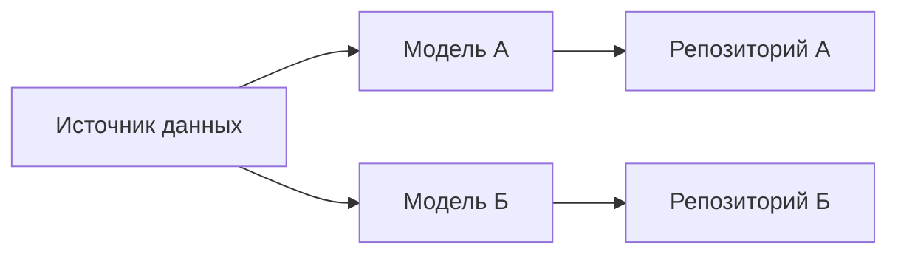

## @e22m4u/js-repository

Абстракция для работы с базами данных для Node.js

- [Установка](#Установка)
- [Введение](#Введение)
- [Настройка](#Настройка)
- [Источник данных](#Источник-данных)
- [Модель данных](#Модель-данных)
- [Репозиторий](#Репозиторий)
- [Фильтрация](#Фильтрация)
- [Связи](#Связи)
- [Тесты](#Тесты)

## Установка

```bash
npm install @e22m4u/js-repository
```

Опционально устанавливаем адаптер. Например, если используется
*MongoDB*, то для подключения потребуется установить
[адаптер mongodb](https://www.npmjs.com/package/@e22m4u/js-repository-mongodb-adapter)
как отдельную зависимость.

```bash
npm install @e22m4u/js-repository-mongodb-adapter
```

**Доступные адаптеры**

|           | описание                                                                                                                       |
|-----------|--------------------------------------------------------------------------------------------------------------------------------|
| `memory`  | виртуальная база в памяти процесса (не требует установки)                                                                      |
| `mongodb` | MongoDB - система управления NoSQL базами (*[установка](https://www.npmjs.com/package/@e22m4u/js-repository-mongodb-adapter))* |

## Введение

Источник, модель и репозиторий. Модуль позволяет спроектировать систему
связанных данных с помощью источников и моделей. Источник описывает способ
подключения к базе и место хранения данных, а модель структуру документа
и связи между коллекциями. Непосредственно чтение и запись осуществляется
репозиториями, которые можно получить после объявления моделей.



## Настройка

Перед началом работы с коллекцией нужно определить источник и модель данных.
Определения хранятся в экземпляре класса `Schema`, и первым шагом будет
создание данного экземпляра.

```js
import {Schema} from '@e22m4u/js-repository';

const schema = new Schema();
```

Интерфейс `Schema` имеет три основных метода:

- `defineDatasource(datasourceDef: object): this` - добавить источник
- `defineModel(modelDef: object): this` - добавить модель
- `getRepository(modelName: string): Repository` - получить репозиторий

## Источник данных

Источник определяет используемый адаптер и его настройки, которые передаются
вместе с объектом определения источника методом `defineDatasource`, как это
показано ниже.

```js
schema.defineDatasource({
  name: 'myMongo', // название нового источника
  adapter: 'mongodb', // название выбранного адаптера
  // настройки адаптера mongodb
  host: '127.0.0.1',
  port: 27017,
  database: 'data'
});
```

**Параметры**

- `name: string` уникальное название
- `adapter: string` выбранный адаптер
- дополнительные параметры (зависит от адаптера)

**Адаптер «memory»**

При желании можно использовать встроенный адаптер `memory`, который хранит
данные в памяти процесса. У него нет специальных настроек, и он отлично
подходит для тестов и прототипирования.

```js
schema.defineDatasource({
  name: 'myMemory', // название источника
  adapter: 'memory', // выбранный адаптер
});
```

## Модель данных

Модель данных описывает структуру документа и может указывать на источник,
который будет использован репозиторием для доступа к коллекции.

```js
// объявление модели "city"
schema.defineModel({
  name: 'city', // название новой модели
  properties: { // поля модели
    name: DataType.STRING,
    population: DataType.NUMBER,
  },
});
```

**Название модели и коллекции**

Название модели должно быть уникальным, так как оно используется
для определения связей и соответствует названию коллекции в базе.
При необходимости можно явно задать название коллекции параметром
`tableName`, если оно не соответствует названию модели.

```js
schema.defineModel({
  name: 'city', // название модели
  tableName: 'CITIES', // название коллекции
});
```

**Источник данных**

Если модель отражает реальную коллекцию базы, а не является частью другой,
то указывая название источника данных в параметре `datasource` появляется
возможность получить репозиторий для этой модели (см. [Репозиторий](#Репозиторий)).

```js
schema.defineModel({
  name: 'city',
  datasource: 'myDatasource', // выбранный источник
});
```

**Поля документа**

Параметр `properties` принимает объект, ключи которого являются именами
полей, а значением тип поля или объект с дополнительными параметрами.
Эти настройки используются для проверки данных перед сохранением в базу
и установки значений по умолчанию (если имеются).

```js
schema.defineModel({
  name: 'city',
  properties: {
    name: DataType.STRING,
    population: DataType.NUMBER,
  },
});
```

**Наследование**

Модель может наследовать поля и связи используя параметр `base`, куда
передается название базовой модели. При этом наследуемые настройки можно
переопределять не затрагивая родителя.

```js
// базовая модель "area"
schema.defineModel({
  name: 'area',
  properties: {
    name: DataType.STRING,
    population: DataType.NUMBER,
  },
});

// модель "city" наследует от модели
// "area" поля "name" и "population"
schema.defineModel({
  name: 'city',
  base: 'area',
});
```

#### Параметры модели

- `name: string` название модели (обязательно)
- `base: string` название наследуемой модели
- `tableName: string` название коллекции в базе
- `datasource: string` выбранный источник данных
- `properties: object` определения полей модели
- `relations: object` определения связей (см. Связи)

#### Типы данных

- `DataType.ANY` разрешено любое значение
- `DataType.STRING` только значение типа `string`
- `DataType.NUMBER` только значение типа `number`
- `DataType.BOOLEAN` только значение типа `boolean`
- `DataType.ARRAY` только значение типа `array`
- `DataType.OBJECT` только значение типа `object`

#### Параметры поля

- `type: string` тип допустимого значения (обязательно)
- `itemType: string` тип элемента массива (для `type: 'array'`)
- `model: string` модель объекта (для `type: 'object'`)
- `primaryKey: boolean` объявить поле первичным ключом
- `columnName: string` переопределение названия колонки
- `columnType: string` тип колонки (определяется адаптером)
- `required: boolean` объявить поле обязательным
- `default: any` значение по умолчанию

## Репозиторий

Объявление модели имеет необязательный параметр `datasource`,
который указывает на источник хранения данных. Наличие источника
позволяет получить репозиторий по названию такой модели. Репозиторий,
в свою очередь, предоставляет интерфейс для чтения и записи данных
этой модели.

```js
import {Schema} from '@e22m4u/js-repository';

const schema = new Schema();

// объявление источника "myMemory"
schema.defineDatasource({
  name: 'myMemory',
  adapter: 'memory',
});

// объявление модели "city"
schema.defineModel({
  name: 'city',
  datasource: 'myMemory', // источник данных
  properties: {
    name: DataType.STRING,
    population: DataType.NUMBER,
  },
});

// получение репозитория модели "city"
const cityRep = schema.getRepository('city');

// записываем новый документ "city"
const city = await cityRep.create({
  name: 'Moscow',
  population: 11980000
});

// выводим результат
console.log(city);
// {
//   "id": 1,
//   "name": "Moscow",
//   "population": 11980000
// }
```

#### Методы

- `create(data, filter = undefined)` добавить новый документ
- `replaceById(id, data, filter = undefined)` заменить весь документ
- `patchById(id, data, filter = undefined)` частично обновить документ
- `patch(data, where = undefined)` обновить все документы или по условию
- `find(filter = undefined)` найти все документы или по условию
- `findOne(filter = undefined)` найти первый документ или по условию
- `findById(id, filter = undefined)` найти документ по идентификатору
- `delete(where = undefined)` удалить все документы или по условию
- `deleteById(id)` удалить документ по идентификатору
- `exists(id)` проверить существование по идентификатору
- `count(where = undefined)` подсчет всех документов или по условию

#### Параметры

- `id` идентификатор (первичный ключ)
- `data` объект отражающий состав документа
- `where` параметры выборки (см. Фильтрация)
- `filter` параметры возвращаемого результата (см. Фильтрация)

## Фильтрация

Некоторые методы репозитория опционально принимают параметр `where` для
условий выборки и/или параметр `filter` управляющий возвращаемым значением.

### where

Рассмотрим применение параметра `where` на примере метода `patch`, который
выполняет поиск и обновление документов по определенному условию.

Сигнатура метода `patch(data, where = undefined)` указывает на два параметра,
где первый принимает объект данных, а второй является опциональным объектом
выборки.

```js
// вызов метода `patch`
await rep.patch(
  // обновить значения полей
  // "hidden" и "updatedAt"
  {
    hidden: true,
    updatedAt: new Date().toISOString(),
  },
  // только в тех документах, где поле "type"
  // равно значению "article", а "publishedAt"
  // содержит дату более раннюю, чем указана
  // в операторе "lte"
  {
    type: 'article',
    publishedAt: {
      lte: '2023-12-02T14:00:00.000Z',
    }
  },
);
```

Второй аргумент метода `patch` предыдущего листинга содержит условия
выборки по которым будет выполнен поиск и обновление документов. Полный
список возможных операторов сравнения приводится ниже.

`{foo: 'bar'}` поиск по значению поля `foo`  
`{foo: {eq: 'bar'}}` оператор равенства `eq`  
`{foo: {neq: 'bar'}}` оператор неравенства `neq`  
`{foo: {gt: 5}}` оператор "больше" `gt`  
`{foo: {lt: 10}}` оператор "меньше" `lt`  
`{foo: {gte: 5}}` оператор "больше или равно" `gte`  
`{foo: {lte: 10}}` оператор "меньше или равно" `lte`  
`{foo: {inq: ['bar', 'baz']}}` равенство одного из значений `inq`  
`{foo: {nin: ['bar', 'baz']}}` исключение значений массива `nin`  
`{foo: {between: [5, 10]}}` оператор диапазона `between`  
`{foo: {exists: true}}` оператор наличия значения `exists`  
`{foo: {like: 'bar'}}` оператор поиска подстроки `like`  
`{foo: {ilike: 'BaR'}}` регистронезависимая версия `ilike`  
`{foo: {nlike: 'bar'}}` оператор исключения подстроки `nlike`  
`{foo: {nilike: 'BaR'}}` регистронезависимая версия `nilike`  
`{foo: {regexp: 'ba.+'}}` оператор регулярного выражения `regexp`  
`{foo: {regexp: 'ba.+', flags: 'i'}}` флаги регулярного выражения

### filter

Методы репозитория асинхронны и возвращают `Promise` с некоторым значением.
Параметр `filter` позволяет влиять на это значение более широким образом,
чем просто ограничение для затрагиваемых данных. Ниже представлен список
опциональных полей объекта `filter`, одним из которых является `where`
(рассматривался ранее).

- `where` объект выборки
- `order` указание порядка
- `limit` ограничение количества документов
- `skip` пропуск документов
- `fields` выбор необходимых полей документа
- `include` включение связанных данных в результат (см. Связи)

#### order

Документы могут быть отсортированы по указанным полям и в нужном
направлении, где `ASC` - по умолчанию, и `DESC` - в обратном порядке.

```js
// на примере метода "find"
const result = await rep.find({
  // упорядочить по полю "featured"
  order: 'featured',
  // по полю "featured" в обратном порядке
  order: 'featured DESC',
  // по нескольким полям в разных направлениях
  order: ['featured ASC', 'publishedAt DESC', 'id'],
});
```

#### limit и skip

При использовании метода `find` может потребоваться комбинация параметров
`limit` и `skip` для механизма пагинации.

```js
// первый параметр метода `find` принимает
// объект настроек возвращаемого результата
const result = await rep.find({
  limit: 12, // вернуть не более 14и документов
  skip: 24,  // пропустить 24 документа выборки
});
```

#### fields

Сократить объем документа можно параметром `fields` указав необходимый
набор полей.

```js
// на примере метода "find"
const result = await rep.find({
  // включить в результат только поле "title"
  fields: 'title',
  // или поле "title", "createdAt" и "featured" 
  fields: ['title', 'createdAt', 'featured'],
  // первичный ключ указывать не обязательно
});
```

## Связи

WIP

<!--
```js
// коллекция имеет три документа
// [
//   {
//     "id": 1,
//     "type": "city",
//     "name": "Bangkok",
//     "hidden": true
//   },
//   {
//     "id": 2,
//     "type": "country",
//     "name": "Thailand",
//     "hidden": true
//   },
//   {
//     "id": 3,
//     "type": "city",
//     "name": "Moscow",
//     "hidden": true
//   }
// ]

// вызов метода `patch` с передачей
// значений для обновляемых полей
const result = await rep.patch({
  hidden: false,
  updatedAt: new Date().toISOString(),
});

// вывод количество затронутых документов
console.log(result);
// 3
```

#### create(data, filter = undefined)

Добавляет новый документ в коллекцию и возвращает его.

```js
const result = await rep.create({
  name: 'Rick Sanchez',
  dimension: 'C-137',
  age: 67,
});

// вывод результата
console.log(result);
// {
//   id: 1, <= определено базой данных
//   name: 'Rick Sanchez',
//   dimension: 'C-137',
//   age: 67
// }
```

Ограничение количества возвращаемых полей.

```js
const result = await rep.create(
  // состав нового документа
  {
    name: 'Rick Sanchez',
    dimension: 'C-137',
    age: 67,
  },
  // параметры возвращаемого результата
  {
    fields: [
      'name',
      'age',
    ]
  }
);

// вывод результата
console.log(result);
// {
//   id: 1,
//   name: 'Rick Sanchez',
//   age: 67
// }

```

Использование второго параметра `filter` метода `create` позволяет
ограничивать количество возвращаемых данных, и разрешать связи к другим
коллекциям (см. Связи).

```js
// подготовка состава для нового документа
const data = {
  name: 'Rick Sanchez',
  dimension: 'C-137',
  age: 67,
  biographyId: 59,        // связь "biography" (см. belongsTo)
  pictureIds: [345, 346], // связь "pictures" (см. referencesMany)
}

// подготовка параметра "filter"
const filter = {
  // "fields" - если определено, то результат
  // будут включать только указанные поля
  fields: [
    'name',
    'biographyId'
    'pictureIds',
  ],
  // "include" - включение в результат
  // связанных документов (см. Связи)
  include: [
    'biography',
    'pictures',
  ],
}

// вызов метода `create` и вывод результата
const result = await rep.create(data, filter);
console.log(result);
// {
//   "name": "Rick Sanchez",
//   "biographyId": 59,
//   "biography": { <= разрешение связи
//      "id": 59,
//      "annotation": "This article is about Rick Sanchez",
//      "body": "He is a genius scientist whose ..."
//   }
//   "pictureIds": [345, 346],
//   "pictures": [ <= разрешение связи
//     {
//       "id": 345,
//       "mime": "image/jpeg",
//       "file": "/uploads/rick345.jpg"
//     },
//     {
//       "id": 346,
//       "mime": "image/jpeg",
//       "file": "/uploads/rick346.jpg"
//     }
//   ],
// }
//
// поля "age" и "dimension" исключены
// из результата опцией "fields"
//
// документы "biography" и "pictures"
// встроены в результат опцией "include"
```

#### replaceById(id, data, filter = undefined)

Заменяет существующий документ по идентификатору и возвращает его. Если
идентификатор не найден, то выбрасывает исключение.

```js
// документ с идентификатором 12
// имеет следующую структуру
// {
//   id: 12,
//   name: 'Rick Sanchez',
//   dimension: 'C-137',
//   age: 67
// }

// вызов метода `replaceById` с передачей
// идентификатора и нового состава
const result = await rep.replaceById(12, {
  name: 'Morty Smith',
  kind: 'a young teenage boy',
  age: 14,
});

// вывод результата
console.log(result);
// {
//   id: 12,
//   name: 'Morty Smith', <= обновлено
//   kind: 'a young teenage boy', <= новое поле
//   age: 14 <= обновлено
// }
//
// поле "dimension" удалено, так как
// не передавалось с новым составом
```

Использование третьего параметра `filter` метода `replaceById` позволяет
ограничивать количество возвращаемых данных, и разрешать связи к другим
коллекциям (см. Связи).

```js
// подготовка состава для заменяемого документа
const data = {
  name: 'Morty Smith',
  kind: 'a young teenage boy',
  age: 14,
  biographyId: 61,        // связь "biography" (см. belongsTo)
  pictureIds: [347, 348], // связь "pictures" (см. referencesMany)
}

// подготовка параметра "filter"
const filter = {
  // "fields" - если определено, то результат
  // будут включать только указанные поля
  fields: [
    'name',
    'biographyId'
    'pictureIds',
  ],
  // "include" - включение в результат
  // связанных документов (см. Связи)
  include: [
    'biography',
    'pictures',
  ],
}

// вызов метода `replaceById` и вывод результата
const result = await rep.replaceById(12, data, filter);
console.log(result);
// {
//   "name": "Morty Smith",
//   "biographyId": 61, <= новое поле
//   "biography": { <= разрешение связи
//      "id": 61,
//      "annotation": "This article is about Morty Smith",
//      "body": "Currently, Morty is 14 years old ..."
//   },
//   "pictureIds": [347, 348], <= новое поле
//   "picture": [ <= разрешение связи
//     {
//       "id": 347,
//       "mime": "image/jpeg",
//       "file": "/uploads/morty347.jpg"
//     },
//     {
//       "id": 348,
//       "mime": "image/jpeg",
//       "file": "/uploads/morty348.jpg"
//     }
//   ]
// }
//
// поля "kind" и "age" записаны в документ,
// но исключены из результата опцией "fields"
//
// документы "biography" и "pictures"
// встроены в результат опцией "include"
```

#### patchById(id, data, filter = undefined)

Частично обновляет существующий документ по идентификатору и возвращает его.
Если идентификатор не найден, то выбрасывает исключение.

```js
// документ с идентификатором 24
// имеет следующую структуру
// {
//   "id": 24,
//   "type": "airport",
//   "name": "Domodedovo Airport",
//   "code": "DME"
// }

// вызов метода `patchById` с передачей
// идентификатора и новых значений
// обновляемых полей
const result = await rep.patchById(24, {
  name: 'Sheremetyevo Airport',
  code: 'SVO',
  featured: true,
});

// вывод результата
console.log(result);
// {
//   "id": 24,
//   "type": "airport",
//   "name": "Sheremetyevo Airport", <= обновлено
//   "code": "SVO", <= обновлено
//   "featured": true <= новое поле
// }
```

Использование третьего параметра `filter` метода `patchById` позволяет
ограничивать количество возвращаемых данных, и разрешать связи к другим
коллекциям (см. Связи).

```js
// подготовка обновляемых данных
const data = {
  name: 'Sheremetyevo Airport',
  code: 'SVO',
  featured: true,
  cityId: 231,            // связь "city" (см. belongsTo)
  companyIds: [513, 514], // связь "companies" (см. referencesMany)
}

// подготовка параметра `filter`
const filter = {
  // "fields" - если определено, то результат
  // будут включать только указанные поля
  fields: [
    'name',
    'cityId',
    'companyIds',
  ],
  // "include" - включение в результат
  // связанных документов (см. Связи)
  include: [
    'city',
    'companies',
  ],
}
  
// вызов метода `patchById` и вывод результата
const result = await rep.patchById(24, data, filter);
console.log(result);
// {
//   "id": 24,
//   "name": "Sheremetyevo Airport", <= обновлено
//   "cityId": 231, <= новое поле
//   "city": { <= разрешение связи
//     "id": 231,
//     "name": "Moscow"
//   },
//   "companyIds": [513, 514], <= новое поле
//   "companies": [ <= разрешение связи
//     {
//       "id": 513,
//       "name": "S7 Airlines"
//     },
//     {
//       "id": 514,
//       "name": "Aeroflot Airlines"
//     },
//   ]
// }
//
// поля "code" и "featured" обновлены,
// но исключены из ответа опцией "fields"
//
// документы "city" и "companies"
// встроены в результат опцией "include"
```

#### patch(data, where = undefined)

Обновляет документы и возвращает их число. Используется для
обновления нескольких документов согласно условиям выборки,
или всей коллекции сразу.

```js
// коллекция имеет три документа
// [
//   {
//     "id": 1,
//     "type": "city",
//     "name": "Bangkok",
//     "hidden": true
//   },
//   {
//     "id": 2,
//     "type": "country",
//     "name": "Thailand",
//     "hidden": true
//   },
//   {
//     "id": 3,
//     "type": "city",
//     "name": "Moscow",
//     "hidden": true
//   }
// ]

// вызов метода `patch` с передачей
// значений для обновляемых полей
const result = await rep.patch({
  hidden: false,
  updatedAt: new Date().toISOString(),
});

// вывод количество затронутых документов
console.log(result);
// 3

// просмотр коллекции методом `find`
// для проверки изменений
const docs = await rep.find();
console.log(docs);
// [
//   {
//     "id": 1,
//     "type": "city",
//     "name": "Bangkok",
//     "hidden": false, <= обновлено
//     "updatedAt": "2023-12-02T14:00:00.000Z" <= новое поле
//   },
//   {
//     "id": 2,
//     "type": "country",
//     "name": "Thailand",
//     "hidden": false, <= обновлено
//     "updatedAt": "2023-12-02T14:00:00.000Z" <= новое поле
//   },
//   {
//     "id": 3,
//     "type": "city",
//     "name": "Moscow",
//     "hidden": false, <= обновлено
//     "updatedAt": "2023-12-02T14:00:00.000Z" <= новое поле
//   }
// ]
```

Использование второго параметра `where` метода `patch` позволяет
определить условия выборки обновляемых документов.

```js
// вызов метода `patch` с передачей
// условий выборки вторым параметром
const result = await rep.patch(
  // новые значения полей
  {
    hidden: false,
    updatedAt: new Date().toISOString(),
  },
  // условия выборки
  {
    type: 'city', // только если "type" равен "city"
    hidden: true, // и "hidden" имеет значение true
  }
);

// вывод количества затронутых документов
console.log(result);
// 2

// по условиям выборки обновлено
// только 2 документа из 3-х
```

#### find(filter = undefined)

Возвращает все документы коллекции или согласно условию.

```js
// вызов метода `find` без аргументов
// возвращает все документы коллекции
const result = await rep.find();
console.log(result);
// [
//   {
//     "id": 1,
//     "type": "article",
//     "title": "The Forgotten Ship",
//     "publishedAt": "2023-12-02T08:00:00.000Z",
//     "featured": true
//   },
//   {
//     "id": 2,
//     "type": "article",
//     "title": "A Giant Bellows",
//     "publishedAt": "2023-12-02T12:00:00.000Z",
//     "featured": false
//   },
//   {
//     "id": 3,
//     "type": "letter",
//     "title": "Hundreds of bottles",
//     "publishedAt": null,
//     "featured": false
//   }
// ]
```

Фильтрация результата (опционально).

```js
// первый параметр может принимать
// объект cо следующими настройками
const result = await rep.find({
  // "where" - фильтрация выборки по условию, где
  // указанные поля должны содержать определенные
  // значения (см. Фильтрация)
  where: {type: 'article', featured: true},
  where: {title: {like: 'the forgotten'}},
  where: {publishedAt: {lte: '2023-12-02T21:00:00.000Z'}},

  // "order" - сортировка по указанному полю может
  // принимать постфикс DESC для обратного порядка
  order: 'featured',
  order: 'publishedAt DESC',
  order: ['publishedAt DESC', 'featured ASC', 'id'],

  // "limit" - ограничение результата
  // "skip" - пропуск документов
  limit: 10,
  skip: 10,

  // "fields" - если определено, то результат
  // будет включать только указанные поля
  fields: 'title',
  fields: ['title', 'featured'],

  // "include" - включить в результат связанные
  // документы (см. Связи)
  include: 'author',
  include: {author: 'role'},
  include: ['author', 'categories'],
});
```

#### findOne(filter = undefined)

Возвращает первый найденный документ или `undefined`  

```js
// коллекция имеет три документа
// [
//   {
//     "id": 1,
//     "type": "article",
//     "title": "The Forgotten Ship",
//     "publishedAt": "2023-12-02T08:00:00.000Z",
//     "featured": true
//   },
//   {
//     "id": 2,
//     "type": "article",
//     "title": "A Giant Bellows",
//     "publishedAt": "2023-12-02T12:00:00.000Z",
//     "featured": false
//   },
//   {
//     "id": 3,
//     "type": "letter",
//     "title": "Hundreds of bottles",
//     "publishedAt": null,
//     "featured": false
//   }
// ]

// вызов метода `findOne` без аргументов
// возвращает первый документ коллекции
const result = await rep.findOne();
console.log(result);
// {
//   "id": 1,
//   "type": "article",
//   "title": "The Forgotten Ship",
//   "publishedAt": "2023-12-02T08:00:00.000Z",
//   "featured": true
// }
```

Фильтрация результата (опционально).

```js
// первый параметр метода `find` принимает
// объект настроек возвращаемого результата
const result = await rep.findOne({
  // "where" - фильтрация выборки по условию, где
  // указанные поля должны содержать определенные
  // значения (см. Фильтрация)
  where: {type: 'article', featured: true},
  where: {title: {like: 'the forgotten'}},
  where: {publishedAt: {lte: '2023-12-02T21:00:00.000Z'}},

  // "order" - сортировка по указанному полю может
  // принимать постфикс DESC для обратного порядка
  order: 'featured',
  order: 'publishedAt DESC',
  order: ['publishedAt DESC', 'featured ASC', 'id'],

  // "skip" - пропуск документов
  skip: 10,

  // "fields" - если определено, то результат
  // будет включать только указанные поля
  fields: 'title',
  fields: ['title', 'featured'],

  // "include" - включить в результат связанные
  // документы (см. Связи)
  include: 'author',
  include: {author: 'role'},
  include: ['author', 'categories'],
});
```

#### findById(id, filter = undefined)

Поиск документа по идентификатору. Возвращает найденный документ
или выбрасывает исключение.

```js
// коллекция содержит три документа
// [
//   {
//     "id": 1,
//     "title": "The Forgotten Ship",
//     "featured": true
//   },
//   {
//     "id": 2,
//     "title": "A Giant Bellows",
//     "featured": false
//   },
//   {
//     "id": 3,
//     "title": "Hundreds of bottles",
//     "featured": false
//   }
// ]

// вызов метода `findById` с передачей
// идентификатора искомого документа
const result = await rep.findById(2);
console.log(result);
// {
//   "id": 2,
//   "title": "A Giant Bellows",
//   "featured": false
// }
```

Использование параметра `filter` (опционально).

```js
// второй параметр метода `findById` принимает
// объект настроек возвращаемого результата
const result = await rep.findById(2, {
  // "fields" - если определено, то результат
  // будут включать только указанные поля
  fields: 'title',
  fields: ['title', 'featured'],

  // "include" - включить в результат связанные
  // документы (см. Связи)
  include: 'author',
  include: {author: 'role'},
  include: ['author', 'categories'],
});
```

#### delete(where = undefined)

Удаляет все документы коллекции или согласно условию. Возвращает количество
удаленных документов.

```js
// коллекция имеет три документа
// [
//   {
//     "id": 1,
//     "title": "The Forgotten Ship",
//     "featured": true
//   },
//   {
//     "id": 2,
//     "title": "A Giant Bellows",
//     "featured": false
//   },
//   {
//     "id": 3,
//     "title": "Hundreds of bottles",
//     "featured": false
//   }
// ]

// вызов метода `delete` без аргументов
// удалит все содержимое коллекции
const result = await rep.delete();
console.log(result);
// 3

// просмотр коллекции методом `find`
// для проверки изменений
const docs = await rep.find();
console.log(docs);
// []
```

Условия выборки (опционально).

```js
// первый параметр метода `delete`
// принимает условия выборки 
const result = await rep.delete({
  title: {
    like: 'bellows', // оператор "like" проверяет поле "title"
  },                 // на содержание подстроки "bellows"
  featured: false,   // значение поля "featured" должно быть false
  // см. Фильтрация
});

// вывод результата
console.log(result);
// 1
```

#### deleteById(id)

Удаляет документ по идентификатору. Возвращает `true` в случае успеха
или `false` если не найден.

```js
// коллекция имеет три документа
// [
//   {
//     "id": 1,
//     "title": "The Forgotten Ship"
//   },
//   {
//     "id": 2,
//     "title": "A Giant Bellows"
//   },
//   {
//     "id": 3,
//     "title": "Hundreds of bottles"
//   }
// ]

// вызов метода `deleteById` с передачей
// идентификатора удаляемого документа
const result = await rep.deleteById(2);

// вывод результата
console.log(result);
// true

// просмотр коллекции методом `find`
// для проверки изменений
const docs = await rep.find();
console.log(docs);
// [
//   {
//     "id": 1,
//     "title": "The Forgotten Ship"
//   },
//   {
//     "id": 3,
//     "title": "Hundreds of bottles"
//   }
// ]
```

#### exists(id)

Проверка существования документа по идентификатору. Возвращает `true`
если найден, в противном случае `false`.  

```js
// коллекция имеет три документа
// [
//   {
//     "id": 1,
//     "title": "The Forgotten Ship"
//   },
//   {
//     "id": 2,
//     "title": "A Giant Bellows"
//   },
//   {
//     "id": 3,
//     "title": "Hundreds of bottles"
//   }
// ]

// вызов метода `exists` с передачей
// существующего идентификатора
const result1 = await rep.exists(2);
console.log(result1);
// true

// результат проверки несуществующего
// идентификатора
const result2 = await rep.exists(10);
console.log(result2);
// false
```

#### count(where = undefined)

Подсчет количества документов и возврат их числа.  

```js
// коллекция имеет три документа
// [
//   {
//     "id": 1,
//     "title": "The Forgotten Ship",
//     "featured": true
//   },
//   {
//     "id": 2,
//     "title": "A Giant Bellows",
//     "featured": false
//   },
//   {
//     "id": 3,
//     "title": "Hundreds of bottles",
//     "featured": false
//   }
// ]

// вызов метода `count` без аргументов
// возвращает общее число документов
const result = await rep.count();
console.log(result);
// 3
```

Условия выборки (опционально).

```js
// первый параметр метода `count`
// принимает условия выборки 
const result = await rep.count({
  featured: {  // оператор "neq" проверяет поле "featured"
    neq: true, // на неравенство значению true
  }
  // см. Фильтрация
});

// вывод результата
console.log(result);
// 2
```

## Расширение

При использовании метода `getRepository` выполняется проверка на
наличие существующего экземпляра репозитория для нужной модели.
При первичном запросе создается новый экземпляр, который будет
сохранен для повторных обращений к методу.

```js
import {Schema} from '@e22m4u/js-repository';
import {Repository} from '@e22m4u/js-repository';

// const schema = new Schema();
// schema.defineDatasource ...
// schema.defineModel ...

const rep1 = schema.getRepository('myModel');
const rep2 = schema.getRepository('myModel');
console.log(rep1 === rep2); // true
```

Если требуется изменить или расширить поведение репозитория, то
перед его созданием можно переопределить его конструктор методом
`setRepositoryCtor`. После чего, все создаваемые репозитории будут
использовать уже пользовательский конструктор вместо стандартного.

```js
import {Schema} from '@e22m4u/js-repository';
import {Repository} from '@e22m4u/js-repository';
import {RepositoryRegistry} from '@e22m4u/js-repository';

class MyRepository extends Repository {
  /*...*/
}

const schema = new Schema();
schema.get(RepositoryRegistry).setRepositoryCtor(MyRepository);
// теперь schema.getRepository(modelName) будет возвращать
// экземпляр класса MyRepository
```

### Filter

Большинство методов репозитория принимают объект `filter` для
фильтрации возвращаемого ответа. Описание параметров объекта:

- **where** *(условия выборки данных из базы)*  
  примеры:  
  `where: {foo: 'bar'}` поиск по значению поля `foo`  
  `where: {foo: {eq: 'bar'}}` оператор равенства `eq`  
  `where: {foo: {neq: 'bar'}}` оператор неравенства `neq`  
  `where: {foo: {gt: 5}}` оператор "больше" `gt`  
  `where: {foo: {lt: 10}}` оператор "меньше" `lt`  
  `where: {foo: {gte: 5}}` оператор "больше или равно" `gte`  
  `where: {foo: {lte: 10}}` оператор "меньше или равно" `lte`  
  `where: {foo: {inq: ['bar', 'baz']}}` равенство одного из значений `inq`  
  `where: {foo: {nin: ['bar', 'baz']}}` исключение значений массива `nin`  
  `where: {foo: {between: [5, 10]}}` оператор диапазона `between`  
  `where: {foo: {exists: true}}` оператор наличия значения `exists`  
  `where: {foo: {like: 'bar'}}` оператор поиска подстроки `like`  
  `where: {foo: {ilike: 'BaR'}}` регистронезависимая версия `ilike`  
  `where: {foo: {nlike: 'bar'}}` оператор исключения подстроки `nlike`  
  `where: {foo: {nilike: 'BaR'}}` регистронезависимая версия `nilike`  
  `where: {foo: {regexp: 'ba.+'}}` оператор регулярного выражения `regexp`  
  `where: {foo: {regexp: 'ba.+', flags: 'i'}}` флаги регулярного выражения


- **order** *(упорядочить записи по полю)*  
  примеры:  
  `order: 'foo'` порядок по полю `foo`  
  `order: 'foo ASC'` явное указание порядка  
  `order: 'foo DESC'` инвертировать порядок  
  `order: ['foo', 'bar ASC', 'baz DESC']` по нескольким полям


- **limit** *(не более N записей)*  
  примеры:  
  `limit: 0` не ограничивать  
  `limit: 14` не более 14-и


- **skip** *(пропуск первых N записей)*  
  примеры:  
  `skip: 0` выборка без пропуска  
  `skip: 10` пропустить 10 объектов выборки


- **include** *(включение связанных данных в результат)*  
  примеры:  
  `include: 'foo'` включение связи `foo`  
  `include: ['foo', 'bar']` включение `foo` и `bar`  
  `include: {foo: 'bar'}` включение вложенной связи `foo`

## Связи

Параметр `relations` описывает набор связей к другим моделям.

Понятия:

- источник связи  
*- модель в которой определена данная связь*  
- целевая модель  
*- модель на которую ссылается источник связи*  

Типы:

- `belongsTo` - ссылка на целевую модель находится в источнике
- `hasOne` - ссылка на источник находится в целевой модели (one-to-one)
- `hasMany` - ссылка на источник находится в целевой модели (one-to-many)
- `referencesMany` - массив ссылок на целевую модель находится в источнике

Параметры:

- `type: string` тип связи
- `model: string` целевая модель
- `foreignKey: string` поле для идентификатора цели
- `polymorphic: boolean|string` объявить связь полиморфной*
- `discriminator: string` поле для названия целевой модели (для `polymorphic: true`)

*i. Полиморфный режим `belongsTo` позволяет динамически определять цель связи,
где имя целевой модели хранится в отдельном поле, рядом с `foreignKey`*

#### BelongsTo

Связь заказа к покупателю через поле `customerId`

```js
schema.defineModel({
  // ...
  relations: {
    // ...
    customer: {
      type: 'belongsTo',
      model: 'customer',
      foreignKey: 'customerId', // опционально
    },
  },
});
```

Полиморфная версия

```js
schema.defineModel({
  // ...
  relations: {
    // ...
    customer: {
      type: 'belongsTo',
      polymorphic: true,
      foreignKey: 'customerId', // опционально
      discriminator: 'customerType', // опционально
    },
  },
});
```

#### HasOne (one-to-one)

Связь покупателя к заказу, как обратная сторона `belongsTo`

```js
schema.defineModel({
  // ...
  relations: {
    // ...
    order: {
      type: 'hasOne',
      model: 'order',
      foreignKey: 'customerId', // поле целевой модели
    },
  },
});
```

Обратная сторона полиморфной версии `belongsTo`

```js
schema.defineModel({
  // ...
  relations: {
    // ...
    order: {
      type: 'hasOne',
      model: 'order',
      polymorphic: 'customer', // имя связи целевой модели
    },
  },
});
```

Явное указание `foreignKey` и `discriminator`

```js
schema.defineModel({
  // ...
  relations: {
    // ...
    order: {
      type: 'hasOne',
      model: 'order',
      polymorphic: true, // true вместо имени модели
      foreignKey: 'customerId', // поле целевой модели 
      discriminator: 'customerType', // поле целевой модели
    },
  },
});
```

#### HasMany (one-to-many)

Связь покупателя к заказам, как обратная сторона `belongsTo`

```js
schema.defineModel({
  // ...
  relations: {
    // ...
    orders: {
      type: 'hasMany',
      model: 'order',
      foreignKey: 'customerId', // поле целевой модели
    },
  },
});
```

Обратная сторона полиморфной версии `belongsTo`

```js
schema.defineModel({
  // ...
  relations: {
    // ...
    orders: {
      type: 'hasMany',
      model: 'order',
      polymorphic: 'customer', // имя связи целевой модели
    },
  },
});
```

Явное указание `foreignKey` и `discriminator`

```js
schema.defineModel({
  // ...
  relations: {
    // ...
    orders: {
      type: 'hasMany',
      model: 'order',
      polymorphic: true, // true вместо имени модели
      foreignKey: 'customerId', // поле целевой модели 
      discriminator: 'customerType', // поле целевой модели
    },
  },
});
```

#### ReferencesMany

Связь покупателя к заказам через поле `orderIds`

```js
schema.defineModel({
  // ...
  relations: {
    // ...
    orders: {
      type: 'referencesMany',
      model: 'order',
      foreignKey: 'orderIds', // опционально
    },
  },
});
```

-->

## Тесты

```bash
npm run test
```

## Лицензия

MIT
