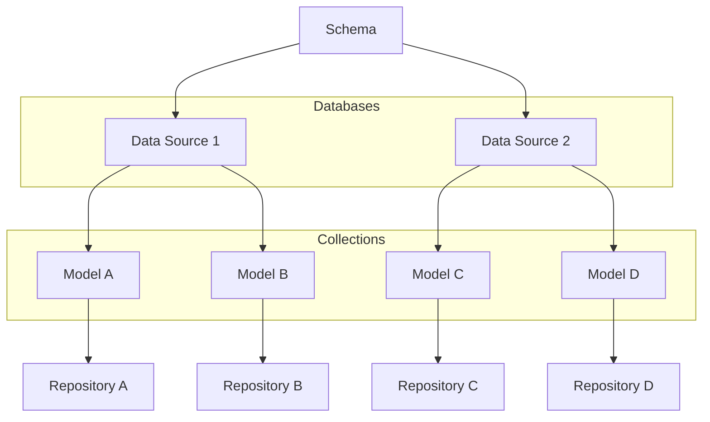

## @e22m4u/js-repository

*English | [Русский](README-ru.md)*

Repository pattern implementation for Node.js

- [Installation](#Installation)
- [Import](#Import)
- [Description](#Description)
- [Example](#Example)
- [Schema](#Schema)
- [Data Source](#Data-Source)
- [Model](#Model)
- [Properties](#Properties)
- [Validators](#Validators)
- [Transformers](#Transformers)
- [Empty Values](#Empty-Values)
- [Repository](#Repository)
- [Filtering](#Filtering)
- [Relations](#Relations)
- [Extension](#Extension)
- [TypeScript](#TypeScript)
- [Tests](#Tests)
- [License](#License)

## Installation

```bash
npm install @e22m4u/js-repository
```

Optionally install an adapter.

|           | description                                                                                                                   |
|-----------|-------------------------------------------------------------------------------------------------------------------------------|
| `memory`  | in-memory virtual database (no installation required)                                                                         |
| `mongodb` | MongoDB - NoSQL database management system (*[install](https://www.npmjs.com/package/@e22m4u/js-repository-mongodb-adapter))* |

## Import

The module supports both ESM and CommonJS standards.

*ESM*

```js
import {Schema} from '@e22m4u/js-repository';
```

*CommonJS*

```js
const {Schema} = require('@e22m4u/js-repository');
```

## Description

The module provides an abstraction layer over different database interfaces
by representing them as named *data sources* connected to *models*. A *model*
describes a database table where columns are represented as model properties.
Each model property can have a specific *type* of allowed value, along with
*validators* and *transformers* that process data before it is written to
the database. Additionally, a *model* can define classic relationship types
like "one-to-one", "one-to-many" and others between models.

Data operations are performed using a *repository*, which is available for each
model with a declared *data source*. The repository can filter requested documents,
validate properties according to the model definition, and include related data
in query results.

- *Data Source* - defines database connection settings
- *Model* - describes document structure and relationships with other models
- *Repository* - handles read and write operations for model documents




## Example

Here's how to define a data source, create a model, and add
a new document to the collection.

```js
import {Schema} from '@e22m4u/js-repository';
import {DataType} from '@e22m4u/js-repository';

// create Schema instance
const schema = new Schema();

// declare "myMemory" data source
schema.defineDatasource({
  name: 'myMemory', // name of new source
  adapter: 'memory', // selected adapter
});

// declare "country" model
schema.defineModel({
  name: 'country', // name of new model
  datasource: 'myMemory', // selected data source
  properties: { // model properties
    name: DataType.STRING, // "string" type
    population: DataType.NUMBER, // "number" type
  },
})

// get repository for "country" model
const countryRep = schema.getRepository('country');

// add new document to "country" collection
const country = await countryRep.create({
  name: 'Russia',
  population: 143400000,
});

// output new document
console.log(country);
// {
//   "id": 1,
//   "name": "Russia",
//   "population": 143400000,
// }
```

## Schema

A `Schema` class instance stores data source and model definitions.

**Methods**

- `defineDatasource(datasourceDef: object): this` - add a data source
- `defineModel(modelDef: object): this` - add a model
- `getRepository(modelName: string): Repository` - get a repository

**Examples**

Import the class and create a schema instance.

```js
import {Schema} from '@e22m4u/js-repository';

const schema = new Schema();
```

Define a new data source.

```js
schema.defineDatasource({
  name: 'myMemory', // name of new source
  adapter: 'memory', // selected adapter
});
```

Define a new model.

```js
schema.defineModel({
  name: 'product', // name of new model
  datasource: 'myMemory', // selected source
  properties: { // model properties
    name: DataType.STRING,
    weight: DataType.NUMBER,
  },
});
```

Get a repository by model name.

```js
const productRep = schema.getRepository('product');
```

## Data Source

A data source defines an adapter selection and its configuration
settings. New data sources are added using the `defineDatasource`
method of a schema instance.

**Parameters**

- `name: string` unique name
- `adapter: string` selected adapter
- additional adapter-specific parameters (if any)

**Examples**

Define a new data source.

```js
schema.defineDatasource({
  name: 'myMemory', // name of new source
  adapter: 'memory', // selected adapter
});
```

Pass additional adapter parameters.

```js
schema.defineDatasource({
  name: 'myMongodb',
  adapter: 'mongodb',
  // mongodb adapter parameters
  host: '127.0.0.1',
  port: 27017,
  database: 'myDatabase',
});
```

## Model

A model describes the structure of a collection document and its relationships
with other models. New models are added using the `defineModel` method
of a schema instance.

**Parameters**

- `name: string` model name (required)
- `base: string` name of parent model to inherit from
- `tableName: string` collection name in database
- `datasource: string` selected data source
- `properties: object` property definitions (see [Properties](#Properties))
- `relations: object` relationship definitions (see [Relations](#Relations))

**Examples**

Define a model with typed properties.

```js
schema.defineModel({
  name: 'user', // name of new model
  properties: { // model properties
    name: DataType.STRING,
    age: DataType.NUMBER,
  },
});
```

## Properties

The `properties` parameter is in the model definition and accepts
an object whose keys are the properties of this model, and the value
is either the property type or an object with additional parameters.

**Data Type**

- `DataType.ANY` any value allowed
- `DataType.STRING` only `string` type value
- `DataType.NUMBER` only `number` type value
- `DataType.BOOLEAN` only `boolean` type value
- `DataType.ARRAY` only `array` type value
- `DataType.OBJECT` only `object` type value

**Parameters**

- `type: string` type of allowed value (required)
- `itemType: string` array item type (for `type: 'array'`)
- `model: string` object model (for `type: 'object'`)
- `primaryKey: boolean` declare property as primary key
- `columnName: string` override column name
- `columnType: string` column type (defined by adapter)
- `required: boolean` declare property as required
- `default: any` default value
- `validate: string | array | object` see [Validators](#Validators)
- `unique: boolean | string` check value for uniqueness

**Parameter `unique`**

If the value of the `unique` parameter is `true` or `'strict'`,
strict uniqueness checking is performed. In this mode,
[empty values](#Empty-Values) are also subject to verification,
where `null` and `undefined` cannot be repeated more than once.

The `'sparse'` mode only checks values with payload, excluding
[empty values](#Empty-Values), whose list differs depending
on the property type. For example, for type `string`, empty
values will be `undefined`, `null` and `''` (empty string).

- `unique: true | 'strict'` strict uniqueness check
- `unique: 'sparse'` exclude [empty values](#Empty-Values) from check
- `unique: false | 'nonUnique'` do not check for uniqueness (default)

Predefined constants can be used as `unique` parameter values
as equivalent to string values `strict`, `sparse` and `nonUnique`.

- `PropertyUniqueness.STRICT`
- `PropertyUniqueness.SPARSE`
- `PropertyUniqueness.NON_UNIQUE`

**Examples**

Short model property definition.

```js
schema.defineModel({
  name: 'city',
  properties: { // model properties
    name: DataType.STRING, // "string" property type
    population: DataType.NUMBER, // "number" property type
  },
});
```

Full model property definition.

```js
schema.defineModel({
  name: 'city',
  properties: { // model properties
    name: {
      type: DataType.STRING, // "string" property type (required)
      required: true, // exclude undefined and null values
    },
    population: {
      type: DataType.NUMBER, // "number" property type (required)
      default: 0, // default value
    },
    code: {
      type: DataType.NUMBER, // "number" property type (required)
      unique: PropertyUniqueness.UNIQUE, // check uniqueness
    },
  },
});
```

Factory default value. The function's return value will be determined
when writing the document.

```js
schema.defineModel({
  name: 'article',
  properties: { // model properties
    tags: {
      type: DataType.ARRAY, // "array" property type (required)
      itemType: DataType.STRING, // "string" item type
      default: () => [], // factory value
    },
    createdAt: {
      type: DataType.STRING, // "string" property type (required)
      default: () => new Date().toISOString(), // factory value
    },
  },
});
```

## Validators

In addition to type checking, additional conditions can be set using
validators, through which the property value will pass before being
written to the database. The exception is [empty values](#Empty-Values),
which are not subject to validation.

- `minLength: number` minimum length of string or array
- `maxLength: number` maximum length of string or array
- `regexp: string | RegExp` regular expression check

**Example**

Validators are specified in the model property definition with
the `validate` parameter, which accepts an object with their names
and settings.

```js
schema.defineModel({
  name: 'user',
  properties: {
    name: {
      type: DataType.STRING,
      validate: { // validators for "name" property
        minLength: 2, // minimum string length
        maxLength: 24, // maximum string length
      },
    },
  },
});
```

### Custom Validators

A validator is a function that receives the value of the corresponding
field before writing to the database. If during validation the function
returns `false`, a standard error is thrown. Standard error substitution
is possible by throwing a custom error directly inside the function.

Custom validator registration is performed using the `addValidator` method
of the `PropertyValidatorRegistry` service, which accepts a new name
and function for value validation.

**Example**

```js
// create validator to allow
// only numeric characters
const numericValidator = (input) => {
  return /^[0-9]+$/.test(String(input));
}

// register "numeric" validator
schema
  .get(PropertyValidatorRegistry)
  .addValidator('numeric', numericValidator);

// use validator in "code" property
// definition for new model
schema.defineModel({
  name: 'document',
  properties: {
    code: {
      type: DataType.STRING,
      validate: 'numeric',
    },
  },
});
```

## Transformers

Transformers are used to modify values of specific fields before writing
to the database. Transformers allow you to specify what changes should
be made to incoming data. The exception is [empty values](#Empty-Values),
which are not subject to transformation.

- `trim` removes whitespace from both ends of string
- `toUpperCase` convert string to uppercase
- `toLowerCase` convert string to lowercase
- `toTitleCase` convert string to title case

**Example**

Transformers are specified in the model property definition with the `transform`
parameter, which accepts the transformer name. If multiple names need to be specified,
an array is used. If the transformer has settings, an object is used where the key
is the transformer name and the value is its parameters.

```js
schema.defineModel({
  name: 'user',
  properties: {
    name: {
      type: DataType.STRING,
      transform: [ // transformers for "name" property
        'trim', // remove spaces from both ends of string
        'toTitleCase', // convert string to title case
      ],
    },
  },
});
```

## Empty Values

Different property types have their own sets of empty values. These sets
are used to determine the presence of a payload in the property value.
For example, the `default` parameter in the property definition sets
the default value only if the incoming value is empty. The `required`
parameter excludes empty values by throwing an error. And the `unique`
parameter in `sparse` mode, on the contrary, allows duplication of empty
values of a unique property.

| type        | empty values              |
|-------------|---------------------------|
| `'any'`     | `undefined`, `null`       |
| `'string'`  | `undefined`, `null`, `''` |
| `'number'`  | `undefined`, `null`, `0`  |
| `'boolean'` | `undefined`, `null`       |
| `'array'`   | `undefined`, `null`, `[]` |
| `'object'`  | `undefined`, `null`, `{}` |

## Repository

Performs read and write operations on documents of a specific model.
You can get a repository using the `getRepository` method of the schema
instance.

**Methods**

- `create(data, filter = undefined)` add new document
- `replaceById(id, data, filter = undefined)` replace entire document
- `replaceOrCreate(data, filter = undefined)` replace or create new
- `patchById(id, data, filter = undefined)` partially update document
- `patch(data, where = undefined)` update all documents or by condition
- `find(filter = undefined)` find all documents or by condition
- `findOne(filter = undefined)` find first document or by condition
- `findById(id, filter = undefined)` find document by identifier
- `delete(where = undefined)` delete all documents or by condition
- `deleteById(id)` delete document by identifier
- `exists(id)` check existence by identifier
- `count(where = undefined)` count all documents or by condition

**Arguments**

- `id: number|string` identifier (primary key)
- `data: object` object reflecting document composition
- `where: object` selection parameters (see [Filtering](#Filtering))
- `filter: object` return result parameters (see [Filtering](#Filtering))

**Examples**

Get repository by model name.

```js
const countryRep = schema.getRepository('country');
```

Add new document to collection.

```js
const res = await countryRep.create({
  name: 'Russia',
  population: 143400000,
});

console.log(res);
// {
//   "id": 1,
//   "name": "Russia",
//   "population": 143400000,
// }
```

Find document by identifier.

```js
const res = await countryRep.findById(1);

console.log(res);
// {
//   "id": 1,
//   "name": "Russia",
//   "population": 143400000,
// }
```

Delete document by identifier.

```js
const res = await countryRep.deleteById(1);

console.log(res); // true
```

## Filtering

Some repository methods accept a settings object that affects the returned
result. The widest set of such settings has the first parameter of the `find`
method, which expects an object containing the set of options listed below.

- `where: object` selection object
- `order: string[]` order specification
- `limit: number` limit number of documents
- `skip: number` skip documents
- `fields: string[]` select required model properties
- `include: object` include related data in result

### where

The parameter accepts an object with selection conditions and supports
a wide range of comparison operators.

`{foo: 'bar'}` search by property `foo` value  
`{foo: {eq: 'bar'}}` equality operator `eq`  
`{foo: {neq: 'bar'}}` inequality operator `neq`  
`{foo: {gt: 5}}` "greater than" operator `gt`  
`{foo: {lt: 10}}` "less than" operator `lt`  
`{foo: {gte: 5}}` "greater than or equal" operator `gte`  
`{foo: {lte: 10}}` "less than or equal" operator `lte`  
`{foo: {inq: ['bar', 'baz']}}` equality to one of values `inq`  
`{foo: {nin: ['bar', 'baz']}}` exclude array values `nin`  
`{foo: {between: [5, 10]}}` range operator `between`  
`{foo: {exists: true}}` value existence operator `exists`  
`{foo: {like: 'bar'}}` substring search operator `like`  
`{foo: {ilike: 'BaR'}}` case-insensitive version `ilike`  
`{foo: {nlike: 'bar'}}` substring exclusion operator `nlike`  
`{foo: {nilike: 'BaR'}}` case-insensitive version `nilike`  
`{foo: {regexp: 'ba.+'}}` regular expression operator `regexp`  
`{foo: {regexp: 'ba.+', flags: 'i'}}` regular expression flags

*i. Conditions can be combined with `and`, `or` and `nor` operators.*

**Examples**

Apply selection conditions when counting documents.

```js
const res = await rep.count({
  authorId: 251,
  publishedAt: {
    lte: '2023-12-02T14:00:00.000Z',
  },
});
```

Apply `or` operator when deleting documents.

```js
const res = await rep.delete({
  or: [
    {draft: true},
    {title: {like: 'draft'}},
  ],
});
```

### order

The parameter orders the selection by specified model properties.
Reverse order direction can be set with the `DESC` postfix in
the property name.

**Examples**

Order by `createdAt` field.

```js
const res = await rep.find({
  order: 'createdAt',
});
```

Order by `createdAt` field in reverse order.

```js
const res = await rep.find({
  order: 'createdAt DESC',
});
```

Order by multiple properties in different directions.

```js
const res = await rep.find({
  order: [
    'title',
    'price ASC',
    'featured DESC',
  ],
});
```

*i. The `ASC` order direction is optional.*

### include

The parameter includes related documents in the result of the called
method. The names of included relations must be defined in the current
model. (see [Relations](#Relations))

**Examples**

Include relation by name.

```js
const res = await rep.find({
  include: 'city',
});
```

Include nested relations.

```js
const res = await rep.find({
  include: {
    city: 'country',
  },
});
```

Include multiple relations using array.

```js
const res = await rep.find({
  include: [
    'city',
    'address',
    'employees'
  ],
});
```

Use filtering of included documents.

```js
const res = await rep.find({
  include: {
    relation: 'employees', // relation name
    scope: { // filter "employees" documents
      where: {hidden: false}, // query conditions
      order: 'id', // document order
      limit: 10, // limit number
      skip: 5, // skip documents
      fields: ['name', 'surname'], // only specified fields
      include: 'city', // include relations for "employees"
    },
  },
});
```

## Relations

The `relations` parameter is in the model definition and accepts
an object whose key is the relation name and value is an object
with parameters.

**Parameters**

- `type: string` relation type
- `model: string` target model name
- `foreignKey: string` current model property for target identifier
- `polymorphic: boolean|string` declare relation as polymorphic*
- `discriminator: string` current model property for target name*

*i. Polymorphic mode allows dynamically determining the target model
by its name, which the document stores in the discriminator property.*

**Relation Type**

- `belongsTo` - current model contains property for target identifier
- `hasOne` - reverse side of `belongsTo` by "one-to-one" principle
- `hasMany` - reverse side of `belongsTo` by "one-to-many" principle
- `referencesMany` - document contains array with target model identifiers

**Examples**

Declare `belongsTo` relation.

```js
schema.defineModel({
  name: 'user',
  relations: {
    role: { // relation name
      type: RelationType.BELONGS_TO, // current model references target
      model: 'role', // target model name
      foreignKey: 'roleId', // foreign key (optional)
      // if "foreignKey" is not specified, then foreign key
      // property is formed according to relation name
      // with "Id" postfix added
    },
  },
});
```

Declare `hasMany` relation.

```js
schema.defineModel({
  name: 'role',
  relations: {
    users: { // relation name
      type: RelationType.HAS_MANY, // target model references current
      model: 'user', // target model name
      foreignKey: 'roleId', // foreign key from target model to current
    },
  },
});
```

Declare `referencesMany` relation.

```js
schema.defineModel({
  name: 'article',
  relations: {
    categories: { // relation name
      type: RelationType.REFERENCES_MANY, // relation through array of identifiers
      model: 'category', // target model name
      foreignKey: 'categoryIds', // foreign key (optional)
      // if "foreignKey" is not specified, then foreign key
      // property is formed according to relation name
      // with "Ids" postfix added
    },
  },
});
```

Polymorphic version of `belongsTo`

```js
schema.defineModel({
  name: 'file',
  relations: {
    reference: { // relation name
      type: RelationType.BELONGS_TO, // current model references target
      // polymorphic mode allows storing target model name
      // in discriminator property, which is formed according to
      // relation name with "Type" postfix, and in this case
      // target model name is stored in "referenceType",
      // and document identifier in "referenceId"
      polymorphic: true,
    },
  },
});
```

Polymorphic version of `belongsTo` with property specification.

```js
schema.defineModel({
  name: 'file',
  relations: {
    reference: { // relation name
      type: RelationType.BELONGS_TO, // current model references target
      polymorphic: true, // target model name stored in discriminator
      foreignKey: 'referenceId', // property for target identifier
      discriminator: 'referenceType', // property for target model name
    },
  },
});
```

Polymorphic version of `hasMany` with target model relation name specification.

```js
schema.defineModel({
  name: 'letter',
  relations: {
    attachments: { // relation name
      type: RelationType.HAS_MANY, // target model references current
      model: 'file', // target model name
      polymorphic: 'reference', // target model polymorphic relation name
    },
  },
});
```

Polymorphic version of `hasMany` with target model property specification.

```js
schema.defineModel({
  name: 'letter',
  relations: {
    attachments: { // relation name
      type: RelationType.HAS_MANY, // target model references current
      model: 'file', // target model name
      polymorphic: true, // current model name is in discriminator
      foreignKey: 'referenceId', // target model property for identifier
      discriminator: 'referenceType', // target model property for current name
    },
  },
});
```

## Extension

The `getRepository` method of the schema instance checks for an existing
repository for the specified model and returns it. Otherwise, a new instance
is created which will be saved for subsequent calls to the method.

```js
import {Schema} from '@e22m4u/js-repository';
import {Repository} from '@e22m4u/js-repository';

// const schema = new Schema();
// schema.defineDatasource ...
// schema.defineModel ...

const rep1 = schema.getRepository('model');
const rep2 = schema.getRepository('model');
console.log(rep1 === rep2); // true
```

Replacing the standard repository constructor is done using
the `setRepositoryCtor` method of the `RepositoryRegistry`
service, which is in the schema instance container. After that,
all new repositories will be created by the specified constructor
instead of the standard one.

```js
import {Schema} from '@e22m4u/js-repository';
import {Repository} from '@e22m4u/js-repository';
import {RepositoryRegistry} from '@e22m4u/js-repository';

class MyRepository extends Repository {
  /*...*/
}

// const schema = new Schema();
// schema.defineDatasource ...
// schema.defineModel ...

schema.get(RepositoryRegistry).setRepositoryCtor(MyRepository);
const rep = schema.getRepository('model');
console.log(rep instanceof MyRepository); // true
```

*i. Since repository instances are cached, the constructor replacement
should be performed before calling the `getRepository` method.*

## TypeScript

Getting a typed repository with model interface specification.

```ts
import {Schema} from '@e22m4u/js-repository';
import {DataType} from '@e22m4u/js-repository';
import {RelationType} from '@e22m4u/js-repository';

// const schema = new Schema();
// schema.defineDatasource ...
// schema.defineModel ...

// define "city" model
schema.defineModel({
  name: 'city',
  datasource: 'myDatasource',
  properties: {
    title: DataType.STRING,
    timeZone: DataType.STRING,
  },
  relations: {
    country: {
      type: RelationType.BELONGS_TO,
      model: 'country',
    },
  },
});

// define "city" interface
interface City {
  id: number;
  title?: string;
  timeZone?: string;
  countryId?: number;
  country?: Country;
}

// get repository by model name
// specifying its type and identifier type
const cityRep = schema.getRepository<City, number>('city');
```

## Tests

npm run test

## License

MIT
